# my-chatgpt-mcp

> **Reliable persistence infrastructure for a long-lived personal AI Skill ecosystem.**
>
> 面向长期个人 AI 系统的统一事件提交、身份解析、可靠队列、状态投影与持久化基础设施。

[](https://nodejs.org/)
[](https://workers.cloudflare.com/)
[](https://developers.cloudflare.com/d1/)
[](https://modelcontextprotocol.io/)
[](#event-protocol)
[](#current-status)

---

# Table of Contents

- [1. What is this?](#1-what-is-this)
- [2. Why does this project exist?](#2-why-does-this-project-exist)
- [3. Core Contract](#3-core-contract)
- [4. Architecture Overview](#4-architecture-overview)
- [5. Persistence Semantics](#5-persistence-semantics)
- [6. Complete Write Sequence](#6-complete-write-sequence)
- [7. Local MCP](#7-local-mcp)
- [8. Local SQLite Outbox](#8-local-sqlite-outbox)
- [9. Identity System](#9-identity-system)
- [10. Event Protocol](#10-event-protocol)
- [11. Worker API](#11-worker-api)
- [12. D1 Cloud Outbox](#12-d1-cloud-outbox)
- [13. QStash](#13-qstash)
- [14. Reconciler and Recovery](#14-reconciler-and-recovery)
- [15. Domain Dispatcher](#15-domain-dispatcher)
- [16. Canonical Google Drive Layout](#16-canonical-google-drive-layout)
- [17. Event Store](#17-event-store)
- [18. Algorithm Domain](#18-algorithm-domain)
- [19. Interview Domain](#19-interview-domain)
- [20. Resume Knowledge Domain](#20-resume-knowledge-domain)
- [21. Projection Model](#21-projection-model)
- [22. Readback Verification](#22-readback-verification)
- [23. Legacy Migration](#23-legacy-migration)
- [24. Failure Model](#24-failure-model)
- [25. Security Boundaries](#25-security-boundaries)
- [26. Repository Structure](#26-repository-structure)
- [27. Quick Start](#27-quick-start)
- [28. Deployment](#28-deployment)
- [29. Relationship with my-chatgpt-skills](#29-relationship-with-my-chatgpt-skills)
- [30. System Invariants](#30-system-invariants)
- [31. Current Status](#31-current-status)
- [32. Roadmap](#32-roadmap)
- [33. Vision](#33-vision)

---

# 1. What is this?

`my-chatgpt-mcp` 是整个个人 AI Skill 生态中的**持久化基础设施层**。

从最表面的角度看，它做的是：

```text
AI Skill
    ↓
submit_event
    ↓
Reliable Drive Sync
    ↓
Google Drive
```

但这并不足以描述它。

当前系统实际上同时负责：

- ChatGPT Desktop / Work 接入
- Codex 接入
- WorkBuddy 接入
- 本地 stdio MCP
- 单一 `submit_event` 写入口
- Schema 1.2 协议
- 全局用户身份
- 本地 SQLite Outbox
- SQLite WAL
- 本地崩溃恢复
- 本地自动重试
- 身份缓存
- Cloudflare Worker
- Cloudflare D1 Cloud Outbox
- Request-level Idempotency
- Event-level Idempotency
- Lease
- QStash
- QStash Deduplication
- QStash Signature Verification
- QStash Failure Callback
- Cloudflare Cron Reconciliation
- Google Drive Event Store
- Profile Snapshot
- Daily Plan Projection
- Resume Snapshot
- Question Bank Snapshot
- Interview Session
- Interview Review
- Algorithm Learning Profile
- Resume Knowledge Profile
- Readback Verification
- Legacy Migration
- Failure Notice
- `needs_attention`

所以它更准确的定位是：

> **Event-driven Personal AI State Infrastructure**

也就是：

> 为长期运行的个人 AI Skill 生态提供统一的事件、身份、可靠性和持久化底座。

---

# 2. Why does this project exist?

如果每一个 Skill 都自己处理长期数据，系统很容易变成：

```text
Algorithm Skill ───────────→ Google Drive
Interview Skill ───────────→ Google Drive
Resume Skill ──────────────→ Google Drive
Future Skill A ────────────→ Local JSON
Future Skill B ────────────→ Database
Future Skill C ────────────→ Another API
```

然后每一个 Skill 都重新实现：

```text
Authentication
Identity
Retry
Idempotency
Google Drive API
File Naming
Directory Layout
Migration
Conflict Handling
State Projection
Recovery
```

随着 Skill 数量增加：

```text
1 Skill
↓
5 Skills
↓
20 Skills
↓
100 Skills
```

整个系统会越来越难维护。

更大的问题是：

> 不同 Skill 很容易逐渐形成不同的“用户”。

例如：

```text
Algorithm User ID = A
Interview User ID = B
Resume User ID = C
```

这与个人 AI 系统的理念完全冲突。

正确结构应该是：

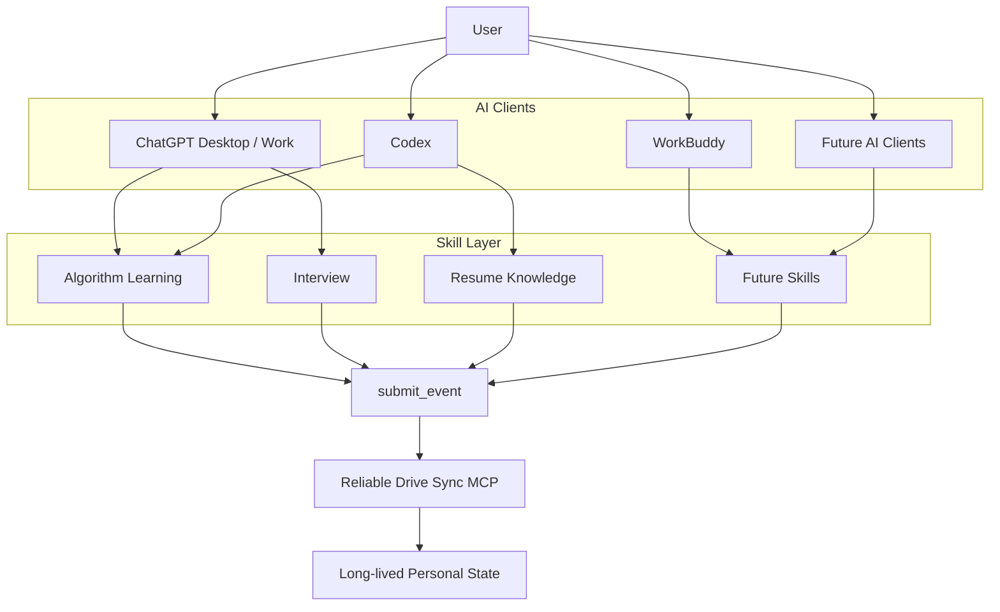

核心原则：

> **Skill 描述发生了什么。**

而不是：

> **Skill 决定修改哪个文件。**

---

# 3. Core Contract

整个项目刻意保持极小的 MCP Surface。

目前 Local MCP 只暴露：

```text
submit_event
```

执行：

```text
tools/list
```

应该只看到：

```json
[
  "submit_event"
]
```

系统刻意不提供：

```text
write_json
save_profile
update_snapshot
append_drive_file
create_folder
upload_artifact
delete_event
```

因为如果 Skill 能直接操作存储：

```text
Skill
  ↓
Drive Implementation
```

业务和基础设施就重新耦合了。

理想结构：

```text
Skill
  ↓
Business Event
  ↓
submit_event
  ↓
Reliable Infrastructure
  ↓
Persistent State
```

---

# 4. Architecture Overview

这是当前系统的总体架构。

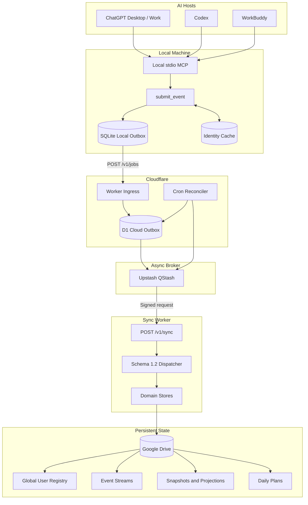

压缩后就是：

```text
ChatGPT / Codex / WorkBuddy
        ↓
Local stdio MCP
        ↓
submit_event
        ↓
SQLite Local Outbox
        ↓
Worker /v1/jobs
        ↓
D1 Cloud Outbox
        ↓
QStash
        ↓
Worker /v1/sync
        ↓
Schema 1.2 Dispatcher
        ↓
Domain Store
        ↓
Google Drive
        ↓
Readback Verification
```

---

# 5. Persistence Semantics

Reliable Drive Sync 最重要的一点，是必须区分不同层级的“成功”。

整个系统存在三个主要持久化阶段。

---

## 5.1 Local Durable

```text
SQLite
✓

D1
?

Google Drive
?
```

意味着：

> 当前事件已经安全保存在本地。

即使：

```text
ChatGPT closes
Codex crashes
WorkBuddy exits
Network disappears
```

事件仍然存在。

---

## 5.2 Cloud Accepted

```text
SQLite
acknowledged

D1
✓

Google Drive
pending
```

意味着：

> 云端已经正式接管任务。

这个状态对应：

```text
deliveryState = cloud_accepted
```

但它绝不代表：

```text
Google Drive saved
```

---

## 5.3 Synced

```text
D1 Job
synced

Google Drive
✓

Readback Verification
✓
```

只有这一步完成之后：

> 异步持久化链路才真正结束。

---

## 5.4 双层 Outbox

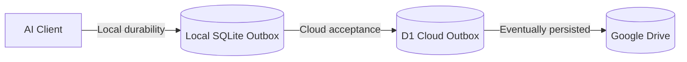

Local Outbox 解决：

```text
客户端退出
电脑断网
Worker 不可访问
HTTP timeout
程序崩溃
```

Cloud Outbox 解决：

```text
QStash 发布失败
QStash 重试
Drive 暂时不可用
OAuth 暂时失败
Projection 暂时失败
Worker 执行失败
```

---

# 6. Complete Write Sequence

这是整个仓库最重要的一张图。

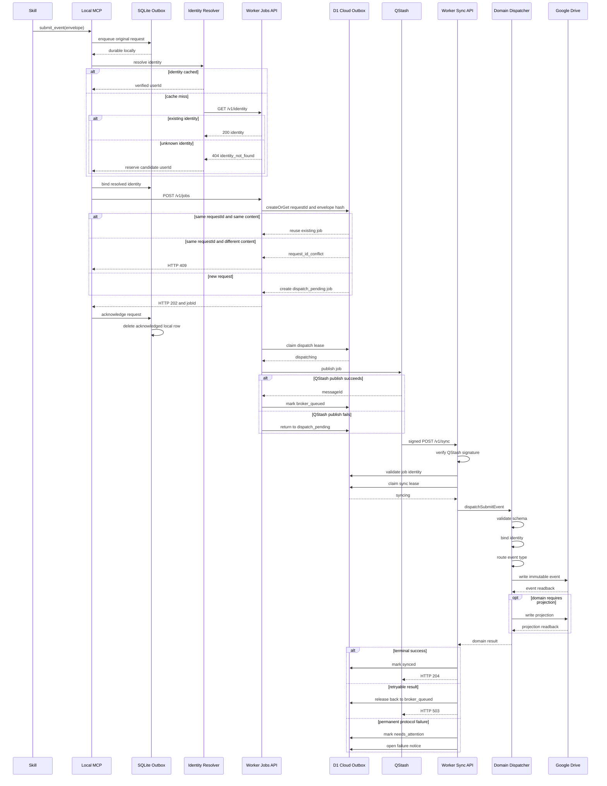

---

# 7. Local MCP

本地 MCP 位于：

```text
tools/reliable-drive-sync-mcp/
```

主要文件：

```text
stdio-bridge.mjs
delivery-service.mjs
local-outbox.mjs
setup-local-clients.ps1
start.cmd
```

整体职责：

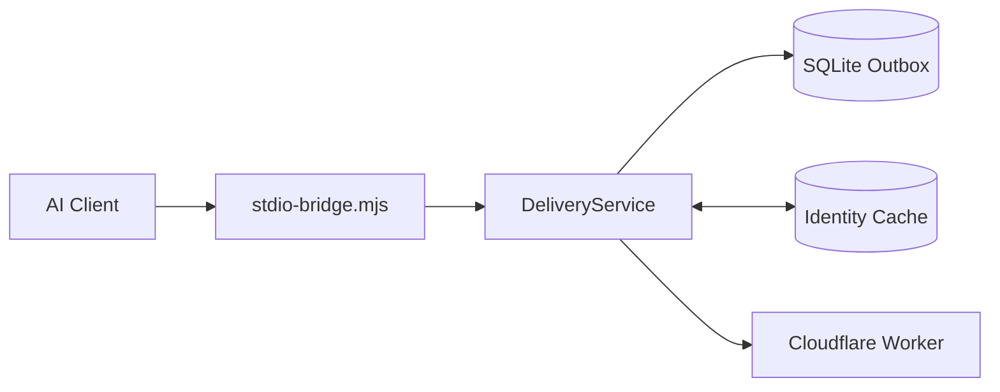

---

## 7.1 stdio-bridge

`stdio-bridge.mjs` 负责：

```text
MCP initialize
MCP ping
tools/list
tools/call
JSON-RPC error handling
```

MCP Server 信息：

```text
name = reliable-drive-sync
version = 2.0.0
```

协议：

```text
2024-11-05
```

---

# 8. Local SQLite Outbox

Local Outbox 是第一道可靠性边界。

默认路径大致为：

```text
%LOCALAPPDATA%\ReliableDriveSync\outbox.sqlite
```

也可以通过：

```text
RELIABLE_DRIVE_SYNC_OUTBOX_PATH
```

指定。

---

## 8.1 WAL

SQLite 启用：

```text
PRAGMA journal_mode = WAL;
```

用于提高崩溃恢复和运行稳定性。

---

## 8.2 Local states

Local Outbox 只有三个主要状态：

```text
pending
sending
blocked
```

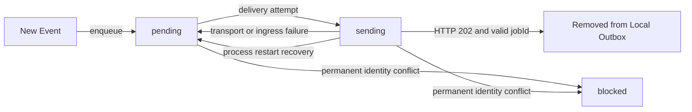

---

## 8.3 Local success condition

一个 Local Outbox Event 不能因为：

```text
request sent
```

就删除。

也不能因为：

```text
HTTP response received
```

就删除。

必须满足：

```text
HTTP 202
+
non-empty jobId
```

然后：

```text
acknowledge(requestId, jobId)
```

才真正删除本地记录。

---

## 8.4 Crash recovery

如果进程崩在：

```text
state = sending
```

下一次 LocalOutbox 初始化时会执行：

```text
sending
→
pending
```

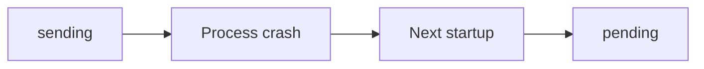

---

## 8.5 Background retry

本地 MCP 运行期间会周期性调用：

```text
flushPending()
```

当前周期约：

```text
30 seconds
```

因此 pending 事件不会只依赖下一次 Skill 调用。

---

## 8.6 FIFO-oriented delivery

本地 pending 记录按照：

```text
created_at
request_id
```

排序。

每轮默认最多处理：

```text
20
```

条。

这意味着旧事件通常会优先于当前事件被 flush。

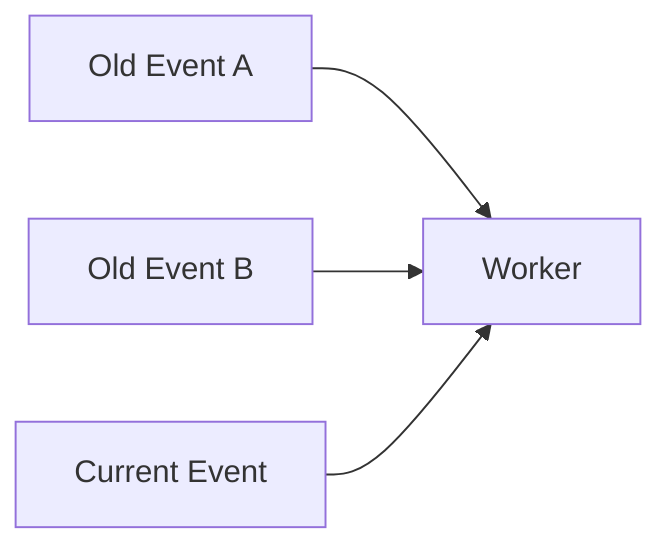

---

## 8.7 Local request idempotency

Local Outbox 保存：

```text
request_id
input_hash
envelope_json
```

如果：

```text
requestId = A
payload = X
```

再次提交：

```text
requestId = A
payload = X
```

则视为安全重试。

但：

```text
requestId = A
payload = Y
```

会得到：

```text
request_id_conflict
```

---

# 9. Identity System

整个 Skill 生态使用统一 Global Identity。

不是：

```text
Algorithm User
Interview User
Resume User
```

而是：

```text
Global User
    ├── algorithm
    ├── interview
    ├── resume-knowledge
    └── future domains
```

---

## 9.1 Identity normalization

用户名经过：

```text
Unicode NFKC
+
trim
```

处理。

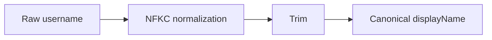

系统不会随意进行大小写折叠。

---

## 9.2 Identity resolution

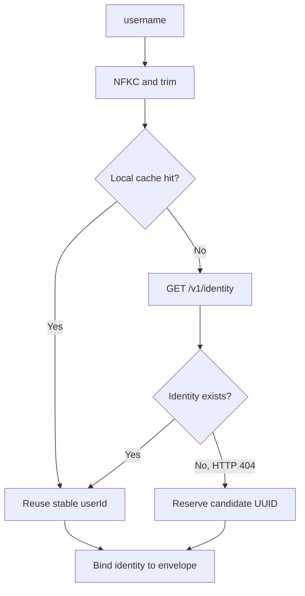

---

## 9.3 Why enqueue happens before identity lookup

系统先执行：

```text
enqueue original request
```

再做：

```text
identity resolution
```

原因是：

> 身份查询需要网络，而本地持久化不应该依赖网络。

因此：

```text
Network failure
```

不会阻止：

```text
Local durability
```

---

## 9.4 Global Identity Storage

Global Registry：

```text
my-chatGPT-skills/
└── user-registry/
    └── registration-<userId>.json
```

User identity：

```text
my-chatGPT-skills/
└── users/
    └── <userId>/
        └── identity.json
```

两者必须一致。

---

## 9.5 Identity creation

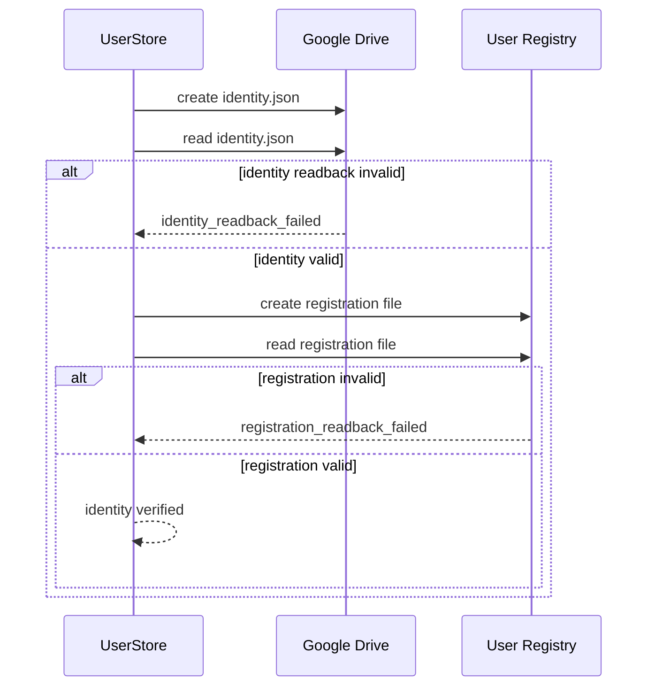

---

## 9.6 Identity conflicts

如果同一个 displayName 对应多个 userId：

```text
user_conflict
```

如果请求提供的 userId 与 Registry 不一致：

```text
identity_mismatch
```

如果 userId 格式非法：

```text
invalid_user_id
```

---

# 10. Event Protocol

当前事件协议：

```text
schemaVersion = "1.2"
```

Envelope 示例：

```json
{
  "schemaVersion": "1.2",
  "namespace": "interview",
  "eventType": "interview.session.completed",
  "identity": {
    "username": "Example User"
  },
  "payload": {
    "event": {}
  },
  "requestId": "550e8400-e29b-41d4-a716-446655440000"
}
```

允许顶层字段：

```text
schemaVersion
namespace
eventType
identity
payload
requestId
```

---

## 10.1 Namespaces

当前：

```text
system
algorithm
interview
resume-knowledge
```

---

## 10.2 Event Types

### System

```text
system.user-registered
system.legacy-migration-requested
```

### Algorithm

```text
algorithm.learning.completed
algorithm.daily-plan-created
```

### Interview

```text
interview.session.list
interview.session.load
interview.session.completed
interview.review.completed
```

### Resume Knowledge

```text
resume-knowledge.resume-ingested
resume-knowledge.claim-confirmed
resume-knowledge.claim-rejected
resume-knowledge.question-bank-created
resume-knowledge.daily-plan-created
resume-knowledge.answer-scored
```

---

## 10.3 Read-only events

以下事件不进入 Outbox：

```text
interview.session.list
interview.session.load
```

以及：

```text
system.legacy-migration-requested
mode = dry-run
```

它们走：

```text
POST /v1/query
```

---

## 10.4 Read sequence

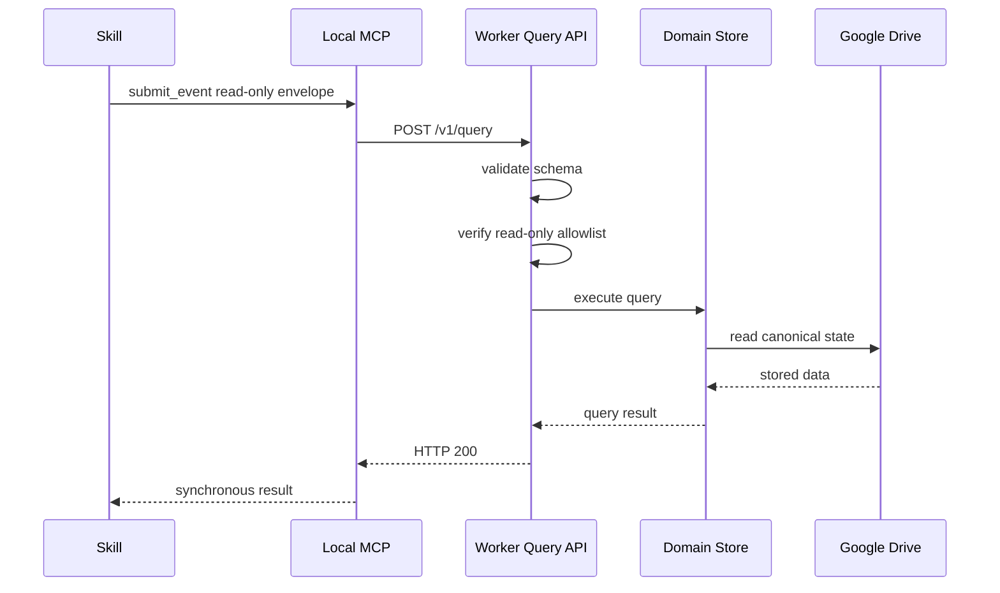

---

# 11. Worker API

Cloudflare Worker 不是公开 MCP Server。

它本质上是：

> Authenticated Job / Query / Sync Service

主要接口：

```text
GET  /v1/identity
POST /v1/query
POST /v1/jobs
POST /v1/sync
POST /v1/qstash/failure
```

---

## 11.1 `/v1/identity`

职责：

```text
username
↓
global registry
↓
verified identity
```

只读。

不会隐式创建用户。

---

## 11.2 `/v1/query`

只允许白名单中的 Read-only Operation。

尝试写：

```text
write_requires_outbox
```

---

## 11.3 `/v1/jobs`

所有正常写业务的云端入口。

```text
Authenticate
↓
Parse JSON
↓
Validate Schema
↓
D1 createOrGet
↓
Return HTTP 202
↓
Dispatch asynchronously
```

---

## 11.4 `/v1/sync`

由 QStash 调用。

职责：

```text
Verify signature
↓
Validate message
↓
Load envelope
↓
Claim sync lease
↓
Dispatch domain event
↓
Mark success / retry / needs_attention
```

---

## 11.5 `/v1/qstash/failure`

QStash 重试耗尽后调用。

职责：

```text
Verify signature
↓
Validate callback
↓
Mark job needs_attention
↓
Open Failure Notice
```

---

# 12. D1 Cloud Outbox

云端表：

```text
schema12_jobs
```

关键字段：

```text
job_id
request_id
user_id
envelope_json
envelope_hash

state

dispatch_attempts
sync_attempts

last_error_code
last_error_message

lease_owner
lease_until

broker_message_id

created_at
updated_at
dispatched_at
completed_at
```

---

## 12.1 Cloud states

合法状态：

```text
dispatch_pending
dispatching
broker_queued
syncing
synced
needs_attention
```

---

## 12.2 Cloud state machine

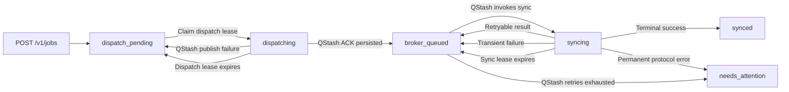

---

## 12.3 Cloud request idempotency

D1 根据：

```text
request_id
+
envelope_hash
```

判断请求。

### Same requestId + same hash

```text
reuse existing job
```

### Same requestId + different hash

```text
request_id_conflict
```

---

# 13. QStash

D1 Job 进入：

```text
dispatch_pending
```

之后 Dispatcher 会尝试发布到 QStash。

---

## 13.1 Dispatch lease

发送 QStash 前：

```text
dispatch_pending
↓
claimForDispatch
↓
dispatching
```

同时设置：

```text
lease_owner
lease_until
```

当前 Lease 大约：

```text
5 minutes
```

---

## 13.2 QStash publication

发布内容包括：

```text
jobId
requestId
userId
```

并使用：

```text
jobId
```

作为：

```text
Upstash-Deduplication-Id
```

---

## 13.3 Broker ACK

QStash 成功后返回：

```text
messageId
```

只有当 messageId 成功持久化到 D1：

```text
broker_message_id
```

Job 才进入：

```text
broker_queued
```

---

## 13.4 Dispatch flow

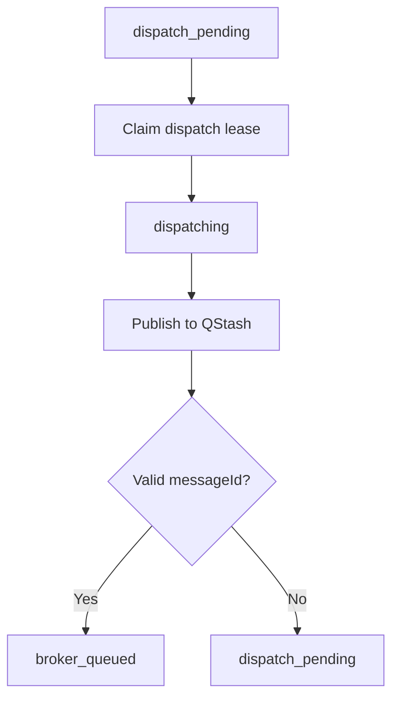

---

## 13.5 Signature Verification

`POST /v1/sync` 会验证：

```text
Upstash-Signature
```

包括：

```text
HS256
issuer
subject
expiration
not-before
body hash
current signing key
next signing key
```

---

## 13.6 Sync flow

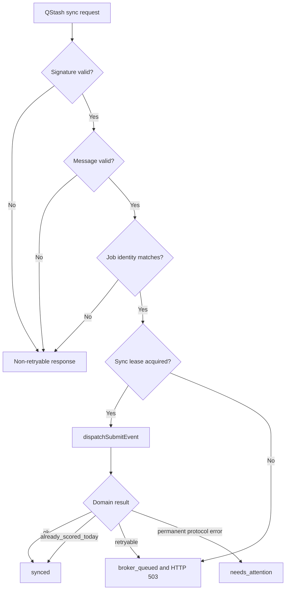

---

# 14. Reconciler and Recovery

QStash 不是唯一恢复机制。

Cloudflare Worker 还配置了 Cron。

当前：

```text
*/5 * * * *
0 * * * *
0 */6 * * *
```

当前这些 Cron 最终都执行核心 Reconciler。

---

## 14.1 Reconciler responsibilities

```text
Requeue expired leases
+
Find dispatch_pending jobs
+
Dispatch jobs again
```

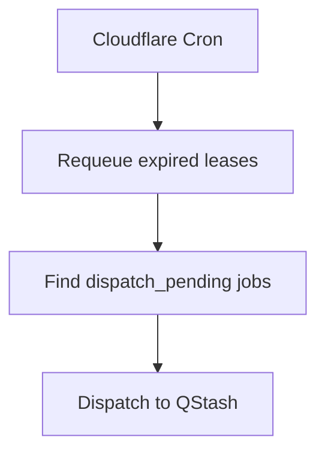

---

## 14.2 Why Reconciler matters

假设：

```text
POST /v1/jobs
```

已经成功写入 D1。

但是：

```text
context.waitUntil dispatcher
```

随后因为 Worker 生命周期或网络问题没有成功发送 QStash。

Job 仍然是：

```text
dispatch_pending
```

之后 Cron 会再次发现它。

---

## 14.3 Reliability layers

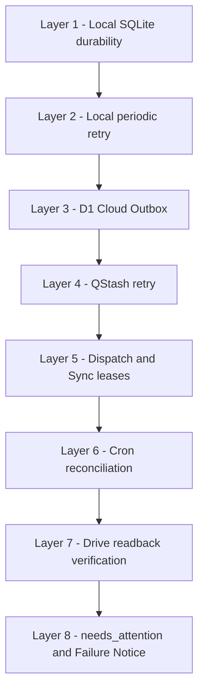

---

# 15. Domain Dispatcher

真正处理业务事件的是：

```text
dispatchSubmitEvent
```

核心流程：

```text
Inspect envelope
↓
Bind identity
↓
Validate event
↓
Route by eventType
↓
Call Domain Store
```

---

## 15.1 Router

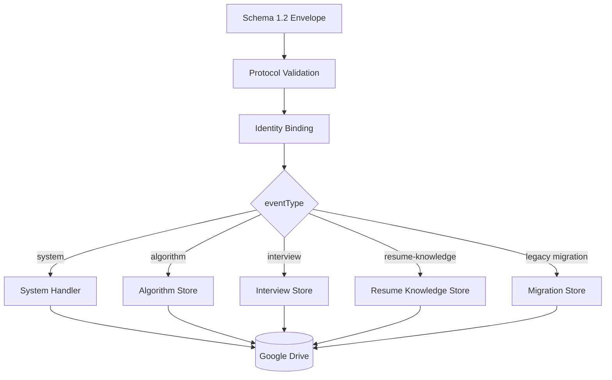

---

## 15.2 Read-only identity rule

这些事件：

```text
system.legacy-migration-requested
interview.session.list
interview.session.load
```

不会自动创建 Identity。

对于 Read-only Operation：

```text
existing user
→ verify

unknown user
→ error
```

避免：

> 因为一次读取操作产生隐式写副作用。

---

# 16. Canonical Google Drive Layout

Canonical Root：

```text
DriveRoot/
└── my-chatGPT-skills/
```

完整布局：

```text
DriveRoot/
└── my-chatGPT-skills/
    │
    ├── user-registry/
    │   └── registration-<userId>.json
    │
    └── users/
        └── <userId>/
            │
            ├── identity.json
            │
            ├── algorithm/
            │   ├── events/
            │   │   └── event-<eventId>.json
            │   │
            │   ├── profile/
            │   │   └── snapshots/
            │   │       └── snapshot-<timestamp>-<headEventId>.json
            │   │
            │   └── plans/
            │       └── daily/
            │           └── daily-plan-<date>-<planId>.json
            │
            ├── interview/
            │   ├── events/
            │   │   └── event-<eventId>.json
            │   │
            │   └── profile/
            │       └── snapshots/
            │           └── snapshot-<timestamp>-<headEventId>.json
            │
            └── resume-knowledge/
                ├── sources/
                │   └── resume/
                │       └── snapshots/
                │           └── resume-<version>-<fingerprint>.json
                │
                ├── question-bank/
                │   └── snapshots/
                │       └── question-bank-<version>-<eventId>.json
                │
                ├── events/
                │   └── event-<eventId>.json
                │
                ├── profile/
                │   └── snapshots/
                │       └── snapshot-<timestamp>-<headEventId>.json
                │
                └── plans/
                    └── daily/
                        └── daily-plan-<date>-<planId>.json
```

---

## 16.1 Path allow-list

业务代码不能随便写任意路径。

允许 Domain：

```text
algorithm
interview
resume-knowledge
```

例如 Algorithm 只允许：

```text
events
profile/snapshots
plans/daily
```

---

## 16.2 Traversal protection

非法：

```text
.
..
/
\
../x
x/y/z
```

不会被接受。

因此：

> Domain Store 不是通用 Drive File Writer。

---

# 17. Event Store

三个主要 Domain 都建立在统一 Event Store 上。

Event 是：

> **Immutable Business Fact**

---

## 17.1 Event persistence

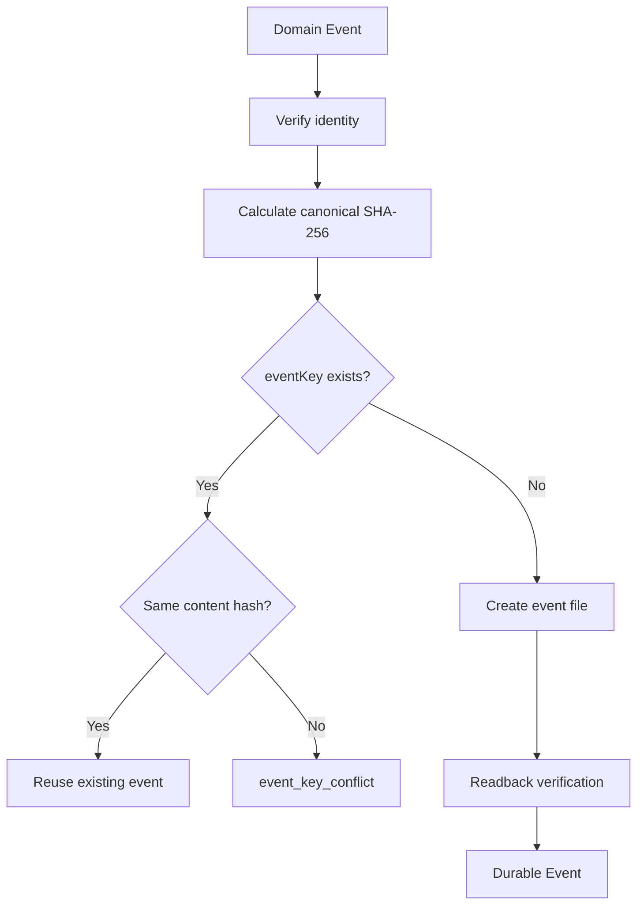

---

## 17.2 Event filename

```text
event-<eventId>.json
```

---

## 17.3 Event validation

一个 Event 文件必须满足：

```text
schemaVersion == 1.2
eventId valid
eventKey valid
eventType valid
userId matches
username matches
filename matches eventId
parent folder correct
contentHash valid
```

否则不会被当作可信 Event。

---

# 18. Algorithm Domain

当前：

```text
algorithm.learning.completed
algorithm.daily-plan-created
```

---

## 18.1 Learning Event

流程：

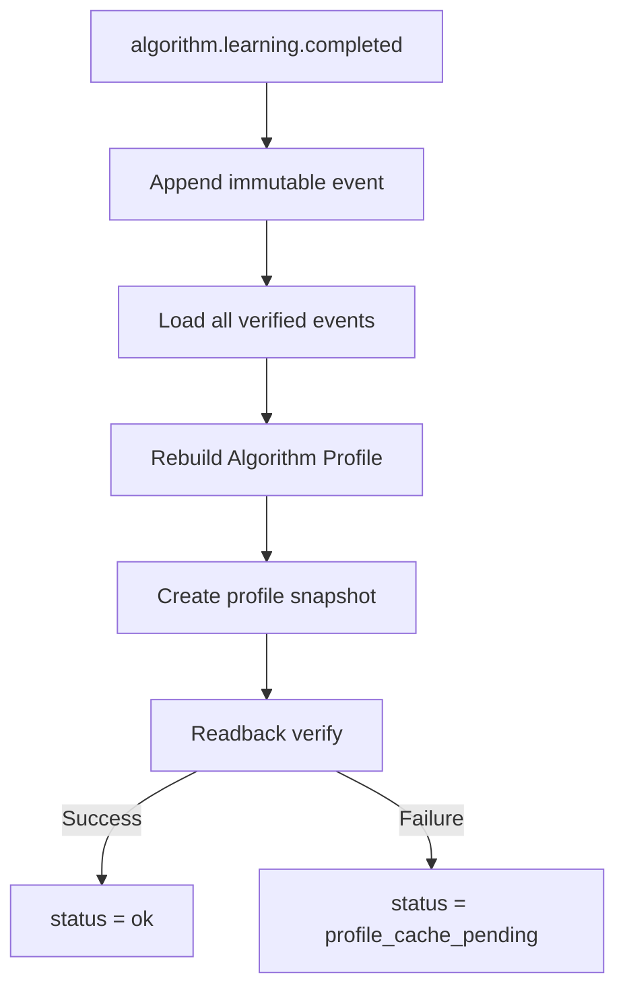

---

## 18.2 Partial success

如果：

```text
event write
✓

profile snapshot
✗
```

返回：

```text
profile_cache_pending
```

这意味着：

> Event 已经成为事实。

但：

> Profile Projection 需要重新构建。

---

## 18.3 Daily Plan

文件：

```text
daily-plan-<localDate>-<planId>.json
```

如果完全相同的 Plan 已存在：

```text
reuse
```

而不是覆盖。

---

# 19. Interview Domain

当前主要能力：

```text
Session
Review
Profile
```

事件：

```text
interview.session.completed
interview.review.completed
```

查询：

```text
interview.session.list
interview.session.load
```

---

## 19.1 Interview workflow

```mermaid
flowchart TD

    SESSION["Interview Session"]
    SEVENT["interview.session.completed"]
    STORE1["Persist Session Event"]
    WAIT["review_pending"]
    REVIEW["Review"]
    REVENT["interview.review.completed"]
    SOURCE{"Source session exists?"}
    STORE2["Persist Review Event"]
    PROFILE["Rebuild Interview Profile"]
    SNAPSHOT["Create Profile Snapshot"]
    OK["status = ok"]
    CACHE["profile_cache_pending"]
    ERROR["source_session_not_found"]

    SESSION --> SEVENT
    SEVENT --> STORE1
    STORE1 --> WAIT

    WAIT --> REVIEW
    REVIEW --> REVENT
    REVENT --> SOURCE

    SOURCE -->|"Yes"| STORE2
    SOURCE -->|"No"| ERROR

    STORE2 --> PROFILE
    PROFILE --> SNAPSHOT

    SNAPSHOT -->|"Success"| OK
    SNAPSHOT -->|"Failure"| CACHE
```

---

## 19.2 Review dependency

Review 必须引用：

```text
sourceSessionEventId
```

系统验证：

```text
Source Session exists
Source Session belongs to same user
sessionId matches
```

否则：

```text
source_session_not_found
```

---

## 19.3 Review Version

Review 具有：

```text
reviewVersion
```

并要求：

```text
eventKey version
```

与：

```text
reviewVersion
```

匹配。

因此支持：

```text
Review v1
Review v2
Review v3
```

而不需要覆盖历史 Review。

---

## 19.4 Profile

```text
Interview Events
↓
rebuildInterviewProfile
↓
Profile Snapshot
```

同样：

```text
Event
=
source of truth

Profile Snapshot
=
derived state
```

---

# 20. Resume Knowledge Domain

当前最复杂的业务 Domain。

它包括：

```text
Resume
Claims
Question Bank
Daily Plan
Answer Scoring
Knowledge Profile
```

---

## 20.1 Overall workflow

```mermaid
flowchart TD

    RESUME["Resume"]
    INGEST["resume-knowledge.resume-ingested"]
    SNAP["Resume Snapshot"]
    CLAIMS["Claims"]
    DECISION["Confirm or Reject Claims"]
    BANK["Question Bank"]
    PLAN["Daily Plan"]
    QUESTION["Question"]
    ANSWER["Answer"]
    SCORE["resume-knowledge.answer-scored"]
    PROFILE["Knowledge Profile"]

    RESUME --> INGEST
    INGEST --> SNAP
    INGEST --> CLAIMS

    CLAIMS --> DECISION
    DECISION --> BANK

    BANK --> PLAN
    PLAN --> QUESTION

    QUESTION --> ANSWER
    ANSWER --> SCORE

    SCORE --> PROFILE
```

---

## 20.2 Resume ingestion

事件：

```text
resume-knowledge.resume-ingested
```

会持久化 Event。

随后生成：

```text
resume-<resumeVersion>-<fingerprint>.json
```

其中保存：

```text
schemaVersion
userId
username
resumeVersion
fingerprint
activatedAt
claims
claimRelations
techTags
evidenceLocations
sourceEventId
sourceEventKey
```

---

## 20.3 Original resume policy

该 Projection 不直接保存原始 Resume 文件。

核心目标是存储：

> 结构化 Resume Knowledge

而不是：

> 把 PDF / DOCX 当作 Blob 上传。

---

## 20.4 Claim decisions

事件：

```text
resume-knowledge.claim-confirmed
resume-knowledge.claim-rejected
```

只记录 Decision。

它们不会：

```text
rewrite resume snapshot
overwrite previous question bank
delete old state
```

未来状态通过 Events 推导。

---

## 20.5 Question Bank

事件：

```text
resume-knowledge.question-bank-created
```

生成：

```text
question-bank-<resumeVersion>-<eventId>.json
```

新版本 Question Bank：

```text
create new snapshot
```

而不是修改旧文件。

---

## 20.6 Daily Plan dependency

Daily Plan 依赖最新 Question Bank。

```mermaid
flowchart LR

    RESUME["Resume"]
    BANK["Question Bank"]
    PLAN["Daily Plan"]

    RESUME --> BANK
    BANK --> PLAN
```

如果 Question Bank 不存在：

```text
status = resume_required
reason = question_bank_missing
```

---

## 20.7 Immutable Daily Plan

对于已经存在的：

```text
daily-plan-<localDate>-<planId>.json
```

再次请求当天计划时，可以直接复用已存在内容。

不会因为模型再次生成而随意改变当天状态。

---

## 20.8 Answer scoring

一个非常关键的规则：

```text
userId
+
localDate
+
questionKey
```

一天只记录第一次有效评分。

---

## 20.9 Scoring flow

```mermaid
flowchart TD

    SCORE["resume-knowledge.answer-scored"]
    BANK{"Question Bank exists?"}
    EVENTS["Load verified score events"]
    REPLAY{"Same eventKey replay?"}
    TODAY{"Already scored today?"}
    APPEND["Append score event"]
    PROFILE["Rebuild knowledge profile"]
    SNAPSHOT["Create profile snapshot"]
    OK["status = ok"]
    DUP["already_scored_today"]
    REQUIRED["resume_required"]
    CACHE["profile_cache_pending"]

    SCORE --> BANK

    BANK -->|"No"| REQUIRED
    BANK -->|"Yes"| EVENTS

    EVENTS --> REPLAY

    REPLAY -->|"Yes"| APPEND
    REPLAY -->|"No"| TODAY

    TODAY -->|"Yes"| DUP
    TODAY -->|"No"| APPEND

    APPEND --> PROFILE
    PROFILE --> SNAPSHOT

    SNAPSHOT -->|"Success"| OK
    SNAPSHOT -->|"Failure"| CACHE
```

---

## 20.10 Replay exception

假设：

```text
Score Event
✓

Profile Snapshot
✗
```

之后 Worker 用同一个：

```text
eventKey
```

重试。

这次重试应该被识别为：

> Projection repair

而不是：

> 第二次答题。

否则会出现：

```text
Event succeeded
↓
Projection failed
↓
Retry
↓
already_scored_today
↓
Profile can never be repaired
```

因此系统显式区分：

```text
same event replay
```

和：

```text
new second attempt
```

---

# 21. Projection Model

系统不是简单地保存“当前 JSON”。

其核心结构是：

```text
Immutable Events
+
Derived Projections
```

```mermaid
flowchart LR

    EVENTS["Immutable Event Stream"]
    REDUCER["Reducer or Rebuild Logic"]
    PROFILE["Profile Snapshot"]
    PLAN["Daily Plan"]
    BANK["Question Bank"]
    RESUME["Resume Snapshot"]

    EVENTS --> REDUCER

    REDUCER --> PROFILE
    REDUCER --> PLAN
    REDUCER --> BANK
    REDUCER --> RESUME
```

---

## 21.1 Event is source of truth

Event 一旦成功持久化：

```text
Event = durable fact
```

Projection 失败：

```text
Projection = rebuildable
```

---

## 21.2 Projection materialization

典型 Projection 写入：

```mermaid
flowchart TD

    VALUE["Projection value"]
    PATH["Resolve canonical path"]
    EXISTS{"Same filename exists?"}
    READ["Read existing file"]
    SAME{"Same content?"}
    REUSE["Reuse existing projection"]
    CONFLICT["projection_conflict"]
    CREATE["Create projection"]
    VERIFY["Readback verify"]
    DONE["Projection durable"]

    VALUE --> PATH
    PATH --> EXISTS

    EXISTS -->|"Yes"| READ
    EXISTS -->|"No"| CREATE

    READ --> SAME

    SAME -->|"Yes"| REUSE
    SAME -->|"No"| CONFLICT

    CREATE --> VERIFY
    VERIFY --> DONE
```

同一个 Projection Key 不允许：

```text
same filename
+
different content
→ overwrite
```

而会：

```text
projection_conflict
```

---

# 22. Readback Verification

系统整体遵循：

> **Persist, then prove persistence.**

典型流程：

```text
Create
↓
Read
↓
Verify
↓
Success
```

---

## 22.1 Verification targets

可能验证：

```text
file id
filename
parent folder
JSON body
schemaVersion
eventId
eventKey
userId
username
contentHash
```

---

## 22.2 Why?

因为：

```text
API returned success
```

与：

```text
Canonical persistent state exists exactly as expected
```

不是完全相同的概念。

---

# 23. Legacy Migration

系统历史上存在过：

```text
pre-normalization roots
```

后来统一到了：

```text
DriveRoot/my-chatGPT-skills/
```

旧数据不会被自动删除或移动。

---

## 23.1 Migration event

唯一迁移入口：

```text
system.legacy-migration-requested
```

当前 Legacy Domain：

```text
algorithm
interview
```

主要迁移：

```text
events
profile/snapshots
```

---

## 23.2 Two-phase migration

```mermaid
flowchart TD

    START["Migration Request"]
    DRY["dry-run"]
    SCAN["Scan Legacy Data"]
    HASH["Hash Sources"]
    COMPARE["Compare Canonical Targets"]
    PLAN["Build Plan"]
    APPROVE["Approve planHash"]
    EXEC["execute"]
    RESCAN["Re-scan"]
    SAME{"planHash unchanged?"}
    CONFLICT{"Any conflict?"}
    PREFLIGHT["Preflight all sources and targets"]
    COPY["Copy missing objects"]
    VERIFY["Readback and hash verification"]
    RECEIPT["Write Migration Receipt"]
    STALE["migration_plan_stale"]
    STOP["migration_conflict"]

    START --> DRY
    DRY --> SCAN
    SCAN --> HASH
    HASH --> COMPARE
    COMPARE --> PLAN

    PLAN --> APPROVE
    APPROVE --> EXEC

    EXEC --> RESCAN
    RESCAN --> SAME

    SAME -->|"No"| STALE
    SAME -->|"Yes"| CONFLICT

    CONFLICT -->|"Yes"| STOP
    CONFLICT -->|"No"| PREFLIGHT

    PREFLIGHT --> COPY
    COPY --> VERIFY
    VERIFY --> RECEIPT
```

---

## 23.3 Dry Run

```text
mode = dry-run
```

只做：

```text
scan
hash
compare
plan
```

不写数据。

---

## 23.4 Actions

每个对象被分类：

```text
copy
skip
conflict
```

### Missing target

```text
copy
```

### Existing same content

```text
skip
```

### Existing different content

```text
conflict
```

---

## 23.5 Plan Hash

Dry Run 生成：

```text
migrationId
planHash
```

Execute 必须提交：

```text
migrationId
approvedPlanHash
```

如果重新扫描后：

```text
currentPlanHash
!=
approvedPlanHash
```

则：

```text
migration_plan_stale
```

---

## 23.6 Preflight before writing

Execute 在复制任何文件之前会：

```text
re-read all sources
verify source hashes
verify all targets
ensure no target appeared concurrently
```

避免部分迁移。

---

## 23.7 Legacy is read-only

Legacy Source：

```text
READ
✓

COPY TO CANONICAL
✓

UPDATE
✗

MOVE
✗

DELETE
✗

OVERWRITE
✗
```

核心原则：

> **Copy forward, never mutate history.**

---

## 23.8 Migration Receipt

成功后：

```text
users/<userId>/
└── migration-<migrationId>-receipt.json
```

记录：

```text
migrationId
planHash
startedAt
finishedAt
summary
source
target
contentHash
action
```

---

# 24. Failure Model

## 24.1 End-to-end failure table

| Failure | Local State | Cloud State | Recovery |
|---|---|---|---|
| Client crashes after enqueue | durable | none | Local retry |
| Identity lookup fails | pending | none | Local retry |
| Worker unavailable | pending | none | Local retry |
| `/v1/jobs` timeout | pending | unknown | Safe retry by requestId |
| D1 accepted | local acknowledged | durable | Cloud owns task |
| QStash publish fails | local removed | dispatch_pending | Cron retry |
| Dispatch lease expires | local removed | dispatch_pending | Reconciler |
| QStash transient failure | local removed | broker_queued | QStash retry |
| Sync lease expires | local removed | broker_queued | Reconciler |
| Drive transient failure | local removed | retryable | QStash retry |
| Event succeeds, Projection fails | local removed | retryable | Projection rebuild |
| Permanent protocol failure | local removed | needs_attention | Operator |
| QStash retries exhausted | local removed | needs_attention | Failure Notice |
| Same requestId and same content | safe reuse | safe reuse | Idempotent |
| Same requestId and different content | conflict | conflict | Reject |
| Same eventKey and same event | reuse | existing event | Idempotent |
| Same eventKey and different event | conflict | failure | Reject |

---

## 24.2 `cloud_accepted`

Example:

```json
{
  "status": "queued",
  "accepted": true,
  "deliveryState": "cloud_accepted",
  "persistence": {
    "localOutbox": "acknowledged",
    "cloudOutbox": "accepted",
    "drive": "pending"
  }
}
```

准确含义：

```text
Local durability
✓

D1 Cloud Outbox
✓

Google Drive
pending
```

---

## 24.3 `pending`

Example：

```json
{
  "status": "queued_locally",
  "accepted": false,
  "deliveryState": "pending",
  "persistence": {
    "localOutbox": "durable",
    "cloudOutbox": "pending",
    "drive": "pending"
  }
}
```

含义：

```text
Local SQLite
✓

Cloud acceptance
not confirmed

Drive
pending
```

---

## 24.4 `needs_attention`

D1 最终无法自动恢复时：

```text
state = needs_attention
```

同时可能创建：

```text
schema12_failure_notices
```

Failure Notice：

```text
notice_id
user_id
category
message
status
opened_at
acknowledged_at
updated_at
```

---

## 24.5 Failure callback flow

```mermaid
flowchart LR

    QS["QStash retries exhausted"]
    CALLBACK["POST /v1/qstash/failure"]
    VERIFY["Verify QStash signature"]
    D1[("D1")]
    ATT["needs_attention"]
    NOTICE["Failure Notice"]

    QS --> CALLBACK
    CALLBACK --> VERIFY
    VERIFY --> D1
    D1 --> ATT
    ATT --> NOTICE
```

---

# 25. Security Boundaries

系统目前刻意不提供：

```text
Public MCP endpoint
/mcp/<token>
Secure MCP Tunnel
Public capability URL
```

Local Client 使用：

```text
stdio MCP
```

Worker 使用：

```text
authenticated HTTP
```

---

## 25.1 Trust boundaries

```mermaid
flowchart LR

    AI["AI Client"]
    LOCAL["Local stdio MCP"]
    WORKER["Worker Ingress"]
    QSTASH["QStash"]
    SYNC["Worker Sync API"]
    DRIVE["Google Drive"]

    AI -->|"stdio"| LOCAL
    LOCAL -->|"Bearer Token"| WORKER
    WORKER -->|"QStash Token"| QSTASH
    QSTASH -->|"Signed request"| SYNC
    SYNC -->|"Google OAuth or Service Account"| DRIVE
```

---

## 25.2 Worker authentication

Ingress 使用：

```text
Authorization: Bearer <MCP_BEARER_TOKEN>
```

状态：

```text
Token secret missing
→ 503 service_unavailable

Authorization missing
→ 401 unauthorized

Wrong token
→ 403 forbidden
```

---

## 25.3 Secrets

以下内容不能提交 Git：

```text
MCP_BEARER_TOKEN

QSTASH_TOKEN
QSTASH_CURRENT_SIGNING_KEY
QSTASH_NEXT_SIGNING_KEY

GOOGLE_DRIVE_FOLDER_ID

GOOGLE_OAUTH_CLIENT_ID
GOOGLE_OAUTH_CLIENT_SECRET
GOOGLE_OAUTH_REFRESH_TOKEN

GOOGLE_SERVICE_ACCOUNT_JSON
```

---

# 26. Repository Structure

```text
my-chatgpt-mcp/
│
├── .codex-plugin/
│   └── plugin.json
│
├── docs/
│   └── superpowers/
│       ├── plans/
│       └── specs/
│
├── services/
│   └── reliable-drive-sync-worker/
│       │
│       ├── migrations/
│       │   └── 0005_schema12_jobs.sql
│       │
│       ├── src/
│       │   ├── index.js
│       │   ├── ingress.js
│       │   ├── protocol.js
│       │   ├── job-repository.js
│       │   ├── dispatcher.js
│       │   ├── qstash.js
│       │   ├── sync.js
│       │   ├── reconciler.js
│       │   ├── submit-event.js
│       │   ├── storage-layout.js
│       │   ├── google-drive.js
│       │   ├── user-store.js
│       │   ├── event-store.js
│       │   ├── algorithm-store.js
│       │   ├── algorithm-profile-model.js
│       │   ├── interview-store.js
│       │   ├── profile-model.js
│       │   ├── resume-knowledge-store.js
│       │   ├── resume-knowledge-model.js
│       │   ├── migration-store.js
│       │   └── legacy-reader.js
│       │
│       ├── test/
│       ├── README.md
│       ├── package.json
│       └── wrangler.toml
│
├── tools/
│   └── reliable-drive-sync-mcp/
│       ├── stdio-bridge.mjs
│       ├── delivery-service.mjs
│       ├── local-outbox.mjs
│       ├── setup-local-clients.ps1
│       ├── start.cmd
│       ├── test/
│       ├── README.md
│       └── package.json
│
├── .env.example
├── package.json
└── README.md
```

---

## 26.1 Responsibility Map

| File / Component | Responsibility |
|---|---|
| `stdio-bridge.mjs` | MCP JSON-RPC entry |
| `delivery-service.mjs` | Local delivery orchestration |
| `local-outbox.mjs` | SQLite durability and identity cache |
| `ingress.js` | Worker ingress and authentication |
| `protocol.js` | Schema 1.2 validation |
| `job-repository.js` | D1 Cloud Outbox |
| `dispatcher.js` | D1 to QStash dispatch |
| `qstash.js` | QStash publisher |
| `sync.js` | QStash sync and failure callback |
| `reconciler.js` | Cron recovery |
| `submit-event.js` | Domain routing |
| `user-store.js` | Global identity |
| `event-store.js` | Immutable event persistence |
| `storage-layout.js` | Canonical path policy |
| `google-drive.js` | Drive persistence adapter |
| `algorithm-store.js` | Algorithm domain |
| `interview-store.js` | Interview domain |
| `resume-knowledge-store.js` | Resume Knowledge domain |
| `migration-store.js` | Safe Legacy Migration |

---

# 27. Quick Start

## Requirements

```text
Node.js >= 22
```

检查：

```bash
node --version
npm --version
```

---

## Clone

```bash
git clone https://github.com/gitgotcha/my-chatgpt-mcp.git
cd my-chatgpt-mcp
```

---

## Tests

完整测试：

```bash
npm test
```

Worker：

```bash
npm run test:worker
```

Local MCP：

```bash
npm run test:bridge
```

---

# 28. Deployment

## 28.1 Deploy Worker

```bash
cd services/reliable-drive-sync-worker
```

应用 D1 Migration：

```bash
npx wrangler d1 migrations apply reliable-drive-sync --remote
```

部署：

```bash
npx wrangler deploy
```

或者根目录：

```bash
npm run deploy:worker
```

---

## 28.2 Worker Secrets

Google OAuth：

```bash
wrangler secret put MCP_BEARER_TOKEN

wrangler secret put QSTASH_TOKEN
wrangler secret put QSTASH_CURRENT_SIGNING_KEY
wrangler secret put QSTASH_NEXT_SIGNING_KEY

wrangler secret put GOOGLE_DRIVE_FOLDER_ID

wrangler secret put GOOGLE_OAUTH_CLIENT_ID
wrangler secret put GOOGLE_OAUTH_CLIENT_SECRET
wrangler secret put GOOGLE_OAUTH_REFRESH_TOKEN
```

Service Account：

```bash
wrangler secret put GOOGLE_SERVICE_ACCOUNT_JSON
```

---

## 28.3 Local Client Setup

Windows PowerShell：

```powershell
$env:RELIABLE_DRIVE_SYNC_INGRESS_SHARED_SECRET = '<Worker MCP_BEARER_TOKEN>'

.\tools\reliable-drive-sync-mcp\setup-local-clients.ps1
```

主要环境变量：

```text
RELIABLE_DRIVE_SYNC_INGRESS_URL
RELIABLE_DRIVE_SYNC_INGRESS_SHARED_SECRET

RELIABLE_DRIVE_SYNC_NODE_PATH
RELIABLE_DRIVE_SYNC_OUTBOX_PATH
```

后两个可选。

---

## 28.4 Supported Clients

当前主要支持：

```text
ChatGPT Desktop / Work
Codex
Codex IDE integration
WorkBuddy
```

多个 Client 最终共享：

```text
start.cmd
↓
stdio-bridge.mjs
↓
SQLite Outbox
↓
Cloud Worker
```

---

# 29. Relationship with my-chatgpt-skills

Skill 仓库：

```text
gitgotcha/my-chatgpt-skills
```

Persistence Infrastructure：

```text
gitgotcha/my-chatgpt-mcp
```

```mermaid
flowchart TD

    SKILLS["my-chatgpt-skills"]
    CONTRACT["Schema 1.2 Event Contract"]
    MCP["my-chatgpt-mcp"]
    STATE["Persistent Personal State"]

    SKILLS --> CONTRACT
    CONTRACT --> MCP
    MCP --> STATE
```

---

## 29.1 Skills own

```text
Business logic
Prompting
Reasoning
User interaction
Event construction
Domain semantics
```

---

## 29.2 MCP infrastructure owns

```text
Identity
Schema validation
Durability
Retry
Idempotency
Queueing
Cloud delivery
Storage layout
Readback verification
Migration safety
```

---

## 29.3 What Skill should know

Skill 理想情况下只应该知道：

```text
What happened?
```

例如：

```text
algorithm.learning.completed
```

而不应该知道：

```text
Google Drive Folder ID
D1 table name
QStash URL
OAuth token
SQLite location
Snapshot naming rule
Lease duration
Cron interval
```

---

# 30. System Invariants

整个系统最重要的不变量：

---

## 30.1 Persistence

```text
No network call before local durability.
```

---

## 30.2 Local acknowledgement

```text
No local deletion before HTTP 202 and jobId.
```

---

## 30.3 Identity

```text
One canonical global user identity.
```

---

## 30.4 Request idempotency

```text
requestId identifies one immutable transport request.
```

---

## 30.5 Event idempotency

```text
eventKey identifies one immutable business event.
```

---

## 30.6 Event history

```text
Events are append-oriented.
```

---

## 30.7 Projection

```text
Derived state may be rebuilt from events.
```

---

## 30.8 Conflict handling

```text
Conflict is safer than silent overwrite.
```

---

## 30.9 Storage

```text
Only canonical allow-listed paths are writable.
```

---

## 30.10 Migration

```text
Legacy data is read-only.
```

---

## 30.11 Verification

```text
Write success requires readback evidence.
```

---

# 31. Current Status

当前：

```text
Reliable Drive Sync
Version 2.0.0
```

Event Protocol：

```text
Schema 1.2
```

MCP Tool：

```text
submit_event
```

Domains：

```text
algorithm
interview
resume-knowledge
```

Local durability：

```text
SQLite
```

Cloud durability：

```text
Cloudflare D1
```

Broker：

```text
Upstash QStash
```

Canonical State：

```text
Google Drive
```

---

## 31.1 Implemented

- [x] Local stdio MCP
- [x] Single `submit_event`
- [x] Schema 1.2
- [x] SQLite Local Outbox
- [x] SQLite WAL
- [x] Crash recovery
- [x] Local periodic retry
- [x] Identity cache
- [x] Global user registry
- [x] Global canonical userId
- [x] Cloudflare Worker
- [x] Bearer authentication
- [x] D1 Cloud Outbox
- [x] Request idempotency
- [x] Dispatch leases
- [x] Sync leases
- [x] QStash
- [x] QStash deduplication
- [x] QStash signature verification
- [x] QStash failure callback
- [x] Cron reconciliation
- [x] Failure notices
- [x] `needs_attention`
- [x] Google Drive persistence
- [x] Canonical storage layout
- [x] Path allow-list
- [x] Event content hashing
- [x] Event-level idempotency
- [x] Readback verification
- [x] Algorithm Domain
- [x] Interview Domain
- [x] Resume Knowledge Domain
- [x] Profile Snapshots
- [x] Daily Plans
- [x] Resume Snapshots
- [x] Question Bank Snapshots
- [x] Read-only Query path
- [x] Legacy Migration
- [x] Migration Plan Hash
- [x] Migration Receipts

---

# 32. Roadmap

未来方向：

- [ ] Operator Dashboard
- [ ] Job Inspector
- [ ] Failure Notice Management
- [ ] Explicit Dead Letter Workflow
- [ ] Projection Rebuild Commands
- [ ] Event Replay Tooling
- [ ] Schema Evolution Framework
- [ ] Additional Domains
- [ ] Cross-domain Projection
- [ ] Backup and Restore
- [ ] Personal State Export
- [ ] Multi-device Reconciliation
- [ ] Integrity Audit
- [ ] Persistent Health Checks
- [ ] Storage Backend Abstraction
- [ ] Better Observability
- [ ] Metrics and Tracing

这些属于长期方向，不代表当前版本已经实现。

---

# 33. Vision

表面上，这个系统做的是：

```text
Skill
→
Google Drive
```

但真正的数据流是：

```text
AI
↓
Business Event
↓
Local Durable Queue
↓
Cloud Durable Queue
↓
Global Identity
↓
Event Store
↓
Derived Projection
↓
Long-term Personal State
```

---

## 33.1 From stateless AI to long-lived AI

传统 AI：

```text
Prompt
↓
Reason
↓
Answer
↓
End
```

长期个人 AI：

```mermaid
flowchart LR

    OBSERVE["Observe"]
    REASON["Reason"]
    ACT["Act"]
    EVENT["Record Event"]
    STATE["Persist State"]
    LEARN["Update Derived State"]
    FUTURE["Future Interaction"]

    OBSERVE --> REASON
    REASON --> ACT
    ACT --> EVENT
    EVENT --> STATE
    STATE --> LEARN
    LEARN --> FUTURE
    FUTURE --> OBSERVE
```

---

## 33.2 Mental Model

如果只记住一张图，请记住这张：

```mermaid
flowchart TB

    USER["User"]

    AI["ChatGPT / Codex / WorkBuddy"]

    SKILL["Skill"]

    EVENT["Business Event"]

    LOCAL[("SQLite Local Outbox")]

    CLOUD[("D1 Cloud Outbox")]

    BROKER["QStash"]

    WORKER["Schema 1.2 Worker"]

    IDENTITY["Global Identity"]

    STORE["Domain Event Store"]

    PROJECTION["Derived Projections"]

    DRIVE[("Google Drive")]

    FUTURE["Future AI Interaction"]

    USER --> AI
    AI --> SKILL
    SKILL --> EVENT
    EVENT --> LOCAL
    LOCAL --> CLOUD
    CLOUD --> BROKER
    BROKER --> WORKER
    WORKER --> IDENTITY
    IDENTITY --> STORE
    STORE --> DRIVE
    STORE --> PROJECTION
    PROJECTION --> DRIVE
    DRIVE --> FUTURE
    FUTURE --> AI
```

---

## 33.3 One Event, End to End

一次正常业务事件真实经历：

```text
01. User interacts with an AI client

02. Skill constructs a business event

03. Skill calls submit_event

04. Original request is written to SQLite

05. Request becomes locally durable

06. Identity cache is checked

07. Worker identity lookup is performed when necessary

08. Identity is bound to the queued envelope

09. Older pending Local Outbox events are flushed first

10. Event is submitted to POST /v1/jobs

11. Worker authenticates the request

12. Schema 1.2 Envelope is validated

13. D1 checks requestId idempotency

14. New job becomes dispatch_pending

15. Worker returns HTTP 202 and jobId

16. Local SQLite row is acknowledged and removed

17. Cloud now owns delivery

18. Dispatcher acquires a dispatch lease

19. Job becomes dispatching

20. Dispatcher publishes the job to QStash

21. QStash returns messageId

22. messageId is persisted

23. Job becomes broker_queued

24. QStash invokes POST /v1/sync

25. Worker verifies the QStash signature

26. Worker validates jobId, requestId and userId

27. Worker acquires the Sync Lease

28. Job becomes syncing

29. dispatchSubmitEvent validates the Envelope

30. Global Identity is verified

31. Domain Event Schema is validated

32. eventType selects a Domain Store

33. Immutable Event is persisted

34. Event is read back

35. Event integrity is verified

36. Domain Projection is calculated when required

37. Projection is persisted

38. Projection is read back

39. Projection integrity is verified

40. Domain returns a terminal or retryable result

41. Terminal success marks D1 Job synced

42. Retryable status returns the Job to broker_queued

43. Permanent semantic failures become needs_attention

44. QStash exhaustion creates a Failure Notice

45. Future AI interactions can consume accumulated long-term state
```

---

## 33.4 The Bigger Idea

如果 AI 没有可靠长期状态：

```text
Agent
≈
Disposable Process
```

如果拥有：

```text
Stable Identity
+
Immutable Events
+
Reliable Queues
+
Profiles
+
Plans
+
History
+
Readback Verification
```

那么：

```text
Agent
→
Long-lived Personal AI System
```

---

`my-chatgpt-mcp` 最终想构建的并不是：

> 一个 Google Drive 上传脚本。

也不是：

> 一个普通 MCP Server。

它真正希望成为：

> **个人 AI Skill 生态的持久化主干。**

今天接入的是：

```text
Algorithm
Interview
Resume Knowledge
```

未来可能接入：

```text
Learning
Research
Coding
Projects
Health
Career
Knowledge
Planning
Personal Agents
...
```

无论 Skill 数量增长到多少，它们都不应该各自重新发明：

```text
Identity
Persistence
Retry
History
Migration
Reliability
```

这些能力应该属于统一基础设施。

---

> **Skills create capabilities.**
>
> **Events create history.**
>
> **Reliable infrastructure turns that history into persistent personal intelligence.**

---

<p align="center">
  <b>my-chatgpt-mcp</b><br>
  Reliable persistence infrastructure for a long-lived personal AI ecosystem.
</p>
