# my-chatgpt-mcp

> **Reliable persistence infrastructure for a long-lived personal AI Skill ecosystem.**
>
> 一个面向长期个人 AI 系统的统一事件提交、身份解析、可靠队列、状态投影与持久化基础设施。

[](https://nodejs.org/)
[](https://workers.cloudflare.com/)
[](https://developers.cloudflare.com/d1/)
[](https://modelcontextprotocol.io/)
[](#event-protocol)
[](#current-status)

---

# 1. What is this?

`my-chatgpt-mcp` 是整个个人 AI Skill 生态中的**持久化基础设施层**。

它最初看起来像一个：

> “把 Skill 数据可靠同步到 Google Drive 的 MCP。”

但随着系统逐渐发展，它实际上承担了远远更多的职责：

- 多 AI 客户端统一 MCP 接入
- 单一 `submit_event` 写入边界
- Schema 1.2 事件协议
- 全局用户身份系统
- 本地 SQLite Outbox
- 云端 Cloudflare D1 Outbox
- 请求级幂等
- Event-level 幂等
- QStash 异步调度
- Worker 重试
- Lease 防重复执行
- Cron 故障恢复
- Google Drive canonical storage
- Event Store
- Profile Snapshot
- Daily Plan Projection
- Resume Snapshot
- Question Bank Projection
- Interview Session / Review
- Algorithm Learning Profile
- Legacy 数据迁移
- Readback Verification
- Failure Notice
- `needs_attention` 人工介入状态

因此它并不是一个单纯的文件同步程序。

更准确地说：

> **它是一套面向 AI Skill 的 Event-driven Personal State Infrastructure。**

---

# 2. Why does this project exist?

如果每一个 Skill 都自己管理长期数据，系统最终很容易变成：

```text
Algorithm Skill ─────────────→ Google Drive
Interview Skill ─────────────→ Google Drive
Resume Skill ────────────────→ Google Drive
Photo Skill ─────────────────→ Local Files
Future Skill A ──────────────→ Database
Future Skill B ──────────────→ Another API
```

然后每个 Skill 都重新实现：

```text
Authentication
Identity
Retry
Idempotency
Drive API
Folder Layout
Data Schema
Network Recovery
Migration
Conflict Detection
State Projection
```

Skill 越多，重复逻辑越多。

更严重的是：

> **每个 Skill 会逐渐拥有一套不同的“用户身份”和“数据世界”。**

这与长期个人 AI 系统的目标完全相反。

本项目选择建立统一基础设施：

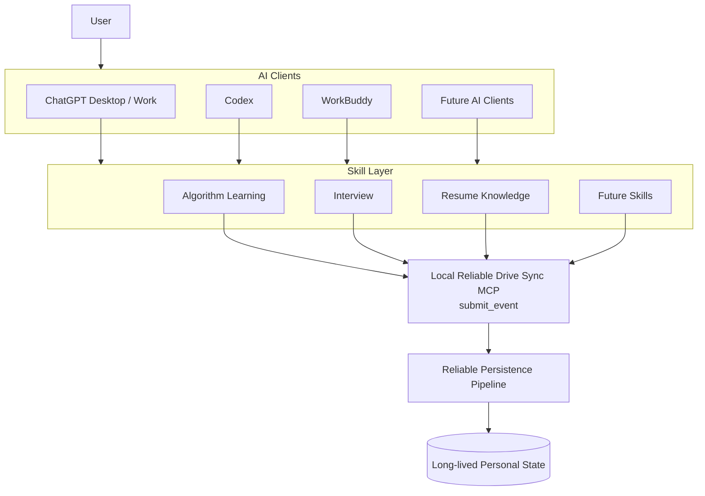

核心思想非常简单：

> **Skill 描述“发生了什么”。**

而不是：

> **Skill 决定“应该修改哪个文件”。**

---

# 3. The core contract

整个系统围绕一个非常小的 MCP Surface 构建。

当前 MCP 只暴露：

```text
submit_event
```

执行：

```text
tools/list
```

应该得到：

```json
[
  "submit_event"
]
```

这是一个刻意设计的约束。

系统并不提供：

```text
write_json
update_profile
append_file
save_snapshot
create_folder
upload_drive
delete_event
modify_user
```

因为一旦这些底层能力直接暴露给 Skill：

```text
Skill
  ↓
Storage Implementation
```

两层就重新耦合了。

正确的关系应该是：

```text
Skill
  ↓
Business Event
  ↓
Persistence Infrastructure
  ↓
Storage Implementation
```

---

# 4. Architecture Overview

这是当前 Reliable Drive Sync 2.0 的完整主链路：

```mermaid
flowchart TD

    subgraph HOSTS[AI Hosts]
        A[ChatGPT Desktop / Work]
        B[Codex]
        C[WorkBuddy]
    end

    subgraph LOCAL[Local Machine]
        MCP[stdio MCP Server<br/>submit_event]
        LS[(SQLite Local Outbox)]
        IC[(Identity Cache)]
    end

    subgraph CF[Cloudflare]
        INGRESS[Worker Ingress]
        D1[(D1 Cloud Outbox)]
        REC[Reconciler / Cron]
    end

    subgraph BROKER[Async Broker]
        QS[Upstash QStash]
    end

    subgraph WORKER[Sync Worker]
        SYNC[/v1/sync]
        ROUTER[Schema 1.2 Dispatcher]
        DOMAIN[Domain Stores]
    end

    subgraph STORAGE[Persistent State]
        DRIVE[(Google Drive)]
        REG[Global User Registry]
        EVENTS[Event Streams]
        PROJ[Snapshots / Plans / Projections]
    end

    A --> MCP
    B --> MCP
    C --> MCP

    MCP --> LS
    MCP <--> IC

    LS -->|POST /v1/jobs| INGRESS
    INGRESS --> D1

    D1 --> QS
    REC --> D1
    REC --> QS

    QS -->|signed request| SYNC
    SYNC --> ROUTER
    ROUTER --> DOMAIN

    DOMAIN --> DRIVE

    DRIVE --> REG
    DRIVE --> EVENTS
    DRIVE --> PROJ
```

可以压缩成：

```text
AI Client
    ↓
Local stdio MCP
    ↓
SQLite Local Outbox
    ↓
Worker /v1/jobs
    ↓
D1 Cloud Outbox
    ↓
QStash
    ↓
Worker /v1/sync
    ↓
Schema 1.2 Dispatcher
    ↓
Domain Store
    ↓
Google Drive
    ↓
Readback Verification
```

---

# 5. Why is the architecture so complicated?

因为系统试图解决的并不是：

> “网络正常时，把一个 JSON 上传成功。”

真正的问题是：

> **如果任何一个阶段失败，数据还能不能最终到达？**

例如：

```text
ChatGPT 崩溃
Codex 被关闭
电脑断网
Worker timeout
Worker 重启
D1 请求失败
QStash 发布失败
QStash 重试耗尽
Google OAuth 失败
Drive API 暂时失败
Profile Projection 失败
事件已经写入但 Snapshot 没写成功
相同 requestId 被重复提交
相同 eventKey 被重复生成
旧数据和新数据发生冲突
迁移过程中源数据发生变化
```

这些失败不能简单变成：

```text
event lost
```

因此 Reliable Drive Sync 使用了：

# 双层 Outbox

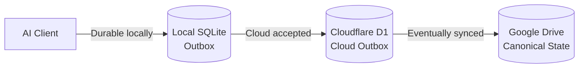

分别解决不同层级的故障。

---

# 6. Three persistence stages

整个系统必须严格区分三个状态。

## Stage 1 — Local Durable

```text
SQLite
✓

D1
?

Drive
?
```

意味着：

> 事件已经不会因为当前 AI 客户端退出而丢失。

---

## Stage 2 — Cloud Accepted

```text
SQLite
✓ / removed after acknowledgement

D1
✓

Drive
pending
```

意味着：

> 云端已经可靠接管这个任务。

但绝不意味着：

> Google Drive 已经写入完成。

---

## Stage 3 — Synced

```text
D1 Job
synced

Drive
✓

Readback
✓
```

只有这个阶段，异步持久化链路才真正结束。

---

# 7. Complete Write Sequence

一次普通业务写入实际经历如下过程：

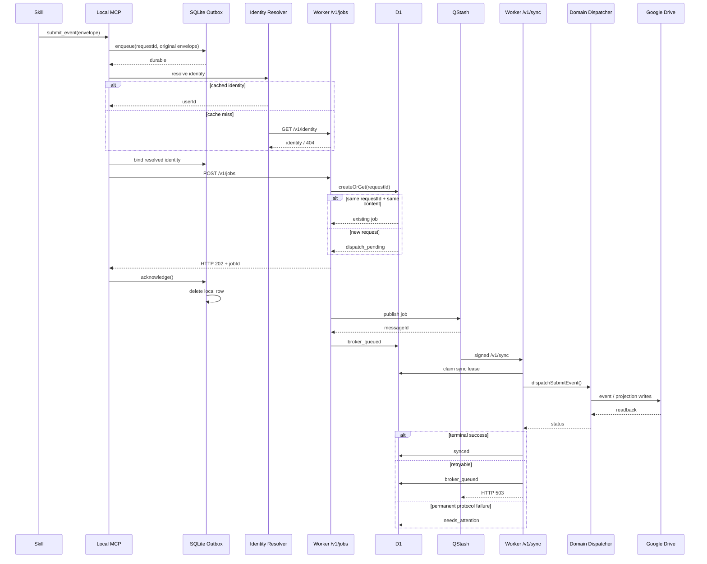

这张图基本就是整个项目的核心。

---

# 8. Local MCP Layer

本地入口：

```text
tools/reliable-drive-sync-mcp/
```

主要组件：

```text
stdio-bridge.mjs
delivery-service.mjs
local-outbox.mjs
start.cmd
setup-local-clients.ps1
```

职责拆分：

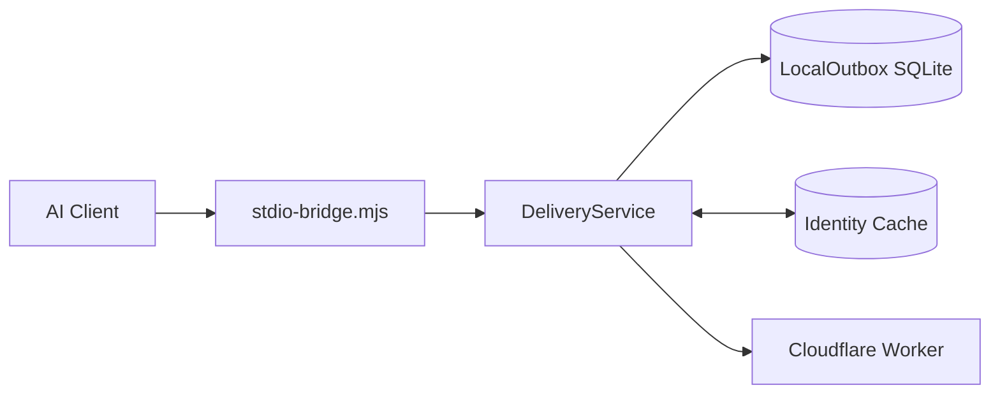

---

# 9. Local Outbox

本地 SQLite Outbox 是第一道可靠性边界。

默认数据库大致位于：

```text
%LOCALAPPDATA%/ReliableDriveSync/outbox.sqlite
```

也可以通过：

```text
RELIABLE_DRIVE_SYNC_OUTBOX_PATH
```

指定。

---

## Local Outbox states

当前本地事件只有三种状态：

```text
pending
sending
blocked
```

状态机：

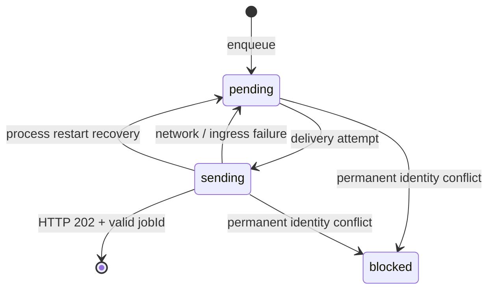

注意：

> `HTTP 202 + jobId` 是删除本地事件的唯一正常成功条件。

也就是说：

```text
POST request sent
```

不够。

```text
HTTP 200
```

也不够。

必须：

```text
HTTP 202
+
non-empty jobId
```

之后 Local Outbox 才认为云端已经正式接管。

---

# 10. Crash Recovery

假设程序执行到：

```text
pending
↓
sending
```

然后：

```text
ChatGPT / Codex / WorkBuddy
突然退出
```

数据库里可能留下：

```text
state = sending
```

下一次 `LocalOutbox` 初始化时会执行恢复：

```text
sending
↓
pending
```

因此：

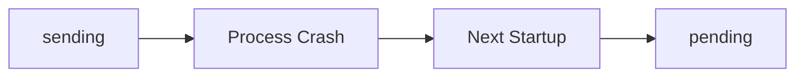

不会因为客户端退出而永久卡在 sending。

---

# 11. Background Local Retry

stdio MCP 运行期间，会定时执行：

```text
flushPending()
```

当前周期：

```text
30 seconds
```

因此 Local Outbox 不仅依赖下一次 Skill 调用触发重试。

它还有运行时自动 flush。

---

# 12. Older events are flushed first

当提交一个新事件时：

```text
new event
```

系统并不是只尝试发送当前事件。

它会从 Local Outbox 中读取：

```text
pending events
```

按照：

```text
created_at
request_id
```

排序，然后优先 flush 较早事件。

默认单轮最多处理：

```text
20 events
```

于是：


这对有依赖关系的事件非常重要。

---

# 13. Local request idempotency

Local Outbox 保存：

```text
request_id
input_hash
envelope_json
```

第一次：

```text
requestId = A
payload = X
```

保存成功。

再次提交：

```text
requestId = A
payload = X
```

允许重试。

但：

```text
requestId = A
payload = Y
```

会触发：

```text
request_id_conflict
```

因此 `requestId` 不是普通 UUID。

它是一个：

> **Idempotency Fence**

---

# 14. Why identity is bound after enqueue

一个非常重要的细节：

Local Outbox 首先保存的是：

> **调用方原始 Envelope**

然后才进行身份解析。

这样：

```text
network unavailable
```

不会阻止：

```text
local durability
```

身份解析成功后，系统可以把：

```text
userId
username
```

绑定到用于云端投递的 Envelope。

但最初的 `input_hash` 仍然代表原始调用内容。

因此：

```text
caller idempotency
```

与：

```text
identity enrichment
```

被分离。

---

# 15. Identity Architecture

整个生态只有一个全局身份系统。

不是：

```text
algorithm/user
interview/user
resume/user
```

分别拥有自己的 userId。

而是：

```text
Global User
     │
     ├── algorithm
     ├── interview
     ├── resume-knowledge
     └── future domains
```

---

# 16. Global identity resolution

身份核心输入：

```text
displayName / username
```

规范化规则：

```text
NFKC
+
trim
```

例如：

```text
Raw Name
   ↓
Unicode NFKC
   ↓
Trim whitespace
   ↓
Canonical displayName
```

系统不会进行随意的大小写折叠。

---

## Identity flow

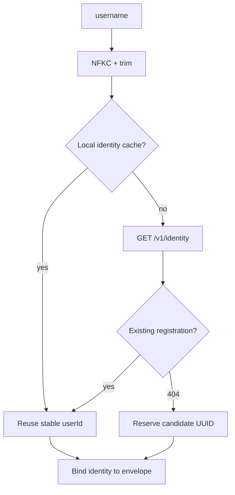

最终 Worker 仍然会在真正业务执行时验证身份一致性。

---

# 17. Global Identity Storage

Google Drive 中存在两份相互验证的身份记录。

## Global registry

```text
my-chatGPT-skills/
└── user-registry/
    └── registration-<userId>.json
```

---

## User identity

```text
my-chatGPT-skills/
└── users/
    └── <userId>/
        └── identity.json
```

---

系统验证：

```text
registration
      ↕
identity.json
```

必须一致。

如果出现：

```text
same name → multiple userIds
```

返回：

```text
user_conflict
```

如果：

```text
provided userId
≠
registered userId
```

返回：

```text
identity_mismatch
```

---

# 18. Identity creation

新身份的创建过程不是单文件写入。

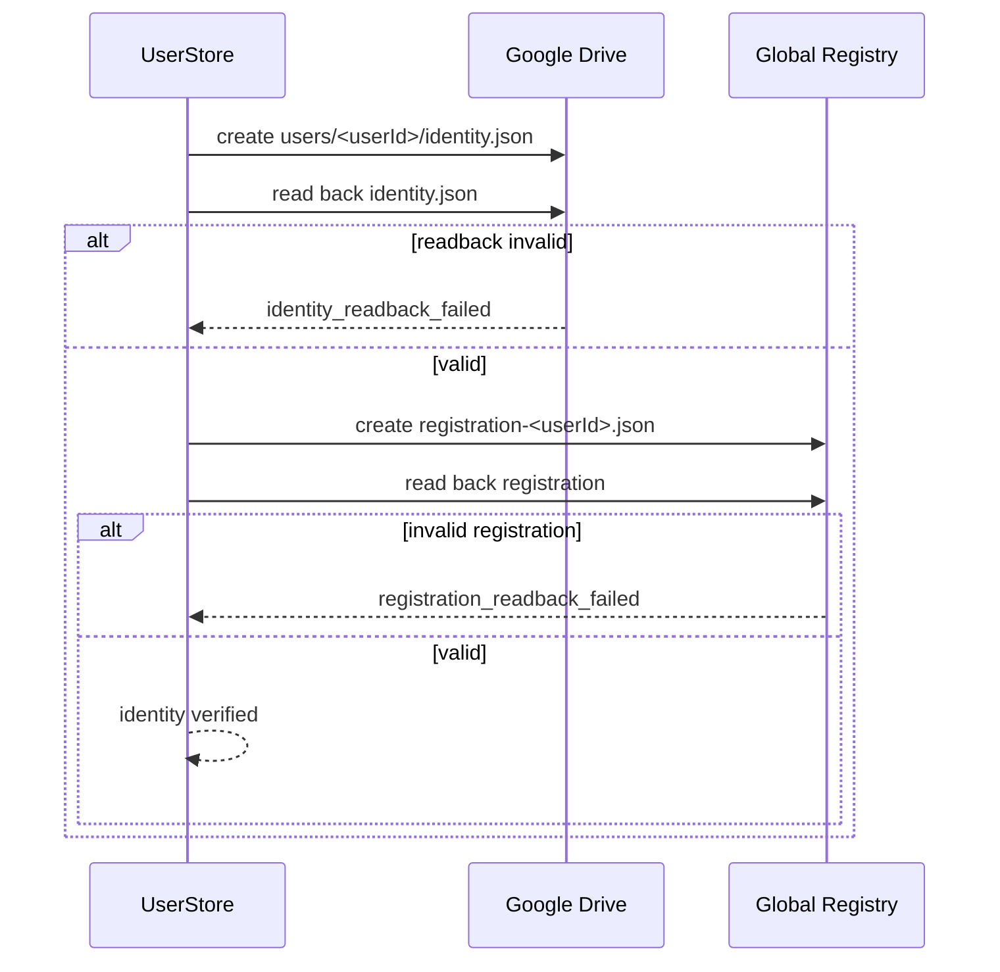

核心原则：

> **Write is not success until readback succeeds.**

---

# 19. Event Protocol

当前协议版本：

```text
schemaVersion = "1.2"
```

Envelope：

```json
{
  "schemaVersion": "1.2",
  "namespace": "interview",
  "eventType": "interview.session.completed",
  "identity": {
    "username": "Example User"
  },
  "payload": {
    "event": {}
  },
  "requestId": "550e8400-e29b-41d4-a716-446655440000"
}
```

允许的顶层字段严格限制为：

```text
schemaVersion
namespace
eventType
identity
payload
requestId
```

---

# 20. Namespaces

当前允许：

```text
system
algorithm
interview
resume-knowledge
```

---

# 21. Event Types

## System

```text
system.user-registered
system.legacy-migration-requested
```

## Algorithm

```text
algorithm.learning.completed
algorithm.daily-plan-created
```

## Interview

```text
interview.session.list
interview.session.load
interview.session.completed
interview.review.completed
```

## Resume Knowledge

```text
resume-knowledge.resume-ingested
resume-knowledge.claim-confirmed
resume-knowledge.claim-rejected
resume-knowledge.question-bank-created
resume-knowledge.daily-plan-created
resume-knowledge.answer-scored
```

---

# 22. Read vs Write Events

不是所有 `submit_event` 都真正进入 Outbox。

当前只读事件：

```text
interview.session.list
interview.session.load
```

以及：

```text
system.legacy-migration-requested
mode = dry-run
```

它们走：

```text
POST /v1/query
```

而不是：

```text
POST /v1/jobs
```

---

## Read flow

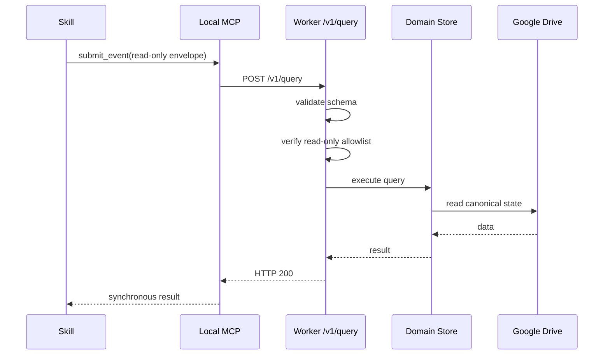

这类查询不会进入：

```text
SQLite Outbox
D1 Outbox
QStash
```

---

# 23. Worker Ingress

Worker 暴露：

```text
GET  /v1/identity
POST /v1/query
POST /v1/jobs
POST /v1/sync
POST /v1/qstash/failure
```

但这些接口职责完全不同。

---

## `/v1/identity`

只读身份查找：

```text
username
↓
global registry
↓
identity
```

它不会通过查询接口偷偷创建用户。

---

## `/v1/query`

只允许明确白名单内的同步读操作。

如果尝试通过 `/v1/query` 写入：

```text
write_requires_outbox
```

---

## `/v1/jobs`

所有正常业务写操作的云端入口。

职责：

```text
authenticate
↓
parse JSON
↓
validate envelope
↓
D1 createOrGet
↓
HTTP 202
↓
async dispatch
```

---

# 24. Worker authentication

Ingress 使用：

```text
Authorization: Bearer <MCP_BEARER_TOKEN>
```

Worker 对 Bearer Token 进行安全比较。

未配置 Secret：

```text
503 service_unavailable
```

缺失 Bearer：

```text
401 unauthorized
```

错误 Bearer：

```text
403 forbidden
```

---

# 25. Cloud Outbox

D1 表：

```text
schema12_jobs
```

核心字段：

```text
job_id
request_id
user_id
envelope_json
envelope_hash
state
dispatch_attempts
sync_attempts
last_error_code
lease_owner
lease_until
broker_message_id
created_at
updated_at
dispatched_at
completed_at
```

---

# 26. Cloud Job State Machine

这是云端最重要的一张图。

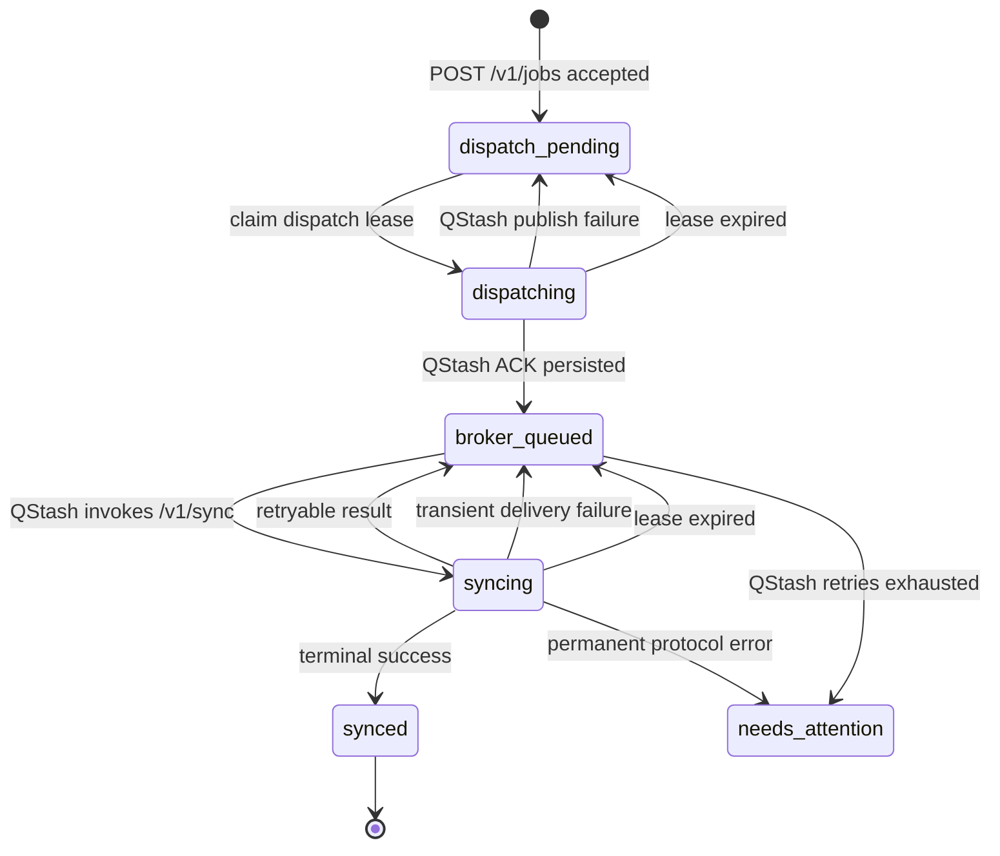

D1 允许的完整状态：

```text
dispatch_pending
dispatching
broker_queued
syncing
synced
needs_attention
```

---

# 27. Why leases exist

假设两个执行器同时尝试：

```text
dispatch(job)
```

或者：

```text
sync(job)
```

系统不能允许两个 Worker 同时真正执行。

因此：

```text
claim
↓
lease_owner
↓
lease_until
```

当前 Dispatch 和 Sync Lease 都大约是：

```text
5 minutes
```

---

## Lease model

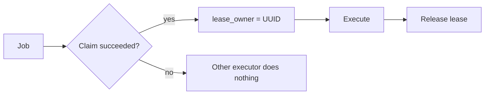

---

# 28. QStash Dispatch

当 D1 Job 为：

```text
dispatch_pending
```

Dispatcher 尝试：

```text
dispatch_pending
↓
dispatching
↓
QStash publish
```

QStash 使用：

```text
jobId
```

作为：

```text
Upstash-Deduplication-Id
```

并设置：

```text
failure callback
```

成功后 QStash 返回：

```text
messageId
```

只有这个 ACK 被成功写回 D1：

```text
broker_message_id
```

Job 才进入：

```text
broker_queued
```

---

# 29. QStash signature verification

`/v1/sync` 不是普通公开 webhook。

Worker 会验证：

```text
Upstash-Signature
```

包括：

```text
HS256
issuer = Upstash
subject = target URL
expiration
not-before
body SHA-256
current signing key
next signing key
```

因此：

```text
random external request
```

无法正常伪造同步任务。

---

# 30. QStash Sync Flow

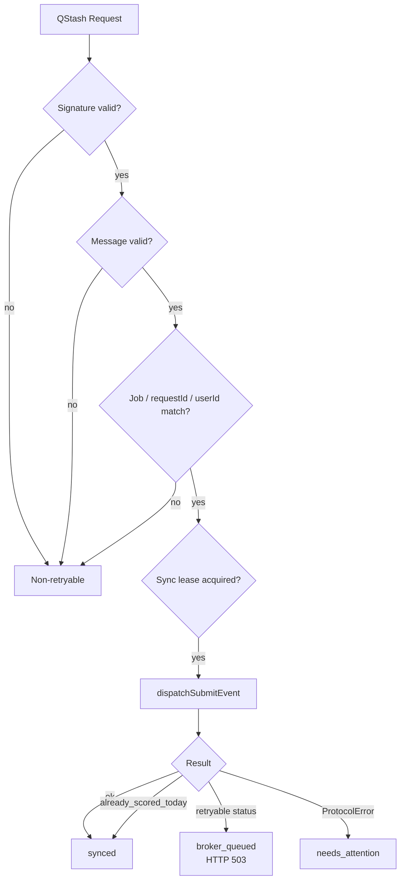

---

# 31. Terminal statuses

目前 Sync Worker 明确把：

```text
ok
already_scored_today
```

视为最终成功。

---

# 32. Retryable situations

以下类型的结果不会被当成整个任务完成：

```text
profile_cache_pending
resume_required
delivery failure
dependency not ready
projection incomplete
```

它们最终会让 QStash / Worker 再尝试执行。

---

# 33. `needs_attention`

某些错误并不是重试可以解决。

例如：

```text
invalid protocol
identity conflict
persistent semantic conflict
QStash retries exhausted
```

Job 会进入：

```text
needs_attention
```

同时 D1 中会创建：

```text
schema12_failure_notices
```

Failure Notice 包含：

```text
notice_id
user_id
category
message
status
opened_at
acknowledged_at
updated_at
```

同一个：

```text
user + category
```

只允许一个未解决的 open notice。

---

# 34. Failure callback

如果 QStash 自己已经把所有重试机会耗尽：

```mermaid
flowchart LR

    QS[QStash Retry Exhausted]

    CB[/v1/qstash/failure]

    VERIFY[Verify Signature]

    D1[(D1)]

    NOTICE[Failure Notice]

    QS --> CB
    CB --> VERIFY

    VERIFY --> D1
    D1 -->|job| D1

    D1 -->|state| ATT[needs_attention]
    ATT --> NOTICE
```

错误码：

```text
qstash_delivery_exhausted
```

---

# 35. Reconciler

QStash 不是唯一恢复机制。

Worker 还配置了 Cron：

```text
*/5 * * * *
0 * * * *
0 */6 * * *
```

当前三个 Cron 最终都会执行相同的核心 reconciliation：

```text
requeue expired leases
+
dispatch pending jobs
```

---

## Reconciliation flow

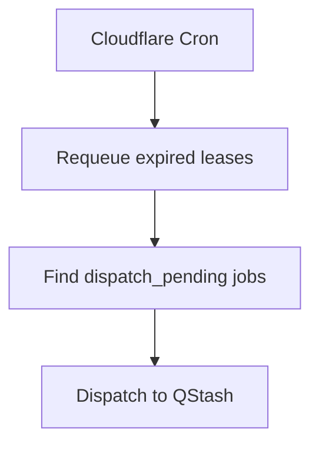

因此即使：

```text
POST /v1/jobs
```

成功写入 D1 后：

```text
context.waitUntil(dispatch)
```

没有顺利完成，

任务也不会永久遗失。

后续 Cron 可以重新发现：

```text
dispatch_pending
```

并再次发送。

---

# 36. Reliability Layers

整个系统实际上有多层恢复机制：

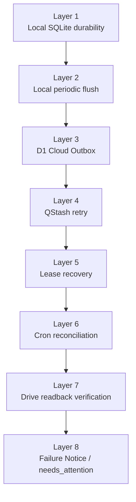

这也是 Reliable Drive Sync 真正的核心价值。

---

# 37. Business Dispatcher

Cloud Outbox 只是负责“可靠送达”。

真正执行业务语义的是：

```text
dispatchSubmitEvent()
```

它会：

```text
inspect envelope
↓
bind identity
↓
validate domain event
↓
select event handler
↓
call domain store
```

---

## Dispatcher architecture

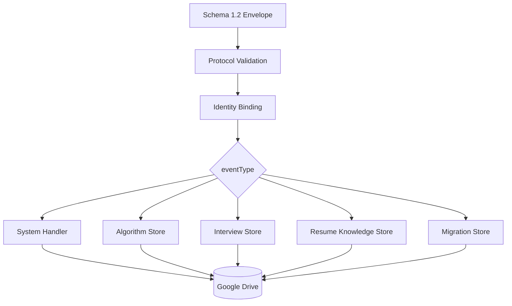

---

# 38. Read-only identity rule

有一组事件非常特殊：

```text
system.legacy-migration-requested
interview.session.list
interview.session.load
```

这些操作不会：

> 因为一次读取而偷偷创建用户。

也就是说：

```text
read
≠
side-effectful registration
```

对于这些事件：

```text
existing identity
→ verify

unknown identity
→ error
```

---

# 39. Canonical Storage Layout

所有正常新数据都位于：

```text
DriveRoot/
└── my-chatGPT-skills/
```

完整结构：

```text
DriveRoot/
└── my-chatGPT-skills/
    │
    ├── user-registry/
    │   └── registration-<userId>.json
    │
    └── users/
        └── <userId>/
            │
            ├── identity.json
            │
            ├── algorithm/
            │   ├── events/
            │   │   └── event-<eventId>.json
            │   │
            │   ├── profile/
            │   │   └── snapshots/
            │   │       └── snapshot-<timestamp>-<headEventId>.json
            │   │
            │   └── plans/
            │       └── daily/
            │           └── daily-plan-<date>-<planId>.json
            │
            ├── interview/
            │   ├── events/
            │   │   └── event-<eventId>.json
            │   │
            │   └── profile/
            │       └── snapshots/
            │           └── snapshot-<timestamp>-<headEventId>.json
            │
            └── resume-knowledge/
                ├── sources/
                │   └── resume/
                │       └── snapshots/
                │           └── resume-<version>-<fingerprint>.json
                │
                ├── question-bank/
                │   └── snapshots/
                │       └── question-bank-<version>-<eventId>.json
                │
                ├── events/
                │   └── event-<eventId>.json
                │
                ├── profile/
                │   └── snapshots/
                │       └── snapshot-<timestamp>-<headEventId>.json
                │
                └── plans/
                    └── daily/
                        └── daily-plan-<date>-<planId>.json
```

---

# 40. Storage paths are allow-listed

Domain Store 不能任意构造 Google Drive 路径。

Storage Layout 只允许预定义 Domain：

```text
algorithm
interview
resume-knowledge
```

以及每个 Domain 的合法路径。

例如 Algorithm：

```text
events
profile/snapshots
plans/daily
```

尝试：

```text
..
../
\
arbitrary/folder
```

会被拒绝。

因此业务代码没有一个“任意 Drive path writer”。

---

# 41. Event Store

三个主要 Domain 都共享 Event Store 模型。

Event 是系统中的：

> **Immutable Fact**

典型流程：

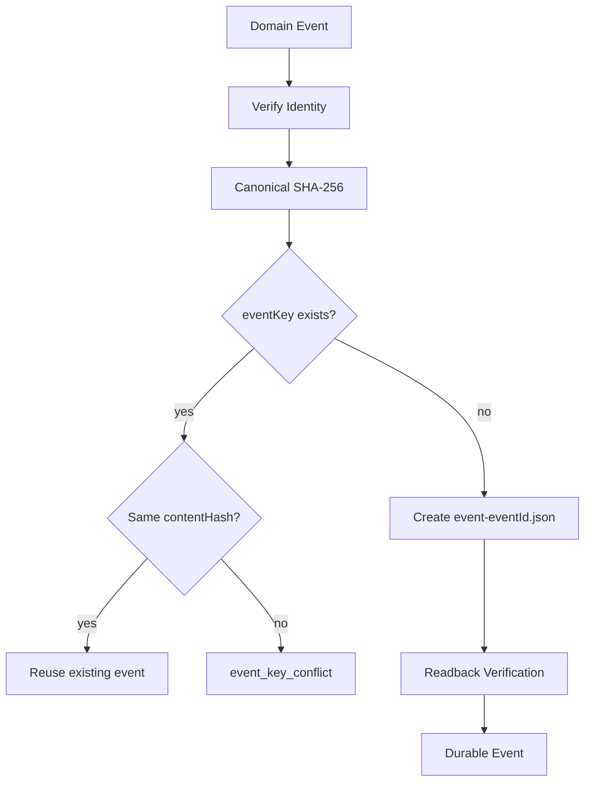

---

# 42. Two idempotency layers

系统实际上有两个不同级别的幂等机制。

## Transport idempotency

```text
requestId
```

用于：

```text
Local Outbox
D1 Job
```

防止：

```text
network retry
duplicate MCP call
```

---

## Business idempotency

```text
eventKey
```

用于：

```text
Domain Event Store
```

防止业务上重复产生同一事件。

---

因此：

```text
requestId
≠
eventKey
```

两者解决的问题完全不同。

---

# 43. Event content hash

事件保存前计算：

```text
SHA-256
```

Hash 基于 canonical JSON。

计算时：

```text
contentHash
```

字段自身被排除。

最终事件中保存：

```text
contentHash
```

读取时再次计算并验证。

因此一个 Event 文件必须同时满足：

```text
correct filename
correct parent
correct eventId
correct userId
correct username
correct schemaVersion
correct contentHash
```

才被视为有效事件。

---

# 44. Event + Projection architecture

系统并不是只保存“当前状态”。

更接近：

```text
Events
+
Derived Projections
```

结构：

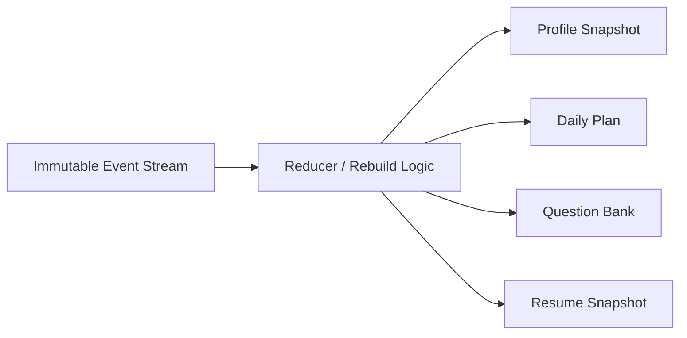

这意味着：

> Projection 可以失败。

但已经可靠写入的 Event 仍然可以保留。

之后可以从 Event Stream 重新构建 Projection。

---

# 45. Algorithm Domain

Algorithm Domain 当前处理：

```text
algorithm.learning.completed
algorithm.daily-plan-created
```

---

## Learning flow

```mermaid
flowchart TD

    LEARN[algorithm.learning.completed]

    EVENT[Append immutable event]

    ALL[Load verified algorithm events]

    REDUCE[rebuildAlgorithmProfile]

    SNAP[Create profile snapshot]

    READ[Readback verify]

    OK[status = ok]

    CACHE[status = profile_cache_pending]

    LEARN --> EVENT

    EVENT --> ALL
    ALL --> REDUCE
    REDUCE --> SNAP

    SNAP --> READ
    READ -->|success| OK

    SNAP -->|failure| CACHE
    READ -->|failure| CACHE
```

非常重要：

如果：

```text
event write
✓

profile snapshot
✗
```

系统不会说整个业务数据都不存在。

而是返回：

```text
profile_cache_pending
```

意味着：

> 事实已经存在，但派生缓存需要重新构建。

---

# 46. Algorithm Daily Plan

Daily Plan 使用：

```text
localDate
+
planId
```

形成文件：

```text
daily-plan-<localDate>-<planId>.json
```

如果已经存在：

```text
reuse
```

而不是覆盖。

因此 Daily Plan 更接近：

> Immutable projection.

---

# 47. Interview Domain

Interview Domain 分成：

```text
Session
Review
Profile
```

主要事件：

```text
interview.session.completed
interview.review.completed
```

读取：

```text
interview.session.list
interview.session.load
```

---

# 48. Interview workflow

```mermaid
flowchart TD

    SESSION[Interview Session]

    SE[interview.session.completed]

    STORE1[Event Store]

    WAIT[review_pending]

    REVIEW[Review Process]

    RE[interview.review.completed]

    SOURCE{Source session exists?}

    STORE2[Append Review Event]

    PROFILE[Rebuild Interview Profile]

    SNAP[Profile Snapshot]

    DONE[status = ok]

    CACHE[profile_cache_pending]

    SESSION --> SE
    SE --> STORE1
    STORE1 --> WAIT

    WAIT --> REVIEW
    REVIEW --> RE

    RE --> SOURCE

    SOURCE -->|yes| STORE2
    SOURCE -->|no| ERR[source_session_not_found]

    STORE2 --> PROFILE
    PROFILE --> SNAP

    SNAP -->|success| DONE
    SNAP -->|failure| CACHE
```

---

# 49. Interview Review dependency

Review 不能凭空存在。

它必须引用：

```text
sourceSessionEventId
```

系统会验证：

```text
review.sessionId
=
source session.sessionId
```

以及：

```text
source event belongs to same identity
```

如果源 Session 不存在：

```text
source_session_not_found
```

---

# 50. Interview Review Version

Review 使用：

```text
reviewVersion
```

并要求 `eventKey` 的版本信息与：

```text
reviewVersion
```

一致。

这样可以支持：

```text
v1
v2
v3
...
```

形式的 Review 演进，而不是直接覆盖历史结果。

---

# 51. Interview Profile Projection

Review Event 写入成功后：

```text
all interview events
↓
rebuildInterviewProfile()
↓
profile snapshot
```

如果：

```text
Review Event
✓

Profile Snapshot
✗
```

返回：

```text
profile_cache_pending
```

因此：

> Event 是事实。

> Profile 是可重建状态。

---

# 52. Interview local artifacts

Interview 业务可能在本地生成：

```text
session JSON
report JSON
report DOCX
```

例如：

```text
outputs/interview/<userId>/
```

但云端事件管道只上传：

> **结构化 JSON Event**

不会把：

```text
Markdown transcript
Base64 document
DOCX report
```

塞入事件同步链路。

---

# 53. Resume Knowledge Domain

这是当前业务最复杂的 Domain。

它包含：

```text
Resume
Claims
Question Bank
Daily Plan
Answer Score
Knowledge Profile
```

完整业务关系：

```mermaid
flowchart TD

    RESUME[Resume]

    INGEST[resume.ingested]

    RS[Resume Snapshot]

    CLAIMS[Claims]

    DECIDE[Confirm / Reject]

    QB[Question Bank]

    PLAN[Daily Plan]

    QUESTION[Question]

    ANSWER[Answer]

    SCORE[answer.scored]

    PROFILE[Knowledge Profile Snapshot]

    RESUME --> INGEST
    INGEST --> RS
    INGEST --> CLAIMS

    CLAIMS --> DECIDE
    DECIDE --> QB

    QB --> PLAN
    PLAN --> QUESTION

    QUESTION --> ANSWER
    ANSWER --> SCORE

    SCORE --> PROFILE
```

---

# 54. Resume ingestion

事件：

```text
resume-knowledge.resume-ingested
```

会先保存 Event。

然后创建：

```text
resume-<version>-<fingerprint>.json
```

但是：

> **原始简历文件不会直接被持久化到这个 Projection。**

保存的是结构化信息：

```text
resumeVersion
fingerprint
claims
claimRelations
techTags
evidenceLocations
sourceEventId
sourceEventKey
```

因此该 Domain 存储的是：

> Resume Knowledge Representation

而不是简单的文件备份。

---

# 55. Claim decisions

事件：

```text
resume-knowledge.claim-confirmed
resume-knowledge.claim-rejected
```

只记录：

> Claim Decision

它们不会回头修改：

```text
Resume Snapshot
```

也不会覆盖：

```text
Question Bank
```

未来状态通过 Event Replay 推导。

---

# 56. Question Bank

事件：

```text
resume-knowledge.question-bank-created
```

形成：

```text
question-bank-<resumeVersion>-<eventId>.json
```

新版本 Question Bank：

```text
create new snapshot
```

旧版本：

```text
preserved
```

不会就地覆盖。

---

# 57. Daily Plan dependency

Resume Daily Plan 依赖：

```text
latest Question Bank
```

如果不存在：

```text
status = resume_required
reason = question_bank_missing
```

因此业务依赖关系明确存在：

```mermaid
flowchart LR

    RESUME[Resume]

    BANK[Question Bank]

    PLAN[Daily Plan]

    RESUME --> BANK
    BANK --> PLAN
```

---

# 58. Immutable daily plan

同一天已经生成计划：

```text
daily-plan-2026-09-03-xxx.json
```

再次请求：

```text
same localDate
```

系统直接返回已经存在的 Plan。

不会因为模型重新生成一次而改变当天计划。

---

# 59. Answer scoring rule

这是 Resume Knowledge 中一个非常特殊的业务约束。

对于：

```text
userId
+
localDate
+
questionKey
```

一天只记录第一次有效评分。

---

## Scoring flow

```mermaid
flowchart TD

    SCORE[resume-knowledge.answer-scored]

    BANK{Question Bank exists?}

    EVENTS[Load verified score events]

    REPLAY{Same eventKey replay?}

    TODAY{Already scored today?}

    APPEND[Append score event]

    PROFILE[Rebuild knowledge profile]

    SNAP[Create profile snapshot]

    OK[status = ok]

    DUP[status = already_scored_today]

    REQ[status = resume_required]

    SCORE --> BANK

    BANK -->|no| REQ
    BANK -->|yes| EVENTS

    EVENTS --> REPLAY

    REPLAY -->|yes| APPEND
    REPLAY -->|no| TODAY

    TODAY -->|yes| DUP
    TODAY -->|no| APPEND

    APPEND --> PROFILE
    PROFILE --> SNAP

    SNAP -->|success| OK
    SNAP -->|failure| CACHE[profile_cache_pending]
```

---

# 60. Why replay is special

假设：

```text
score event
```

已经成功写入。

但：

```text
profile snapshot
```

失败。

异步 Worker 重试同一个 Event 时：

```text
same eventKey
```

它必须被视为：

> Projection Retry

而不是：

> 今天第二次答题。

否则就会出现：

```text
event successful
↓
snapshot failed
↓
retry
↓
already_scored_today
↓
snapshot永远无法修复
```

因此系统专门区分：

```text
same event replay
```

与：

```text
new second scoring attempt
```

---

# 61. Resume profile rebuilding

成功评分后：

```text
all verified events
+
latest question bank
↓
rebuildResumeKnowledgeProfile()
↓
profile snapshot
```

Profile 仍然遵循：

```text
Events = source facts
Snapshot = derived state
```

---

# 62. Projection write discipline

Resume Knowledge 中大多数 Projection 都使用同一种模式：

```mermaid
flowchart TD

    P[Projection Value]

    PATH[Resolve canonical folder]

    EXISTS{Same filename exists?}

    READ[Read existing]

    SAME{Same content?}

    REUSE[Reuse]

    CONFLICT[projection_conflict]

    CREATE[Create JSON]

    VERIFY[Readback verify]

    DONE[Projection durable]

    P --> PATH
    PATH --> EXISTS

    EXISTS -->|yes| READ
    READ --> SAME

    SAME -->|yes| REUSE
    SAME -->|no| CONFLICT

    EXISTS -->|no| CREATE
    CREATE --> VERIFY
    VERIFY --> DONE
```

因此系统不会：

```text
same key
+
different content
→ overwrite
```

而是：

```text
projection_conflict
```

---

# 63. Readback Verification

这是整个项目另一个非常重要的设计原则。

系统不会认为：

```text
Drive create API returned success
```

就代表真正完成。

典型写入：

```text
create
↓
read
↓
verify
↓
success
```

验证内容可能包括：

```text
file id
filename
parent folder
JSON content
content hash
identity
schema version
```

---

# 64. Why readback matters

因为：

```text
API accepted
```

与：

```text
canonical persistent state exists exactly as expected
```

并不是完全相同的语义。

因此项目整体遵循：

> **Persist, then prove persistence.**

---

# 65. Legacy compatibility

历史上系统曾存在：

```text
pre-normalization namespace roots
```

现在统一到：

```text
DriveRoot/my-chatGPT-skills/
```

但是：

> 系统不会自动破坏、移动或删除旧数据。

Canonical Event Store 在某些情况下还可以读取 Legacy 数据：

```text
canonical events folder exists
→ canonical wins

canonical folder absent
→ legacy fallback
```

---

# 66. Legacy Migration

迁移入口：

```text
system.legacy-migration-requested
```

只支持历史 Domain：

```text
algorithm
interview
```

迁移范围目前限定到：

```text
events
profile/snapshots
```

---

# 67. Migration is deliberately two-phase

完整迁移：

```mermaid
flowchart TD

    START[Migration Request]

    DRY[dry-run]

    SCAN[Scan Legacy]

    HASH[Hash Sources]

    TARGET[Compare Canonical Targets]

    PLAN[Build Migration Plan]

    APPROVE[Human / Caller Approval]

    EXEC[execute]

    RESCAN[Re-scan Sources]

    VERIFY{Plan Hash unchanged?}

    CONFLICT{Any conflict?}

    PREFLIGHT[Preflight all copy targets]

    COPY[Copy missing objects]

    READBACK[Readback + hash verify]

    RECEIPT[Migration Receipt]

    START --> DRY
    DRY --> SCAN
    SCAN --> HASH
    HASH --> TARGET
    TARGET --> PLAN

    PLAN --> APPROVE
    APPROVE --> EXEC

    EXEC --> RESCAN
    RESCAN --> VERIFY

    VERIFY -->|no| STALE[migration_plan_stale]
    VERIFY -->|yes| CONFLICT

    CONFLICT -->|yes| STOP[migration_conflict]
    CONFLICT -->|no| PREFLIGHT

    PREFLIGHT --> COPY
    COPY --> READBACK
    READBACK --> RECEIPT
```

---

# 68. Dry Run

Dry Run：

```text
mode = dry-run
```

只做：

```text
scan
hash
compare
plan
```

绝不写数据。

输出每个对象的：

```text
source
target
contentHash
action
reason
```

Action：

```text
copy
skip
conflict
```

---

# 69. Approved Plan Hash

Dry Run 生成：

```text
planHash
migrationId
```

Execute 必须提供：

```text
migrationId
approvedPlanHash
```

执行时重新扫描。

如果：

```text
currentPlanHash
≠
approvedPlanHash
```

返回：

```text
migration_plan_stale
```

这意味着：

> 用户批准的是一个确定的数据集合，而不是“随便迁移当前有什么”。

---

# 70. Migration conflict policy

目标已经存在时：

### Same content

```text
skip
```

### Different content

```text
conflict
```

绝不会：

```text
overwrite
```

---

# 71. Migration preflight

Execute 在真正复制第一个文件之前会：

1. 再次读取所有待复制 Source；
2. 再次校验 Source Hash；
3. 检查所有 Target；
4. 确认没有并发 Target 变化。

然后才真正开始写。

目的是避免：

```text
copy file 1
copy file 2
发现 file 3 冲突
```

导致部分迁移。

---

# 72. Legacy source is permanently read-only

迁移系统对 Legacy 数据遵守：

```text
READ
✓

CREATE canonical copy
✓

UPDATE source
✗

MOVE source
✗

DELETE source
✗

OVERWRITE source
✗
```

核心原则：

> **Copy forward, never mutate history.**

---

# 73. Migration Receipt

成功迁移后：

```text
users/<userId>/
└── migration-<migrationId>-receipt.json
```

记录：

```text
migrationId
planHash
startedAt
finishedAt
summary
source
target
contentHash
action
```

因此迁移是可审计的。

---

# 74. Complete Failure Model

| Failure | Local Event | Cloud Job | Result |
|---|---|---|---|
| Client crashes before submit | not created | none | caller responsibility |
| Client crashes after SQLite enqueue | durable | none | retry later |
| Identity lookup network failure | durable | none/pending | retry |
| Worker unavailable | durable | none | retry |
| `/v1/jobs` non-202 | durable | none | retry |
| D1 accepted | local row removed | durable | cloud owns delivery |
| QStash publish failure | removed locally | `dispatch_pending` | Cron retry |
| Dispatcher lease expires | removed locally | requeued | retry |
| QStash delivery fails transiently | removed locally | `broker_queued` | QStash retry |
| Sync lease expires | removed locally | requeued | retry |
| Drive transient failure | removed locally | retryable | retry |
| Event durable, profile fails | removed locally | retryable | rebuild projection |
| Protocol conflict | removed locally | `needs_attention` | operator action |
| QStash retries exhausted | removed locally | `needs_attention` | failure notice |
| Duplicate requestId / same payload | safe reuse | safe reuse | idempotent |
| Duplicate requestId / different payload | conflict | conflict | rejected |
| Duplicate eventKey / same event | reuse | existing event | idempotent |
| Duplicate eventKey / different event | conflict | protocol/business failure | rejected |

---

# 75. Receipt semantics

Local MCP 返回的最重要状态有两个。

---

## `cloud_accepted`

示例：

```json
{
  "status": "queued",
  "accepted": true,
  "deliveryState": "cloud_accepted",
  "persistence": {
    "localOutbox": "acknowledged",
    "cloudOutbox": "accepted",
    "drive": "pending"
  }
}
```

准确含义：

```text
Local SQLite
✓

Cloud D1
✓

Google Drive
pending
```

Skill 可以说：

> Cloud Outbox 已接收。

不能说：

> Google Drive 已保存。

---

# 76. `pending`

示例：

```json
{
  "status": "queued_locally",
  "accepted": false,
  "deliveryState": "pending",
  "persistence": {
    "localOutbox": "durable",
    "cloudOutbox": "pending",
    "drive": "pending"
  }
}
```

准确含义：

```text
Local SQLite
✓

Cloud
unknown / pending

Drive
pending
```

可以安全关闭客户端。

事件仍然留在本地等待重试。

---

# 77. Security Boundaries

系统目前刻意：

> **不提供公开远程 MCP Server。**

不存在：

```text
/mcp/<token>
public MCP endpoint
Secure MCP Tunnel
public capability URL
```

AI Host 连接：

```text
local stdio MCP
```

Local MCP 再访问：

```text
authenticated Worker HTTP API
```

---

## Trust boundaries

```mermaid
flowchart LR

    AI[AI Client]

    LOCAL[Local stdio MCP]

    WORKER[Worker Ingress]

    Q[QStash]

    SYNC[Sync Endpoint]

    DRIVE[Google Drive]

    AI -->|stdio| LOCAL

    LOCAL -->|Bearer Token| WORKER

    WORKER -->|QStash Token| Q

    Q -->|Signed JWT-like signature| SYNC

    SYNC -->|OAuth / Service Account| DRIVE
```

---

# 78. Secrets

以下内容不能提交 Git：

```text
MCP_BEARER_TOKEN

QSTASH_TOKEN
QSTASH_CURRENT_SIGNING_KEY
QSTASH_NEXT_SIGNING_KEY

GOOGLE_DRIVE_FOLDER_ID

GOOGLE_OAUTH_CLIENT_ID
GOOGLE_OAUTH_CLIENT_SECRET
GOOGLE_OAUTH_REFRESH_TOKEN

GOOGLE_SERVICE_ACCOUNT_JSON
```

---

# 79. Repository Structure

```text
my-chatgpt-mcp/
│
├── .codex-plugin/
│   └── plugin.json
│
├── docs/
│   └── superpowers/
│       ├── plans/
│       └── specs/
│
├── services/
│   └── reliable-drive-sync-worker/
│       │
│       ├── migrations/
│       │   └── 0005_schema12_jobs.sql
│       │
│       ├── src/
│       │   ├── index.js
│       │   ├── ingress.js
│       │   ├── protocol.js
│       │   ├── job-repository.js
│       │   ├── dispatcher.js
│       │   ├── qstash.js
│       │   ├── sync.js
│       │   ├── reconciler.js
│       │   │
│       │   ├── submit-event.js
│       │   ├── storage-layout.js
│       │   ├── google-drive.js
│       │   ├── user-store.js
│       │   ├── event-store.js
│       │   │
│       │   ├── algorithm-store.js
│       │   ├── algorithm-profile-model.js
│       │   │
│       │   ├── interview-store.js
│       │   ├── profile-model.js
│       │   │
│       │   ├── resume-knowledge-store.js
│       │   ├── resume-knowledge-model.js
│       │   │
│       │   ├── migration-store.js
│       │   └── legacy-reader.js
│       │
│       ├── test/
│       ├── README.md
│       ├── package.json
│       └── wrangler.toml
│
├── tools/
│   └── reliable-drive-sync-mcp/
│       ├── stdio-bridge.mjs
│       ├── delivery-service.mjs
│       ├── local-outbox.mjs
│       ├── setup-local-clients.ps1
│       ├── start.cmd
│       ├── test/
│       ├── README.md
│       └── package.json
│
├── .env.example
├── package.json
└── README.md
```

---

# 80. Responsibility Map

| Component | Responsibility |
|---|---|
| `stdio-bridge.mjs` | MCP JSON-RPC entry |
| `delivery-service.mjs` | identity + local/cloud delivery orchestration |
| `local-outbox.mjs` | SQLite durability |
| `ingress.js` | Worker HTTP ingress/auth |
| `protocol.js` | Schema 1.2 validation |
| `job-repository.js` | D1 Cloud Outbox |
| `dispatcher.js` | D1 → QStash dispatch |
| `qstash.js` | broker publisher |
| `sync.js` | QStash delivery execution |
| `reconciler.js` | cron recovery |
| `submit-event.js` | domain router |
| `user-store.js` | global identity |
| `event-store.js` | immutable event persistence |
| `storage-layout.js` | canonical path policy |
| `algorithm-store.js` | algorithm domain |
| `interview-store.js` | interview domain |
| `resume-knowledge-store.js` | resume knowledge domain |
| `migration-store.js` | legacy migration |
| `google-drive.js` | Drive persistence adapter |

---

# 81. Quick Start

## Requirements

```text
Node.js >= 22
```

检查：

```bash
node --version
npm --version
```

---

## Clone

```bash
git clone https://github.com/gitgotcha/my-chatgpt-mcp.git
cd my-chatgpt-mcp
```

---

# 82. Run Tests

完整测试：

```bash
npm test
```

Worker：

```bash
npm run test:worker
```

Local MCP：

```bash
npm run test:bridge
```

---

# 83. Deploy Worker

```bash
cd services/reliable-drive-sync-worker
```

应用 D1 Migration：

```bash
npx wrangler d1 migrations apply reliable-drive-sync --remote
```

部署：

```bash
npx wrangler deploy
```

或者根目录：

```bash
npm run deploy:worker
```

---

# 84. Configure Worker Secrets

推荐 Google OAuth：

```bash
wrangler secret put MCP_BEARER_TOKEN

wrangler secret put QSTASH_TOKEN
wrangler secret put QSTASH_CURRENT_SIGNING_KEY
wrangler secret put QSTASH_NEXT_SIGNING_KEY

wrangler secret put GOOGLE_DRIVE_FOLDER_ID

wrangler secret put GOOGLE_OAUTH_CLIENT_ID
wrangler secret put GOOGLE_OAUTH_CLIENT_SECRET
wrangler secret put GOOGLE_OAUTH_REFRESH_TOKEN
```

也支持：

```bash
wrangler secret put GOOGLE_SERVICE_ACCOUNT_JSON
```

Service Account 更适合 Shared Drive 等场景。

对于普通 My Drive，OAuth 通常更加合适。

---

# 85. Configure Local Clients

Windows PowerShell：

```powershell
$env:RELIABLE_DRIVE_SYNC_INGRESS_SHARED_SECRET = '<Worker MCP_BEARER_TOKEN>'

.\tools\reliable-drive-sync-mcp\setup-local-clients.ps1
```

Local Bridge 使用：

```text
RELIABLE_DRIVE_SYNC_INGRESS_URL
RELIABLE_DRIVE_SYNC_INGRESS_SHARED_SECRET
RELIABLE_DRIVE_SYNC_NODE_PATH
RELIABLE_DRIVE_SYNC_OUTBOX_PATH
```

其中后两个可选。

---

# 86. Client Topology

当前主要支持：

```text
ChatGPT Desktop / Work
Codex
Codex IDE integration
WorkBuddy
```

它们最终共享同一套：

```text
start.cmd
↓
stdio-bridge.mjs
↓
Local SQLite Outbox
```

因此多个 AI Client 使用的是同一种持久化协议。

---

# 87. Relationship with `my-chatgpt-skills`

Skill 生态：

```text
gitgotcha/my-chatgpt-skills
```

Persistence Infrastructure：

```text
gitgotcha/my-chatgpt-mcp
```

两者关系：

```mermaid
flowchart TD

    SKILLS[my-chatgpt-skills]

    CONTRACT[Schema 1.2 Event Contract]

    MCP[my-chatgpt-mcp]

    STATE[(Persistent Personal State)]

    SKILLS --> CONTRACT
    CONTRACT --> MCP
    MCP --> STATE
```

---

# 88. Separation of Responsibilities

## Skills own

```text
Business Logic
Prompting
Reasoning
User Interaction
Event Construction
Domain Semantics
```

## MCP Infrastructure owns

```text
Identity
Schema Validation
Durability
Retry
Idempotency
Queueing
Cloud Delivery
Storage Layout
Readback Verification
Migration Safety
```

这个边界非常重要。

---

# 89. What a Skill should know

理想情况下，Skill 只需要知道：

```text
What event happened?
```

例如：

```text
algorithm.learning.completed
```

而不需要知道：

```text
Google Drive Folder ID
OAuth Access Token
D1 table name
QStash endpoint
SQLite file path
snapshot filename
retry interval
lease duration
```

---

# 90. What a Skill must never assume

收到：

```text
cloud_accepted
```

时不能说：

```text
Google Drive saved successfully.
```

正确表达：

```text
The event has been accepted by the durable cloud queue
and will be persisted asynchronously.
```

---

# 91. System Invariants

整个架构最重要的不变量：

### Persistence

```text
No network call before local durability.
```

### Cloud acknowledgement

```text
No local deletion before HTTP 202 + jobId.
```

### Identity

```text
One canonical global user identity.
```

### Transport idempotency

```text
requestId identifies one immutable request.
```

### Event idempotency

```text
eventKey identifies one immutable business event.
```

### History

```text
Events are append-oriented.
```

### Projection

```text
Derived state may be rebuilt from events.
```

### Storage

```text
Only canonical allow-listed paths are writable.
```

### Migration

```text
Legacy data is read-only.
```

### Conflict handling

```text
Conflict > overwrite.
```

### Verification

```text
Write success requires readback evidence.
```

---

# 92. What this architecture is really building

表面上：

```text
Skill
→
Google Drive
```

实际上：

```text
AI
→
Event
→
Durable Queue
→
Identity
→
Event Store
→
Projection
→
Long-term Personal State
```

---

# 93. From stateless AI to long-lived AI

传统 AI Workflow：

```text
Prompt
↓
Reason
↓
Answer
↓
Conversation ends
```

长期个人 AI：

```mermaid
flowchart LR

    OBSERVE[Observe]

    REASON[Reason]

    ACT[Act]

    EVENT[Record Event]

    STATE[Persist State]

    LEARN[Update Profile]

    FUTURE[Future Interaction]

    OBSERVE --> REASON
    REASON --> ACT
    ACT --> EVENT
    EVENT --> STATE
    STATE --> LEARN
    LEARN --> FUTURE
    FUTURE --> OBSERVE
```

---

# 94. Why persistence matters

如果 AI 没有可靠长期状态：

```text
Agent
≈
Disposable Process
```

拥有：

```text
Identity
+
Events
+
Profiles
+
Plans
+
History
+
Reliable Persistence
```

之后：

```text
Agent
→
Long-lived Personal System
```

---

# 95. Current Status

当前架构：

```text
Reliable Drive Sync 2.0.0
```

事件协议：

```text
Schema 1.2
```

唯一 MCP Tool：

```text
submit_event
```

当前 Domain：

```text
algorithm
interview
resume-knowledge
```

本地可靠层：

```text
SQLite
```

云端可靠层：

```text
Cloudflare D1
```

异步 Broker：

```text
Upstash QStash
```

Canonical Persistent Store：

```text
Google Drive
```

---

# 96. Implemented

- [x] Local stdio MCP
- [x] Single `submit_event`
- [x] Schema 1.2
- [x] Local SQLite Outbox
- [x] WAL mode
- [x] Crash recovery
- [x] Periodic local retry
- [x] Local identity cache
- [x] Global identity registry
- [x] Cloudflare Worker ingress
- [x] Bearer authentication
- [x] D1 Cloud Outbox
- [x] Request idempotency
- [x] Dispatch leases
- [x] Sync leases
- [x] QStash
- [x] QStash signature verification
- [x] QStash deduplication
- [x] Failure callback
- [x] Cron reconciliation
- [x] `needs_attention`
- [x] Failure notices
- [x] Google Drive persistence
- [x] Canonical storage layout
- [x] Storage path allowlist
- [x] Event content hashing
- [x] Event-level idempotency
- [x] Readback verification
- [x] Algorithm Domain
- [x] Interview Domain
- [x] Resume Knowledge Domain
- [x] Profile snapshots
- [x] Daily plans
- [x] Question-bank snapshots
- [x] Resume snapshots
- [x] Read-only query path
- [x] Safe legacy migration
- [x] Migration receipts

---

# 97. Long-Term Direction

未来可以继续探索：

- [ ] Better observability
- [ ] Operator dashboard
- [ ] Failure Notice management
- [ ] Job inspection tooling
- [ ] Projection rebuild commands
- [ ] Dead-letter workflows
- [ ] Schema evolution framework
- [ ] Additional Skill domains
- [ ] Cross-domain derived state
- [ ] Event replay tooling
- [ ] Storage backend abstraction
- [ ] Backup / restore
- [ ] Personal state export
- [ ] Multi-device reconciliation
- [ ] More explicit user identity lifecycle
- [ ] Automated integrity audits
- [ ] Persistent infrastructure health checks

这些属于未来方向，不代表当前已经实现。

---

# 98. Non-Goals

本项目目前不是：

```text
General-purpose database
Google Drive file manager
Public remote MCP gateway
Arbitrary file uploader
Generic cloud SDK
Distributed filesystem
General event streaming platform
```

它首先服务于：

> **AI Skill → Long-term Personal State**

这个明确场景。

---

# 99. Engineering Philosophy

```text
Reliability > Convenience

Explicit State > Ambiguous Success

Events > Direct Mutation

Idempotency > Blind Retry

Durability > Network Optimism

Readback > Assumption

Conflict > Silent Overwrite

Append History > Destructive Update

Safe Migration > Automatic Cleanup

One Stable Contract > Many Storage Tools

Infrastructure Complexity Must Stay Below the Skill Layer
```

---

# 100. Mental Model

如果只记住整个项目的一张图，请记住这张：

```mermaid
flowchart TB

    USER[User]

    AI[ChatGPT / Codex / WorkBuddy]

    SKILL[Skill]

    EVENT[Business Event]

    LOCAL[(Local SQLite Outbox)]

    CLOUD[(D1 Cloud Outbox)]

    BROKER[QStash]

    WORKER[Schema 1.2 Worker]

    ID[Global Identity]

    STORE[Domain Event Store]

    PROFILE[Derived Projections]

    DRIVE[(Google Drive)]

    FUTURE[Future AI Interaction]

    USER --> AI
    AI --> SKILL

    SKILL --> EVENT

    EVENT --> LOCAL

    LOCAL --> CLOUD

    CLOUD --> BROKER

    BROKER --> WORKER

    WORKER --> ID

    ID --> STORE

    STORE --> DRIVE

    STORE --> PROFILE

    PROFILE --> DRIVE

    DRIVE --> FUTURE

    FUTURE --> AI
```

---

# 101. One Event, End to End

最终，一次 Skill 操作真正发生的是：

```text
01. User interacts with AI

02. Skill produces a business event

03. submit_event receives the envelope

04. Original request is durably written to SQLite

05. Identity is resolved / verified

06. Bound envelope is prepared

07. Older pending events are flushed first

08. Event is POSTed to /v1/jobs

09. Worker validates Schema 1.2

10. D1 checks requestId idempotency

11. Cloud job becomes dispatch_pending

12. Worker returns HTTP 202 + jobId

13. Local SQLite row is acknowledged and removed

14. Dispatcher acquires a lease

15. Job is published to QStash

16. QStash messageId is persisted

17. Job becomes broker_queued

18. QStash invokes /v1/sync

19. Worker verifies QStash signature

20. Worker validates jobId/requestId/userId

21. Sync lease is acquired

22. Envelope enters dispatchSubmitEvent

23. Identity is verified again

24. Domain event schema is validated

25. EventType selects the Domain Store

26. Immutable event is written

27. Event is read back and verified

28. Derived projections are rebuilt if required

29. Projection is written

30. Projection is read back and verified

31. Domain returns terminal or retryable status

32. Terminal success marks D1 job synced

33. Retryable status returns the job to retry flow

34. Permanent conflicts become needs_attention

35. Future AI interactions can consume the accumulated state
```

---

# 102. Vision

`my-chatgpt-mcp` 最终想解决的并不是：

> 如何把一个 JSON 文件同步到 Google Drive。

而是：

> **当几十个甚至上百个 AI Skills 长期服务于同一个人时，如何让它们共享同一套可靠、可验证、可恢复、可演进的个人状态基础设施。**

今天：

```text
Algorithm Skill
Interview Skill
Resume Skill
```

未来可能变成：

```text
Learning
Research
Coding
Health
Career
Knowledge
Planning
Photography
Finance
Projects
Personal Agents
...
```

但它们不应该各自重新发明：

```text
Identity
Persistence
Retry
History
Storage
```

它们应该建立在一个共同基础之上。

---

> **Skills create capabilities.**
>
> **Events create history.**
>
> **Reliable infrastructure turns that history into persistent personal intelligence.**

---

Direct Drive writes and the removed artifact/candidate tools are intentionally
unsupported.

## Generic profile capability

The single `submit_event` tool also serves an opt-in generic user-profile
protocol. Five logical events share the existing tool:

- `system.capabilities.read` — discover whether the deployed runtime supports
  the generic profile protocol. Read-only via `/v1/query`.
- `system.user.resolve` — resolve a normalized display name to a stable
  `userId` without registering. Read-only via `/v1/query`.
- `system.user-registered` — explicit registration (unchanged behavior).
- `profile.snapshot.read` — read the rebuilt profile for a verified user and
  domain. Read-only via `/v1/query`.
- `profile.evidence.recorded` — append immutable profile evidence. Write via
  `/v1/jobs`; only this event is durable.

The protocol is gated by the Worker variable `GENERIC_PROFILE_ENABLED`. Only
the exact string `"true"` enables it; unset, empty, `"false"` and any other
value keep it off, and the three generic read/write events return
`unsupported_capability` while all existing events behave exactly as before.

Generic profile domains are kebab-case, length 2–64, matching
`^[a-z0-9][a-z0-9-]{0,62}[a-z0-9]$`, and reject the reserved names
`algorithm`, `interview`, `resume-knowledge`, `system` and `profile`. The
generic store writes only under `users/<userId>/<domain>/{events,profile/snapshots}`;
it never reuses the specialized domain folders.

A successful write acknowledgement reports only `deliveryState: "pending"`
(local SQLite durable) or `"cloud_accepted"` (D1 accepted). It never promises a
Drive `fileId`; Drive delivery is asynchronous. `profile_cache_pending` is a
Worker-internal projection state returned when the durable event was accepted
but the snapshot could not yet be cached; it is not an MCP acknowledgement.

Existing `algorithm`, `interview` and `resume-knowledge` domains remain
specialized and unchanged; their protocols, stores and reducers are not
migrated.
