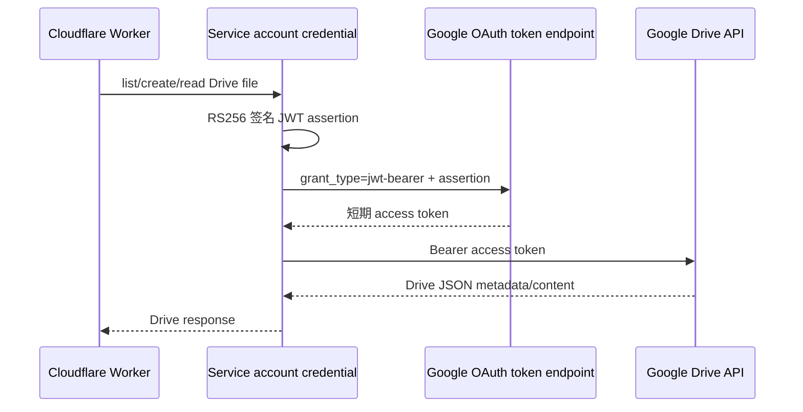

# Google Drive 服务账号同步设计

## 决策与目标

部署时已确认外部 OAuth Client 的完整 `https://www.googleapis.com/auth/drive` 权限要求受限范围验证，不能作为这个单用户 Worker 的无人值守生产方案。本设计改用 Google Cloud Service Account（服务账号）认证：Worker 以服务账号身份访问 Drive，而不是以某个 Google 用户身份使用 refresh token。

目标是在不改变本地 MCP、SQLite Outbox、D1、QStash、同步状态机和目录扩展模型的前提下，让部署的 Worker 自动写入两个人工指定并授权的 Drive 子目录。用户确认的目录映射为：

| 变量 | 文件夹 ID | 用途 |
| --- | --- | --- |
| `DRIVE_EVENTS_PARENT_ID` | `1ZZRD4a1Z93NT1OGKbRkLPu13TsHbDsF8` | 不可变事件 JSON |
| `DRIVE_SNAPSHOTS_PARENT_ID` | `1bAokejGSIdn2oLCWPjDgSb3xbiX0r999` | 聚合快照 JSON |

这些 ID 是普通部署配置，不是认证秘密。服务账号仅被共享这两个目录的编辑权限；它无权浏览专用 Google 账号的其他 Drive 文件。

## 认证架构

新增 `GoogleServiceAccountCredential`，作为 Drive REST 能力层取得 access token 的唯一新增职责。

JWT 使用 service account 的 PEM 私钥，以 Web Crypto 的 `RSASSA-PKCS1-v1_5` + `SHA-256` 签名，包含下列固定声明：

- `iss`: `GOOGLE_SERVICE_ACCOUNT_EMAIL`
- `scope`: `https://www.googleapis.com/auth/drive`
- `aud`: `https://oauth2.googleapis.com/token`
- `iat`: 当前 Unix 秒
- `exp`: `iat + 3600`

使用 OAuth token endpoint 的 JWT bearer grant 换取短期 token。access token 只保存在当前 Worker isolate 的内存缓存中，并在距过期 60 秒前复用；它不写入 D1、Drive、日志、Git 或 Cloudflare 配置。

虽然 assertion 使用完整 Drive scope，服务账号的实际可见范围由 Drive ACL 限制：只共享 `events`、`snapshots` 目录给服务账号邮箱。该身份对未共享目录的 API 请求会被 Google 拒绝。

## 配置接口

新增两个运行时绑定：

| Cloudflare 类型 | 变量 | 说明 |
| --- | --- | --- |
| Text variable | `GOOGLE_SERVICE_ACCOUNT_EMAIL` | 形如 `name@project.iam.gserviceaccount.com` 的服务账号邮箱 |
| Secret | `GOOGLE_SERVICE_ACCOUNT_PRIVATE_KEY` | 下载的服务账号 JSON 中 `private_key` 字段的完整 PEM 值 |

已有 `DRIVE_EVENTS_PARENT_ID` 和 `DRIVE_SNAPSHOTS_PARENT_ID` 继续作为 Text variables。OAuth Client、Client Secret 和 Refresh Token 不配置到 Cloudflare；已创建的 OAuth Client 可保留在 Google Cloud 项目中但不会被 Worker 使用。

配置优先级明确为：当 email 与 private key 都存在时，服务账号认证优先；否则保留既有 access-token / refresh-token 实现作为兼容路径。只有服务账号配置了一半时，返回 `drive_configuration_unavailable`（重试型），而不是静默降级到另一种认证方式。私钥读取时同时支持实际 PEM 换行和 Cloudflare/CLI 中常见的字面 `\\n`。

## 代码边界

`packages/workers/src/drive-adapter.ts` 保持 `DriveCapability`、`GoogleDriveCapability`、`DriveDestinationAdapter` 的公开职责不变。新增独立 credential 类型用于生成 token：

- `GoogleDriveCapability.token()` 先选择完整服务账号配置，再选择已有显式 access token，最后选择 refresh token。
- 所有 Drive `list`、`create`、`read` 调用继续经过同一 `request()` 方法，确保不会复制 HTTP 或错误分类逻辑。
- token cache 和 production adapter LRU 指纹加入服务账号 email / private-key 值；缓存只保留 SHA-256 摘要，绝不保留原始私钥。

`packages/workers/src/index.ts` 的 `WorkerConfig` 增加这两个可选绑定；`.env.example` 仅增加空变量名，绝不放示例私钥。

## 错误处理与状态机影响

认证失败沿用现有 `SyncOutcome` 映射：

| 情况 | 结果 | 原因 |
| --- | --- | --- |
| email/private key 缺失或只配置一个 | retryable `drive_configuration_unavailable` | 允许管理员补齐配置后自动重试 |
| token endpoint 429 / 5xx / 网络错误 | retryable `drive_rate_limited` 或 `drive_unavailable` | 不丢弃已入队事件 |
| token endpoint 400 / 401 / 403 | permanent `drive_request_rejected` | 服务账号或私钥失效，需要人工修复 |
| Drive 403（未共享目录） | permanent `drive_request_rejected` | 明确提示需要共享指定目录 |
| Drive 404 / payload readback 异常 | 保持既有分类 | 复用不可变事件与快照恢复逻辑 |

不修改 D1 job 状态机：同步 handler 仍只在完整、经过签名验证的 QStash 调用中工作；`retryable` 保持/回到可恢复状态，`permanent` 进入 `needs_attention` 并创建通知。

## 外部操作流程

1. 在现有 Google Cloud Project 的 IAM & Admin → Service Accounts 中创建 `reliable-drive-sync-worker` 服务账号。
2. 为该服务账号创建一个 JSON key，仅下载一次；从中提取 `client_email` 与 `private_key`。
3. 在 Drive 的 `events` 和 `snapshots` 目录分别将服务账号邮箱加入共享对象，并给“编辑者”角色。不共享上级根目录或其他个人文件。
4. 在 Cloudflare Worker 设置中写入服务账号 email、private key、两个目录 ID；email 和目录 ID 是 Text variable，私钥为 Secret。
5. 部署 Worker，提交一条新的非敏感事件，检查 D1 最终为 `synced`，并确认两目录各有对应 JSON。

服务账号 JSON key 不发送到聊天、不写进磁盘项目、不提交 Git。若下载文件已不再需要，应通过操作系统回收站删除；若怀疑泄漏，在 Google Cloud 删除该 key 并新建一个。

## 测试与验收

实现前先添加失败测试，随后最小实现并覆盖：

1. 有效 PEM + 服务账号配置会对 token endpoint 发出 JWT bearer grant；断言 header/claim（`iss`、`scope`、`aud`、时间窗口）正确，且 Drive 请求使用返回的 Bearer token。
2. 字面 `\\n` 私钥也能导入并签名。
3. 缺失或部分服务账号配置产生可重试配置错误，不发 token 请求，不意外回退到 OAuth。
4. token endpoint 的 5xx、429、4xx 分别映射到既定 retryable/permanent outcome。
5. 服务账号绑定加入 production adapter cache 指纹；不同服务账号或私钥不能共享 capability/cache。
6. 原有 refresh-token、Drive readback、快照完整性、QStash 签名及全套 Worker 测试保持通过。

验收成功条件：不配置 OAuth refresh token 的前提下，一条新事件可由 Worker 写入已共享的 `events` 和 `snapshots`；其 D1 job 到达 `synced`，同时私钥不会出现在仓库、日志或测试快照中。
