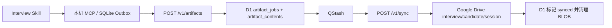

# D1 面试产物暂存设计

## 目标

在不启用 Cloudflare R2 的前提下，保留现有 Worker、D1、QStash 与 Google Drive，同步面试 Skill 的 JSON、Markdown 与 DOCX 产物。

## 选择与边界

- 采用 D1 作为云端暂存层；不使用 R2、KV 或新增第三方服务。
- 单个 `submit_artifact` 解码后产物最大 **1 MiB**；超限返回明确的 413，不创建任务或残留内容。
- 支持现有六类不可变产物；DOCX 同样暂存并最终上传 Drive。
- D1 暂存内容同时作为受认证 MCP 的小型文本读取副本；最终归档仍为 Google Drive 文件。同步成功后保留不超过 1 MiB 的内容，便于复盘 Skill 读取 JSON/Markdown；DOCX 仅返回元数据。
- 现有 `/v1/jobs` 事件链路、事件文件与快照行为完全不变。

## 数据模型

`artifact_jobs` 保留产物身份、候选人、会话、类型、内容类型、SHA-256、状态、QStash 信息、租约与 Drive 文件 ID；移除 `r2_key`。

新增 `artifact_contents`：

```sql
artifact_key TEXT PRIMARY KEY REFERENCES artifact_jobs(artifact_key),
content BLOB NOT NULL,
byte_length INTEGER NOT NULL,
created_at TEXT NOT NULL
```

`artifact_key` 是幂等键：相同 key 与相同 SHA-256 返回原任务；同 key 不同 SHA-256 返回 409。D1 的每个 BLOB/行限制为 2 MB，因此 1 MiB 上限保留足够的编码和元数据余量。

## 数据流



Worker 仅在 D1 中成功保存元数据和 BLOB 后返回 202 并发起 QStash 投递。QStash 签名、租约、状态机、重试与失败通知沿用现有逻辑。同步 Worker 先从 D1 读取内容，上传 Drive，确认成功后以同一 lease 原子标记 `synced`；小型内容保留用于受认证读取。

## 读取与错误处理

- `read_artifact` 只读取 `synced` 的 JSON / Markdown；数据来源是受认证的 D1 内容副本，绝不对未认证调用暴露。
- DOCX 继续不可通过 MCP 正文读取；返回其元数据。
- 空间/配置/网络/Drive 5xx 为 503 可重试；校验失败、超限、任务内容缺失或 Drive 4xx 为可见的永久失败。
- 若同步后清理 BLOB 失败，任务不应重传文件；保留 `synced` 并由后续低优先级清理。重复 QStash 投递对 `synced` 返回 204。

## 配置与迁移

- 删除 `ARTIFACTS` R2 binding 和 `[[r2_buckets]]` 配置。
- 删除对 `DRIVE_ARTIFACTS_PARENT_ID` 的空配置占位以外无新增云端密钥；使用已存在的 Drive OAuth 或服务账号配置。
- 新迁移将当前未部署的 `artifact_jobs.r2_key` 迁移为内容表路径；已应用的 `0003` 不回滚，新增 `0004` 执行兼容性迁移。
- 部署前在本地运行全量测试、类型检查和构建；部署后提交一个小型 session 产物并验证 D1 状态与 Drive 文件。
