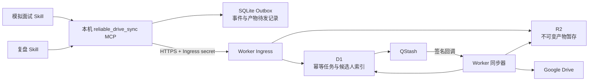
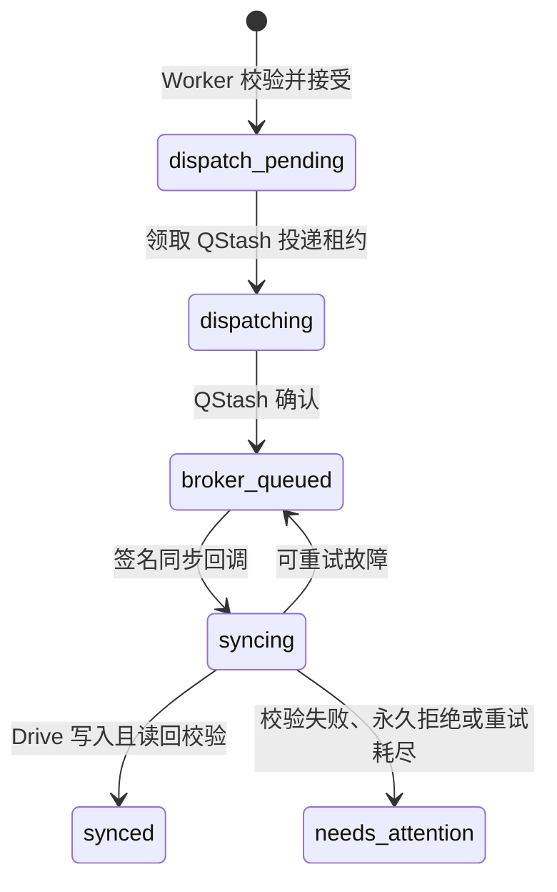

# 面试模拟与复盘 MCP 化设计

## 目标

将 `conducting-java-backend-mock-interviews` 和 `reviewing-java-backend-interviews` 改造成 MCP 客户端：两个 Skill 不再直接读写 Google Drive。候选人选择、上下文读取、原始证据、复盘、画像变更与报告归档都经 `reliable_drive_sync` MCP、Cloudflare Worker、D1、QStash、R2 和 Drive 完成。

## 非目标

- 不迁移、覆盖、删除或移动现有 Drive 候选人目录。
- 不改变候选人二次确认、模拟自动应用、真实面试需用户确认、复盘评分规则。
- 不在 Skill 或本机配置保存 Google OAuth、QStash 或 Cloudflare 凭据。

## 总体架构



### 职责边界

| 层级 | 负责 | 不负责 |
| --- | --- | --- |
| 面试 Skill | 交互确认、提问、复盘推理、形成已知事实、调用 MCP | 直连 Drive、重试 HTTP、管理 OAuth |
| 本机 MCP | 输入校验、本机 SQLite 先落盘、提交/读取 Worker、自动补发 | 评分、画像规则、云端文件写入 |
| D1 | 事件/产物幂等、状态机、候选人摘要与版本投影 | 存放二进制 DOCX |
| R2 | 不可变产物的可靠暂存、供异步同步读取 | 面向 Skill 的业务规则 |
| QStash | 异步投递、失败重试、签名 | 业务数据最终存储 |
| Worker | 鉴权、候选人查询、状态转换、Drive 写入与读回校验 | 直接对话式面试 |
| Drive | 最终可读归档、事件与快照 | 本机离线队列 |

## Drive 归档布局

新增产物父文件夹绑定 `DRIVE_ARTIFACTS_PARENT_ID`。新文件使用以下布局：

```text
events/interview/<candidateId>/event-<encoded-eventKey>.json
snapshots/interview/<candidateId>/snapshot-<timestamp>-<uuid>.json
artifacts/interview/<candidateId>/<sessionId>/
  raw_transcript.md
  session.json
  review_v1.json
  profile_update_event_v1.json
  review_report_v1.docx
```

`candidateId` 填入通用事件协议中的 `userId`；`sourceSkill` 统一为 `interview`。模拟、复盘、真实面试和画像动作由 `type` 区分。既有根目录 JSON 与候选人树保持只读，绝不被新流程移动或改写。

## MCP 接口

现有 `submit_event` 保持向后兼容。新接口都由本机 MCP 通过同一入口密钥调用 Worker。

### 1. `list_candidates`

```ts
type ListCandidatesInput = { query?: string; limit?: number };
type CandidateSummary = {
  candidateId: string;
  displayName: string;
  note: string;
  activeResumeId: string | null;
  domains: string[];
};
```

只返回摘要，不返回简历、画像、会话或产物内容。模拟/复盘 Skill 必须展示 ID、姓名和备注，取得用户二次确认后才允许下一步。

### 2. `get_candidate_context`

```ts
type CandidateContextInput = {
  candidateId: string;
  selectedDomain?: string;
  resumeId?: string;
  sessionId?: string;
};
type CandidateContext = {
  candidate: CandidateSummary;
  activeResume: { resumeId: string; claims: Record<string, unknown> } | null;
  domainGuidance: Record<string, unknown> | null;
  profile: Record<string, unknown> | null;
  session: Record<string, unknown> | null;
};
```

该工具仅供 Skill 在候选人二次确认后的受控流程调用。Worker 从 D1 索引和已验证的 JSON 产物组装内容；不返回 DOCX 或原始二进制文件。

### 3. `read_artifact`

```ts
type ReadArtifactInput = { candidateId: string; artifactKey: string };
type ReadArtifactResult = {
  artifactKey: string;
  contentType: "application/json" | "text/markdown";
  text: string;
};
```

仅允许读取 JSON 或 Markdown，用于复盘消费 `session.json` 和 `raw_transcript.md`。DOCX 只作为最终报告归档，不通过 MCP 回传给模型。

### 4. `submit_artifact`

```ts
type ArtifactSubmission = {
  schemaVersion: "1";
  artifactId: string;              // 新 UUID
  artifactKey: string;             // 同一次重试必须复用
  candidateId: string;             // 与 userId 相同的稳定候选人 ID
  sourceSkill: "interview";
  sessionId: string;
  artifactType: "session" | "raw_transcript" | "review" | "profile_update" | "report" | "resume_parsed";
  fileName: string;                // 固定安全文件名，不含路径
  contentType: "application/json" | "text/markdown" | "application/vnd.openxmlformats-officedocument.wordprocessingml.document";
  contentBase64: string;           // 原始字节的 base64
  sha256: string;                  // 原始字节 SHA-256 十六进制
  createdAt: string;
  dependsOn?: string[];            // 例如 review 依赖 session/raw transcript artifactKey
};
```

限制：解码后最大 10 MiB；`fileName` 只能是预定义产物名称；`candidateId`、`sessionId` 与 `sourceSkill` 必须匹配 `^[A-Za-z0-9][A-Za-z0-9_-]{0,63}$`。Worker 校验 Base64、长度、SHA-256、类型和候选人一致性后才接收。重复 `artifactKey` 只接受完全相同的 checksum 与元数据，否则返回冲突，不覆盖旧产物。

### 5. `submit_event`

复用现有 `SyncEvent`。面试事件必须使用：

```text
userId       = candidateId
sourceSkill  = interview
eventKey     = <candidateId>:interview:<sessionId>:<event-type>:<ISO-8601>
destination  = drive
```

推荐事件类型：

```text
interview.candidate_registered
interview.resume_registered
interview.mock_session_created
interview.review_completed
interview.profile_update_applied
interview.profile_update_pending
interview.profile_update_rejected
interview.review_corrected
```

事件 `payload` 引用相关 `artifactKey`，而不是复制大段转写或 Base64 内容。

## 可靠性与状态机

### 本机 Outbox

SQLite 扩展为两张待发记录表：`local_outbox_events`（已有）与 `local_outbox_artifacts`。二者均先持久化、再发送；`sending` 状态在 MCP 重启时恢复为 `pending`。Worker 返回 HTTP 202 后才删除相应本机记录。

### 云端记录

D1 新增 `artifact_jobs`（`artifact_key` 唯一）和 `interview_candidates`。`artifact_jobs` 保存不可变元数据、checksum、R2 对象键、Drive 文件 ID、依赖、状态、错误码与租约；二进制内容只保存在 R2 与最终 Drive 文件中。



事件与产物共享相同的调度、签名验证和异常语义。产物同步仅在 `dependsOn` 的所有产物均为 `synced` 时执行；否则返回可重试。事件可以在云端接受时建立 D1 候选人索引投影，但只有 Drive 写入/快照读回后才是最终 `synced`。

### R2 与 Drive 顺序

1. Worker 校验入站产物，按由 `artifactKey` 派生的确定性对象键写入 R2。
2. Worker 写入或核对 D1 `artifact_jobs` 记录，再排入 QStash。
3. 同步 Worker 从 R2 读取字节，向目标 Drive 目录上传正确 MIME 类型文件。
4. Worker 读回 Drive 文件，校验父目录、文件名、大小与 SHA-256；成功后标记 `synced`。
5. R2 暂存对象保留 30 天，由生命周期规则清理；Drive 是最终长期归档。

如果 R2 成功、D1 失败，下一次同一 `artifactKey` 会重新核对并复用 R2 对象；若 D1 已存在但 R2 丢失，则保持可重试并重新上传本机 Outbox 中同 checksum 的内容。不得无条件覆盖内容不同的对象。

## 读取与候选人安全

- `list_candidates` 只读取 D1 的最小候选人摘要。
- `get_candidate_context` 和 `read_artifact` 接受明确 `candidateId`；Skill 的二次确认是对话层强制门禁，MCP 记录访问审计事件但不能凭空证明用户对话确认。
- 新候选人通过 `interview.candidate_registered` 事件创建索引；已注册简历的解析 JSON 作为 `resume_parsed` 产物，并由 `interview.resume_registered` 事件绑定活动简历。
- 当前旧 Drive 候选人树在迁移期只读。新增内部 MCP 工具 `import_legacy_candidate` 将在明确指定候选人后由 Worker 读取旧根目录、生成新索引和不可变导入产物；它是单独的迁移任务，不阻塞新流程。
- 未迁移候选人必须返回 `candidate_not_migrated`，Skill 不得直接回退到 Drive。

## 两个 Skill 的改造

### 模拟面试 Skill

1. 使用 `list_candidates` 选择候选人，展示摘要并取得二次确认。
2. 使用 `get_candidate_context` 获取锁定简历、领域指引与历史弱点。
3. 维持每题原始问题、回答、追问和标签在内存会话对象中。
4. 结束后按顺序调用 `submit_artifact(session.json)`、`submit_artifact(raw_transcript.md)`、`submit_event(interview.mock_session_created)`。
5. 报告 `cloud_accepted` 或 `pending`，不声称 Drive 已完成。

### 复盘 Skill

1. 经 `list_candidates` 和二次确认后，使用 `get_candidate_context`/`read_artifact` 读取指定会话。
2. 生成并本地渲染检查 DOCX；将 `review_vN.json`、`review_report_vN.docx`、`profile_update_event_vN.json` 用 `submit_artifact` 提交。
3. 模拟面试提交 `interview.review_completed` 与 `interview.profile_update_applied`；真实面试先提交 `interview.profile_update_pending`，仅在用户确认后提交 `...applied`，拒绝则提交 `...rejected`。
4. Worker 在 D1 以 `candidateId + sessionId + reviewVersion` 做画像事件幂等与乐观版本检查；冲突产生 `profile_conflict`，不覆盖当前画像。

## 云端配置与部署

新增 Cloudflare 资源与绑定：

```toml
[[r2_buckets]]
binding = "ARTIFACTS"
bucket_name = "reliable-drive-sync-artifacts"
```

新增公开变量：

```text
DRIVE_ARTIFACTS_PARENT_ID=<Drive artifacts 顶层文件夹 ID>
R2_ARTIFACT_RETENTION_DAYS=30
```

保留现有 D1、QStash、Drive OAuth、事件父文件夹和快照父文件夹配置。无需把任何 OAuth、QStash 或入口密钥复制到面试 Skill 或新电脑。

## 验证标准

### 单元与集成测试

- 产物 Outbox 的入队、重启恢复、超时、重复键与 checksum 冲突。
- Worker 对 Base64、大小、MIME、路径、SHA-256 和 candidate/session ID 的拒绝。
- R2 → QStash → Drive 的同步成功、读回校验、限流重试、永久失败与重复投递。
- `dependsOn` 未同步时不提前上传 Review 或 DOCX。
- 候选人摘要不泄露详情；未迁移候选人不能经 Skill 直接读取旧 Drive。
- 模拟自动应用、真实 pending/确认/拒绝、画像版本冲突与 Review V2 修正重放。
- 现有算法 Skill 的 `submit_event` 流程必须保持回归通过。

### 云端冒烟测试

1. 创建虚构 `TEST-candidate-001`，提交 JSON、Markdown 与 DOCX 三种产物及一个事件。
2. 查询 D1，要求事件与三个产物均为 `synced`。
3. 列出 Drive，要求文件位于 `artifacts/interview/TEST-candidate-001/<sessionId>/`，事件与快照位于对应三层目录。
4. 重复同一键，要求不出现第二份文件；更换 checksum 但复用键，要求冲突且不覆盖。

## 风险与取舍

- R2 是新增依赖，但它避免把二进制报告塞进 D1、QStash 或 JSON 快照；这是保留 DOCX 且保持可靠性的必要边界。
- 候选人二次确认是 Skill 的对话安全规则；使用同一 MCP 入口密钥的本机进程被视为可信客户端。若未来需要多人/多设备权限隔离，应增加用户身份令牌和服务端访问控制。
- 旧资料导入单独实施，避免一次迁移意外改写真实候选人历史。
