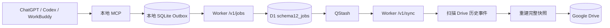
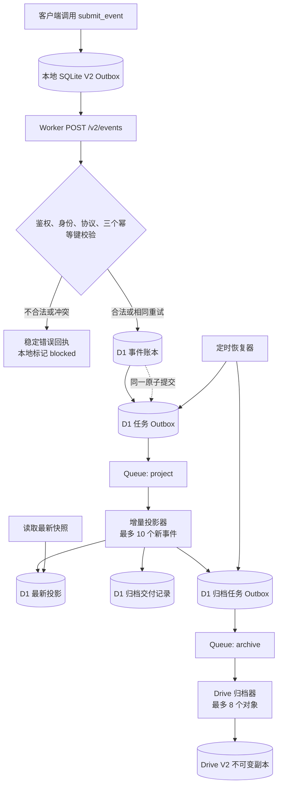

# Reliable Drive Sync V2 业务改造需求与架构基线

> 文档日期：2026-09-05  
> 文档用途：交给 Workbuddy 生成实施计划，再由 Codex 审核。  
> 当前阶段：只定义业务、架构与验收边界；不得据此直接开始编码、部署或迁移数据。
>
> **修订记录（Rev 2，2026-09-05，依据 Codex 审核）**：
> 1. §8/§7.2/§12 示例与 canary 领域名统一为 Schema 1.2 协议白名单中的 `algorithm`；`algorithm-learning` 仅作为 Skill 名称与展示标签，不是 envelope namespace。
> 2. §12/§21.1/§22 的“全量/增量等价”改为 **V2 全量 fold（同一 `event_seq` 排序语义）与增量的等价**；旧 V1 Rebuild 模型按业务时间排序，只作领域规则参照，不再声称逐字段等价。
> 3. §10.2 明确读取接口为带身份绑定的 `POST /v2/query`，不提供仅凭全局 Bearer 的跨用户 GET 查询。

## 1. 本次改造要解决什么

Reliable Drive Sync V1 已证明本地 SQLite Outbox、Worker、D1、异步投递和 Drive 备份这条路线可行，但当前云端同步仍会在一次任务中反复扫描历史 Drive 文件。历史事件增多后，一次 Worker 调用可能超过免费方案允许的 50 个外部子请求。

V2 的核心不是“再加缓存”，而是改变业务真相的存放位置和快照生成方式：

- D1 保存不可变的业务事件，成为云端权威账本；
- 新快照只读取“上次有效投影 + 本次尚未处理的新事件”；
- Cloudflare Queue 只负责异步唤醒，不保存业务真相；
- Drive 只保存最终审计副本，不参与同步接收和投影计算；
- 任意一次 Worker 调用的业务预算最多使用 40 个外部子请求，固定预留 10 个安全余量；
- 旧数据不迁移、不覆盖、不删除，V1 与 V2 使用隔离的表、接口和 Drive 根目录。

一句话目标：**让每次事件提交的成本与“这次新增了多少数据”有关，而不再与“历史上一共有多少事件”有关。**

## 2. 使用本文件的规则

Workbuddy 应基于本文件另行生成可执行实施计划，不能直接实现。本轮交付顺序固定为：

1. Workbuddy 输出实施计划；
2. Codex 对计划进行源码一致性、数据一致性、失败恢复和 50 子请求上限审核；
3. 用户确认审核后的计划；
4. 才允许建立隔离工作区并进入开发。

实施计划必须给出精确文件、测试、命令、预期结果、部署检查点和回滚方式。若计划与本文件冲突，应先修改计划或提出设计变更，不能在编码时自行改变本文件中的锁定决策。

## 3. 已锁定的架构决策

以下内容无需 Workbuddy 再做技术选型：

1. 保留本地 SQLite Outbox，并继续只暴露一个 MCP 工具 `submit_event`。
2. 保留现有业务 envelope 的 `schemaVersion: "1.2"`；“V2”表示存储和处理架构版本，不强迫所有业务事件更换协议版本。
3. 新增 `POST /v2/events` 作为写入口；V1 的 `/v1/jobs` 在切换完成前保持不变。
4. D1 是 V2 的权威事件账本与权威投影来源。
5. Cloudflare Queue 替换 QStash，D1 Outbox 仍是可恢复任务的权威记录。
6. Drive 是最终一致的不可变审计副本，不是热路径数据库，也不是生成下一版快照时的输入源。
7. 不启用 R2。只有未来出现大文件、Drive 配额或归档吞吐问题时，才单独评审 R2。
8. V2 新建五张以 `rds2_` 开头的表，不修改、复用或删除 `schema12_jobs` 等 V1 表。
9. V2 使用新的 Drive 根目录 `DriveRoot/my-chatGPT-skills-v2/`，不扫描或迁移 V1 Drive 数据。
10. Worker 平台上限按 50 个外部子请求处理；业务代码每次调用最多允许 40 个，预留 10 个用于框架、日志、重试和未来扩展。
11. 投影器单次最多处理 10 个新事件；Drive 归档器单次最多处理 8 个归档对象。
12. 所有后台处理都按“至少一次投递、允许乱序、业务结果恰好一次”设计。
13. 用户身份先在 D1 明确注册或解析；事件接收热路径不得扫描 Drive 来判断身份。
14. 旧数据不迁移。V1 冻结为历史只读数据源，V2 从显式初始化后的新状态开始。

## 4. 当前 V1 基线和受保护内容

### 4.1 当前链路



V1 的主要扩展性问题位于 `扫描 Drive 历史事件 -> 重建完整快照`。单次任务读取的文件数量会随历史持续增长，缓存只能降低同一次调用中的重复访问，不能消除历史扫描本身。

### 4.2 当前源码事实

- 本地入口：`tools/reliable-drive-sync-mcp/stdio-bridge.mjs`
- 本地持久层：`tools/reliable-drive-sync-mcp/local-outbox.mjs`
- 本地投递编排：`tools/reliable-drive-sync-mcp/delivery-service.mjs`
- Worker 路由：`services/reliable-drive-sync-worker/src/index.js`
- V1 接收：`services/reliable-drive-sync-worker/src/ingress.js`
- V1 云端任务表：`services/reliable-drive-sync-worker/migrations/0005_schema12_jobs.sql`
- V1 QStash 调度：`services/reliable-drive-sync-worker/src/dispatcher.js`
- V1 Drive 同步：`services/reliable-drive-sync-worker/src/sync.js`
- V1 当前配置：`services/reliable-drive-sync-worker/wrangler.toml`

### 4.3 不得覆盖的本地修改

当前工作树已有用户未提交的 V1 热修，涉及：

- `services/reliable-drive-sync-worker/src/event-store.js`
- `services/reliable-drive-sync-worker/src/google-drive.js`
- `services/reliable-drive-sync-worker/src/sync.js`
- `services/reliable-drive-sync-worker/test/event-store.test.js`
- `services/reliable-drive-sync-worker/test/google-drive.test.js`
- `services/reliable-drive-sync-worker/test/sync.test.js`

这些修改用于减少 V1 Drive 重复读取和改善脱敏错误日志。实施计划必须先安排独立审查、验证和保存该基线，再建立 V2 隔离开发工作区。不得把这些改动当成 V2 文件随手重写，也不得使用会丢失工作区修改的 Git 命令。

### 4.4 当前测试基线

- Worker 测试：380/380 通过。
- Bridge 测试：45/46 通过。
- 唯一已知失败是 Node v26 不再输出 `node:sqlite` 实验性警告，而测试仍硬编码要求该警告出现一次；并发投递的数据断言没有失败。

实施计划的第一个质量门必须把此断言改为与 Node 版本无关的“首次提交前不加载 SQLite”行为测试，并在 V2 开发前取得完整绿色基线。

## 5. V2 总体流程



关键理解：

- 客户端拿到 `accepted` 时，表示事件和对应后台任务已经一起写入 D1；不表示快照已更新，也不表示 Drive 已同步。
- Queue 消息丢失或重复都不会丢业务，因为待办任务仍在 D1 Outbox 中，定时恢复器可以重新投递。
- 投影器只读取 D1 中游标之后的新事件，不读取 Drive，不遍历全部历史。
- Drive 归档失败不会撤销已被 D1 接收的业务事件；失败任务会重试或进入人工处理状态。

## 6. 四个运行模块分别负责什么

| 模块 | 一句话职责 | 不负责什么 |
|---|---|---|
| Worker | 云端业务入口和执行环境：鉴权、校验、调用 D1、消费 Queue、执行投影与归档。 | 不把内存当持久化存储，不在同步接收时扫描 Drive。 |
| D1 | 权威网络持久层：保存用户、不可变事件、后台任务、最新投影和归档状态。 | 不负责主动执行后台任务。 |
| Queue | 异步唤醒器：告诉某个 Worker“现在有一批投影或归档工作可做”。 | 不作为业务账本，不保证只投递一次，也不保证顺序。 |
| Drive | 最终一致的审计与灾备副本：保存可人工查看的不可变事件和投影文件。 | 不参与接收判定，不参与每次快照计算，不承担在线查询。 |

本地 SQLite Outbox 是第五个、位于用户电脑上的可靠性模块：它确保网络断开、Worker 超时或客户端重启时，尚未被 D1 确认接收的 envelope 不会丢失。

## 7. 五张 D1 表的业务职责

### 7.1 一句话版本

| 表 | 通俗解释 |
|---|---|
| `rds2_users` | “这是谁”，保存权威用户身份。 |
| `rds2_business_events` | “发生过什么”，每个业务事实只追加、不覆盖。 |
| `rds2_event_outbox` | “接下来必须做什么”，保存尚未完成的异步工作。 |
| `rds2_projections` | “目前是什么状态”，保存把历史事件折叠后的最新结果。 |
| `rds2_archive_deliveries` | “Drive 副本送到了没有”，保存每个归档对象的交付状态。 |

### 7.2 建议字段与约束

#### `rds2_users`

| 字段 | 作用 |
|---|---|
| `user_id` | 权威 UUID 主键。 |
| `display_name` | 展示名，例如“乔炳源”。 |
| `name_key` | NFKC、去首尾空格后的身份查询键。 |
| `status` | `active` 或 `disabled`。 |
| `created_at`、`updated_at` | 审计时间。 |

约束：`name_key` 唯一；已禁用身份不能接收新写事件。

#### `rds2_business_events`

| 字段 | 作用 |
|---|---|
| `event_seq` | D1 生成的单调递增整数主键，也是权威处理顺序。 |
| `event_id` | 不可变业务事件 ID，全局唯一。 |
| `request_id` | 一次客户端提交尝试的幂等 ID，全局唯一。 |
| `user_id` | 事件归属用户。 |
| `namespace` | 业务域，取值必须是协议白名单之一：`system`、`algorithm`、`interview`、`resume-knowledge`、`profile`。 |
| `event_type` | 事件类型，例如 `algorithm.learning.completed`。 |
| `event_key` | 业务幂等键，例如“某用户某题某自然日第一次有效回答”。 |
| `envelope_json` | 经过完整校验的规范 envelope。 |
| `envelope_hash` | 规范 JSON 的 SHA-256，用于区分重试和冲突。 |
| `occurred_at` | 客户端声明的业务发生时间，只用于业务展示。 |
| `accepted_at` | Worker 接收时间，用于审计。 |

唯一约束：

- `request_id` 全局唯一；
- `event_id` 全局唯一；
- `(user_id, namespace, event_type, event_key)` 组合唯一。

`event_seq` 决定投影顺序，不能用客户端 `occurred_at` 代替。该表只允许插入，不允许更新历史 envelope 或删除事件；更正必须通过新的 correction/invalidation 事件表达。

#### `rds2_event_outbox`

| 字段 | 作用 |
|---|---|
| `task_id` | 后台任务主键，可作为用户看到的 job/receipt 标识。 |
| `task_type` | `project_event` 或 `archive_artifact`。 |
| `event_seq` | 投影任务对应的业务事件；非对应类型时可为空。 |
| `archive_delivery_id` | 归档任务对应的交付记录；非对应类型时可为空。 |
| `state` | `pending`、`dispatching`、`queued`、`processing`、`completed`、`needs_attention`。 |
| `attempt_count` | 已尝试次数。 |
| `lease_owner`、`lease_until` | 防止两个 Worker 同时认领同一任务。 |
| `queue_message_id` | 最近一次 Queue 回执，用于排障，不作为业务真相。 |
| `last_error_code` | 机器可读的脱敏错误码。 |
| `available_at` | 下一次允许重试的时间。 |
| 时间字段 | 创建、更新、完成时间。 |

事件接收时，`business_events` 行和对应的 `project_event` 行必须在同一个 D1 原子批次中成功或一起回滚。

#### `rds2_projections`

| 字段 | 作用 |
|---|---|
| `user_id`、`namespace`、`projection_name` | 共同确定一个用户的一种投影。 |
| `projection_version` | 投影数据格式版本。 |
| `last_event_seq` | 已经处理到哪个权威事件游标。 |
| `state_json` | Reducer 下次增量更新所需的完整内部状态。 |
| `public_view_json` | 提供给 Skill/客户端读取的最小公开快照。 |
| `content_hash` | 检测相同内容和归档幂等。 |
| `updated_at` | 投影更新时间。 |

主键为 `(user_id, namespace, projection_name)`。投影更新必须采用游标条件或事务，较旧消费者不能覆盖较新投影。

#### `rds2_archive_deliveries`

| 字段 | 作用 |
|---|---|
| `archive_delivery_id` | 归档交付主键。 |
| `artifact_kind` | `business_event` 或 `projection_snapshot`。 |
| `artifact_key` | 确定性幂等键，全局唯一。 |
| `user_id`、`namespace` | Drive 目录路由。 |
| `source_event_seq` | 对应业务事件；投影快照可为空。 |
| `projection_name`、`projection_event_seq` | 对应投影版本；事件归档可为空。 |
| `artifact_json`、`artifact_hash` | 已冻结的待归档内容及哈希。 |
| `drive_path` | 确定性目标路径。 |
| `state` | `pending`、`delivering`、`delivered`、`needs_attention`。 |
| `drive_file_id` | 成功后保存的 Drive 文件 ID。 |
| `attempt_count`、错误和时间字段 | 重试与审计。 |

投影事务应同时写入最新投影、归档对象和 `archive_artifact` Outbox 任务。归档器只上传 `artifact_json`，不得在上传时重新构建业务内容。

## 8. 一个完整例子：乔完成 LeetCode 206

假设乔第一次明确回复“第一题完成”，客户端构造：

```json
{
  "schemaVersion": "1.2",
  "namespace": "algorithm",
  "eventType": "algorithm.learning.completed",
  "requestId": "algorithm-checkin-2026-09-05-leetcode-206-first",
  "identity": {
    "userId": "<乔在 rds2_users 中的 UUID>",
    "displayName": "乔炳源"
  },
  "payload": {
    "event": {
      "eventId": "<本次事实的 UUID>",
      "eventKey": "2026-09-05:leetcode-206:first-valid-answer",
      "eventType": "algorithm.learning.completed",
      "result": "completed"
    }
  }
}
```

一次成功处理后，五张表依次发生这些变化：

| 时刻 | 表 | 发生的事情 |
|---|---|---|
| 接收前 | `rds2_users` | 找到乔的有效 UUID 与展示名，身份一致。 |
| D1 接收 | `rds2_business_events` | 插入一行，D1 分配 `event_seq=101`。这行永久表示“乔在当天第一次有效回答中完成了 206”。 |
| 同一原子提交 | `rds2_event_outbox` | 插入 `project_event(event_seq=101)`，表示投影工作尚未完成。 |
| Queue 唤醒后 | `rds2_projections` | 读取原投影游标 100，只应用 101，更新掌握度与 `last_event_seq=101`。不读取 1—100 的事件，也不读取 Drive。 |
| 同一投影事务 | `rds2_archive_deliveries` | 冻结事件 101 和新快照的归档 JSON，并创建对应归档任务。 |
| Drive 归档后 | `rds2_archive_deliveries` | 状态变成 `delivered`，记录 Drive 文件 ID。业务事件和 D1 快照在此之前已经有效。 |

如果投影器收到两次相同 Queue 消息，第二次看到 `last_event_seq=101`，不会再次增加掌握分；它只会确认对应任务已经完成。

如果 Drive 上传成功但 Worker 在收到响应前断线，重试会先按确定性父目录和文件名精确查找，校验内容哈希相同后复用原文件，不创建第二份副本。

## 9. 三个业务 ID 与一个任务 ID

| 标识 | 回答的问题 | 谁生成 | 重试时是否变化 |
|---|---|---|---|
| `requestId` | “这是哪一次提交请求？” | 客户端 | 不变 |
| `eventId` | “这是哪一个不可变业务事实？” | 客户端 | 不变 |
| `eventKey` | “业务规则上，这个位置是否已经记录过？” | Skill/客户端按契约生成 | 不变 |
| `taskId` / `jobId` | “云端哪一项后台工作负责后续处理？” | Worker | 同一已接收请求返回原值 |

幂等结果必须稳定：

| 情况 | 云端结果 | 本地处理 |
|---|---|---|
| 三个 ID 和规范内容完全相同 | 返回原始 durable receipt，不新增事件或任务 | 删除已确认的 SQLite 行 |
| `requestId` 相同但内容哈希不同 | `409 request_id_conflict` | 标记 `blocked`，停止自动重试 |
| `eventId` 相同但内容哈希不同 | `409 event_id_conflict` | 标记 `blocked`，停止自动重试 |
| 同一业务作用域的 `eventKey` 已存在，新 `eventId/requestId` 再提交 | 返回 `already_recorded` 和首次事件回执，不覆盖首次得分 | 删除本次 SQLite 行并向用户说明首次结果仍有效 |
| Queue 或 Worker 重复执行后台任务 | 依据 D1 游标、唯一键和任务状态变成无副作用重放 | 不产生第二个业务结果 |

“同一道题同一自然日只记录第一次明确回答”由 `eventKey` 的业务作用域唯一约束实现；不能依靠客户端记忆，也不能让第二次回答覆盖第一条事件。

## 10. 接收接口与回执语义

### 10.1 `POST /v2/events`

接收顺序：

1. 校验 Bearer 鉴权、请求大小和 JSON 格式；
2. 完整校验 envelope 和内部业务事件，不能只校验外壳；
3. 在 `rds2_users` 校验身份状态、UUID 和规范展示名；
4. 计算规范 JSON 哈希；
5. 判断 `requestId`、`eventId`、作用域 `eventKey` 的重试或冲突；
6. 原子插入业务事件和投影 Outbox 任务；
7. 返回稳定 durable receipt；
8. Queue 发布可以随后进行。即使 Queue 暂时不可用，D1 Outbox 仍能被恢复器重新投递。

首次接收和完全相同的重试都必须返回足够让本地安全清理 Outbox 的回执：

```json
{
  "status": "accepted",
  "deliveryState": "cloud_accepted",
  "requestId": "...",
  "eventId": "...",
  "eventKey": "...",
  "eventSeq": 101,
  "taskId": "...",
  "persistence": {
    "localOutbox": "acknowledged",
    "eventLedger": "accepted",
    "projection": "pending",
    "drive": "pending"
  }
}
```

`cloud_accepted` 只表示 D1 已经原子保存事件与任务。任何客户端、Skill 或日志都不得把它描述为“Drive 已同步”或“快照已更新”。

### 10.2 读取接口

V2 的最新学习画像、面试画像和简历知识画像必须从 `rds2_projections.public_view_json` 读取。读取请求不得通过 Drive 文件列表重建快照。读取接口使用带身份绑定的 `POST /v2/query`（请求体携带已验证身份与查询范围，服务端核对 `rds2_users` 后只返回该用户的数据）；不得提供仅凭全局 Bearer 就能按 `requestId`/`eventId` 查询任意用户状态的 GET 接口。

计划至少应覆盖：

- 根据已验证身份读取指定 namespace 的最新公开投影；
- 根据 `requestId` 或 `eventId` 查询事件、投影与 Drive 归档的分层状态；
- 继续通过同一个 MCP 工具表达读请求，除非后续有单独批准的工具拆分设计。

## 11. 本地 SQLite Outbox 的 V2 语义

现有正确行为继续保留：

- 网络请求前先持久化完整 envelope；
- `request_id` 是本地主键；
- 同 `requestId + 同原始输入` 重用原行；
- 同 `requestId + 不同原始输入` 本地直接报冲突；
- 进程重启把遗留 `sending` 恢复为 `pending`；
- 定时或下一次提交扫描 pending，单批最多取 20 条；
- 只有得到 V2 durable receipt 或明确的 `already_recorded` 结果才清理行。

V2 必须补强：

- 原子认领 pending 行；若 `markSending` 未成功，当前 flush 不得继续发送该行；
- 三种 ID 冲突是永久阻塞错误，不能每 30 秒无限重试；
- 网络超时、5xx 和临时限流恢复为 pending，并采用有上限的退避；
- “D1 已提交但响应丢失”时，用同一三个 ID 重试并取得原回执；
- 接收成功后可删除 payload 行，但必须保留最小本地 receipt 记录供排障；
- 抽取 Worker 和本地共同使用的纯 V2 协议模块，避免两端校验规则漂移。

旧本地 V1 Outbox 文件不迁移、不删除。V2 默认使用独立的 `outbox-v2.sqlite`；正式切换前应先让用户选择处理仍处于 pending 的 V1 行，不能静默遗弃。

## 12. 增量投影规则

每个业务域提供纯 Reducer，统一接口语义为：

```text
emptyProjection(identity) -> initialState
applyEvent(currentState, validatedEvent) -> nextState
publicView(nextState) -> clientSafeSnapshot
```

投影器必须：

1. 按 `(user_id, namespace, projection_name)` 读取当前投影和 `last_event_seq`；
2. 从 D1 读取 `event_seq > last_event_seq` 的最多 10 个事件，并按 `event_seq ASC`；
3. 逐个调用纯 Reducer；
4. 原子写入新投影、完成已覆盖的投影任务、创建冻结归档对象及归档任务；
5. 如果还有事件，保留或创建下一次唤醒；
6. 如果没有新事件，将重复 Queue 消息安全确认。

旧的全历史 rebuild 模型不能继续出现在在线热路径。等价语义定义为：对同一组事件，**按权威 `event_seq` 排序的 V2 全量 fold（一次性 apply 全部事件）必须与分成任意批次的增量 apply 结果逐字段一致**。这是 V2 自身的排序语义：`event_seq` 是接收顺序，迟到或回填事件的业务效果按接收顺序折叠，与 V1 按业务时间排序的 rebuild 结果可能不同。旧 V1 Rebuild 模型只作领域规则参照（correction、reviewVersion、同日首次评分等语义来源），不作为逐字段等价 Oracle；这些领域规则各自建立领域不变量测试。

首个生产 canary 使用 `algorithm` 领域。稳定后依次覆盖 profile、interview 和 resume-knowledge。现有 correction、invalidation、同日首次评分、依赖顺序等领域规则必须在领域不变量测试中得到证明，不能因为改成增量就弱化。

## 13. Queue 与 D1 Outbox 的配合

Queue 采用至少一次、可能乱序的事实模型。建议建立：

- 投影主队列，消费者 `max_batch_size=10`；
- Drive 归档主队列，消费者 `max_batch_size=8`；
- 两个对应的 Dead Letter Queue；
- 明确的 `max_retries` 和退避；
- 每条消息只携带定位信息，不携带唯一业务真相。

D1 Outbox 是恢复依据：

- 发布 Queue 前用短租约认领任务；
- 发布成功后记录 Queue message ID 和 `queued`；
- 发布失败则释放租约并设置下一次 `available_at`；
- 定时恢复器只取到期任务，使用有上限的小批量，不允许 `LIMIT 100 + Promise.all`；
- 消费者崩溃后，过期租约可被回收；
- 达到重试阈值转入 `needs_attention`，不得静默丢弃。

## 14. Drive V2 归档规则

建议确定性目录：

```text
DriveRoot/my-chatGPT-skills-v2/
  users/<userId>/
    <namespace>/
      events/event-<eventId>.json
      snapshots/<projectionName>-through-<eventSeq>.json
```

归档规则：

- 文件名、父目录、内容和哈希在 D1 `archive_deliveries` 中先冻结；
- 上传时只处理冻结内容；
- 重试先按父目录和精确文件名查询，不扫描历史事件集合；
- 已存在且哈希一致视为成功重放；
- 已存在但哈希不同进入 `needs_attention`，禁止覆盖；
- 新建后做精确 readback 和哈希校验；
- 同一 Worker 调用内复用 OAuth token 和已解析的确定性父目录；
- 任何情况下都不得修改 V1 根目录或覆盖已归档 JSON。

Drive 投影快照可以保留多个不可变版本。在线读取只使用 D1 当前投影，Drive 版本用于人工审计和灾难恢复。

## 15. 50 个外部子请求的强制预算

### 15.1 统一预算器

所有会触发 Worker 外部绑定或网络访问的封装，在调用前必须通过统一 `SubrequestBudget` 申请额度。预算器至少提供：

```text
remaining()
consume(category, count=1)
assertWithinLimit()
snapshotByCategory()
```

业务硬上限为 40。额度不足时停止领取新对象，完成或安全释放已领取任务；不得先调用再记账，也不得通过捕获平台异常来判断是否超限。

### 15.2 每类调用的上限

| Worker 调用类型 | 单批上限 | 允许的外部行为 | 业务上限 |
|---|---:|---|---:|
| `POST /v2/events` | 1 个事件 | 鉴权、D1 原子接收、至多一次 Queue 唤醒 | ≤ 10 |
| 投影消费者 | 10 个新事件 | D1 读取/批处理、至多受控 Queue 唤醒；不访问 Drive | ≤ 20 |
| Queue 恢复器 | 小批到期任务 | D1 认领并分批发布 Queue | ≤ 30 |
| Drive 归档消费者 | 8 个对象 | 一次 token 获取、确定性目录解析、每对象精确查找/新建/readback | ≤ 40 |

实施计划必须用可注入假客户端统计真实调用次数，并覆盖最坏分支：8 个对象全部不存在、全部需要创建且全部 readback。任何测试路径只要超过 40 就失败。

此外还需有生产指标：总调用数、按类别调用数、剩余额度、提前停止批次次数。日志不得包含 Bearer、OAuth token、完整 envelope、完整用户画像或 Drive 文件正文。

## 16. 一致性和失败恢复

| 故障点 | 系统必须表现 |
|---|---|
| 本地已写 SQLite，尚未发到 Worker | 保留 pending，重启后继续。 |
| Worker 已写 D1，响应丢失 | 同一请求重试返回原 receipt，不新增事件。 |
| 事件已写 D1，Queue 发布失败 | 接收仍有效；D1 Outbox 定时重投。 |
| Queue 重复或乱序 | `event_seq` 游标保证每个事件只产生一次业务效果。 |
| 投影执行一半失败 | D1 原子事务回滚，任务稍后重试。 |
| 投影已提交，确认 Queue 前崩溃 | 重复消费发现游标已前进，无副作用确认。 |
| Drive 新建成功，响应丢失 | 精确查询文件并校验哈希，复用原文件。 |
| Drive 长期不可用 | D1 事件和投影继续有效，归档状态进入重试或人工处理。 |
| 某个归档文件同名异内容 | 禁止覆盖，转 `needs_attention`。 |
| 达到子请求预算 | 停止扩批，释放未执行租约，留下可恢复任务。 |

## 17. 身份与安全边界

- `rds2_users.user_id` 使用权威 UUID，不以展示名或 Drive 文件夹名充当主键。
- 展示名通过 NFKC 和 trim 生成 `name_key`，保持当前全局身份语义。
- 客户端提供 userId 时必须核对，不能盲信；缺少可确认身份时停止事件写入。
- 身份注册与业务事件接收必须有明确契约；传输失败时不得擅自创建第二个用户。
- Worker 写接口必须鉴权；Queue 消费只接受 Cloudflare Queue 绑定上下文，不暴露可伪造的公网同步入口。
- 错误响应使用稳定、脱敏的机器错误码；详细异常只进入受控日志。
- Drive、D1、Queue 凭证只通过 Worker secrets/bindings 注入，不写入仓库、回执或测试快照。

## 18. 是否需要 R2

本次不需要 R2，原因是：

- V2 已把热查询和投影迁到 D1，Drive 不再处于在线关键路径；
- 当前对象是体积较小的 JSON，Drive 足够承担低吞吐审计归档；
- 加入 R2 会新增存储一致性、生命周期、权限和恢复路径，却不会解决原先的“全历史扫描”根因；
- 先把 D1 增量投影和有界 Drive 归档做好，系统复杂度更可控。

只有出现以下可观测事实之一，才另立设计评审：归档对象明显变大、Drive API 配额成为主要瓶颈、需要高频程序化读取归档、需要比 Drive 更明确的生命周期策略，或需要跨区域大规模恢复。

## 19. 切换、旧数据与回滚原则

### 19.1 不迁移旧数据

- 不把 V1 Drive 事件导入 V2 D1；
- 不把 `schema12_jobs` 改造成 V2 事件表；
- 不删除 V1 D1 表、QStash 状态或 Drive 文件；
- V2 用户需要显式初始化身份与初始投影；
- V1 在 V2 稳定后停止新写，历史保留只读。

### 19.2 发布门

建议的发布阶段是：完整绿色基线、V2 D1 表与暗部署、合成用户 canary（带身份初始化）、algorithm 单域 canary、本地 MCP/Skill 切换、其他领域逐个启用、稳定观察、最后关闭 V1 写入和 QStash。

每阶段必须可单独回滚。回滚通过功能开关和上一部署版本完成，不删除任何已经被 V2 接收的事件。已经接收 V2 事件后，不允许把同一业务事实自动改写到 V1。

## 20. Workbuddy 实施计划必须覆盖的工作包

以下是计划覆盖范围，不是本文件中的执行步骤：

1. **基线保护与契约层**：保存 V1 热修、修复版本相关测试、提取共享 V2 协议、建立全部冲突矩阵测试。
2. **D1 V2 数据底座**：新增独立迁移、五表约束、仓库层、原子接收和身份解析。
3. **V2 接口与本地 MCP**：`/v2/events`、稳定回执、原子认领、永久冲突阻塞、最小 receipt 历史。
4. **D1 Outbox 与 Cloudflare Queue**：队列、DLQ、有界分批、租约、恢复器和状态查询。
5. **增量投影框架**：游标事务、Reducer 接口、V2 全量 fold 与增量等价测试和 algorithm canary。
6. **其余领域 Reducer**：generic profile、interview、resume knowledge，逐域证明现有业务规则等价。
7. **Drive V2 归档**：确定性路径、冻结 artifact、精确幂等查找、readback 和失败恢复。
8. **40 子请求预算与可观测性**：统一预算器、最坏路径测试、脱敏日志和生产指标。
9. **Skill/插件契约升级**：更新 `my-chatgpt-skills` 源仓库、契约测试、插件重装流程和所有用户文案。
10. **端到端验证与发布**：混沌测试、暗部署、合成事件、生产 canary、切换、观察和回滚演练。

每个工作包必须采用测试先行，列出精确文件和提交边界。不可把四个领域 Reducer、基础设施和生产切换合并成一个巨型提交。

## 21. 验收标准

### 21.1 功能正确性

- 同一合法 envelope 重试任意次数，D1 只有一条业务事件并返回同一 receipt。
- 任意三个 ID 冲突均得到确定响应，永久冲突不进入无限重试。
- 事件和初始投影任务原子提交，不存在“有事件、无后续任务”。
- Queue 重复、乱序、丢消息和消费者崩溃都不会丢事件或重复修改画像。
- 增量投影与按 `event_seq` 排序的 V2 全量 fold 在相同合法事件序列上结果逐字段等价。
- 在线读取只访问 D1 投影，不扫描 Drive。
- Drive 归档支持成功、重试、响应丢失恢复、同名异内容阻断和 DLQ/人工处理。

### 21.2 性能与限制

- 任意 Worker 调用的计数不超过 40 个外部子请求。
- 事件提交成本不随用户历史事件总量增长。
- 投影每批最多 10 个新事件，归档每批最多 8 个对象。
- 恢复器不再出现 `LIMIT 100 + Promise.all` 的无界并发模式。

### 21.3 数据与安全

- V1 表和 Drive 根目录保持不变。
- V2 不读取或迁移 V1 历史以构建新投影。
- 所有写事件先完成身份校验和内部业务校验。
- secret、token、完整画像和完整事件正文不进入普通日志。
- `cloud_accepted`、`projection completed`、`Drive delivered` 三个状态在 API、Skill 文案和运维查询中严格区分。

### 21.4 测试与发布

- Worker、Bridge、共享契约、Skill 契约和端到端测试全部通过。
- 已知 Node v26 warning 断言已替换为行为测试。
- 存在可重复运行的最坏子请求预算测试和生产合成 canary。
- 每个发布阶段有进入条件、退出条件、监控窗口和可验证回滚命令。
- 关闭 V1/QStash 前，V2 的接收、投影、归档和状态查询均已通过生产 canary。

## 22. Codex 审核 Workbuddy 计划时的检查清单

Codex 收到计划后至少检查：

- 是否完整覆盖五张表以及表间原子边界；
- 是否把 Queue 当作唤醒器而非业务真相；
- 是否为三个 ID 分别定义了相同重试与冲突测试；
- 是否所有在线快照都来自 D1 增量投影；
- 是否有任何路径仍会扫描 Drive 全历史；
- 是否每个 Worker 入口都有最坏 40 子请求证明；
- 是否保存了当前六个未提交的 V1 热修文件；
- 是否避免迁移、覆盖或删除 V1 数据；
- 是否给每个领域 Reducer 安排 V2 全量 fold（`event_seq` 序）与增量等价测试，以及领域不变量测试；
- 是否严格区分 D1 接收、投影完成和 Drive 归档完成；
- 是否包含暗部署、canary、状态观测、DLQ、人工恢复和回滚；
- 是否更新 `my-chatgpt-mcp` 与 `my-chatgpt-skills` 两个仓库的契约，而非只改 Worker。

任何一项缺失，都应先退回计划修订，不进入实现。

## 23. 仍需用户学习确认，但不阻塞 Workbuddy 写计划的内容

以下不是开放技术选型，默认值已经在本文锁定；它们只是下一次学习时优先讲清的主题：

1. 为什么 `business_events` 是不可变账本，而 `projections` 可以不断被新版本替换；
2. 为什么 Queue 里已有消息，仍需要 D1 `event_outbox`；
3. 为什么 Drive 成功与否不能决定一次业务提交是否有效；
4. `eventId`、`eventKey`、`requestId` 分别拦截哪一种重复；
5. 一次投影事务为什么同时涉及 projection、outbox 和 archive delivery；
6. 如何从 `pending -> queued -> processing -> completed/needs_attention` 判断故障位置。

Workbuddy 可以围绕这些已锁定语义拆任务，但不得假设用户已授权实际实施。用户会先把实施计划交给 Codex 审核。

## 24. 参考资料

- Cloudflare Workers limits: <https://developers.cloudflare.com/workers/platform/limits/>
- Cloudflare Queues configuration: <https://developers.cloudflare.com/queues/configuration/configure-queues/>
- Cloudflare Queues batching and retries: <https://developers.cloudflare.com/queues/configuration/batching-retries/>
- Cloudflare Queues delivery model: <https://developers.cloudflare.com/queues/reference/how-queues-works/>
- Cloudflare D1 batch API: <https://developers.cloudflare.com/d1/worker-api/d1-database/#batch>

