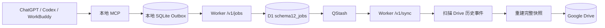
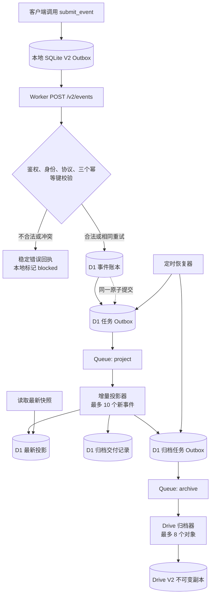

# Reliable Drive Sync V2 业务改造需求与架构基线

> 文档日期：2026-09-05  
> 文档用途：交给 Workbuddy 生成实施计划，再由 Codex 审核。  
> 当前阶段：只定义业务、架构与验收边界；不得据此直接开始编码、部署或迁移数据。
>
> **修订记录（Rev 2，2026-09-05，依据 Codex 审核）**：
> 1. §8/§7.2/§12 示例与 canary 领域名统一为 Schema 1.2 协议白名单中的 `algorithm`；`algorithm-learning` 仅作为 Skill 名称与展示标签，不是 envelope namespace。
> 2. §12/§21.1/§22 的“全量/增量等价”改为 **V2 全量 fold（同一 `event_seq` 排序语义）与增量的等价**；旧 V1 Rebuild 模型按业务时间排序，只作领域规则参照，不再声称逐字段等价。
> 3. §10.2 明确读取接口为带身份绑定的 `POST /v2/query`，不提供仅凭全局 Bearer 的跨用户 GET 查询。
>
> **修订记录（Rev 3，2026-09-05，依据 Codex 复审）**：
> 1. §7.2/§13：Queue 消息体固定为 `{taskId, taskType, attempt}`；D1 Outbox 与 Queue 的唯一业务关联键是确定性 `taskId`；`queue_message_id` 降级为 nullable 诊断字段（生产端 `Queue.send()` 不返回消息 ID，不得参与幂等、恢复与业务查询）；允许同一 `taskId` 重复发布，重复消费无副作用由 D1 状态、租约、游标与归档幂等保证；两个 DLQ 必须配置消费者。
> 2. §15：每次 Worker invocation 根部只建一个 `SubrequestBudget`，传给该 invocation 内全部 D1、Queue、Drive、fetch 客户端；业务上限固定 40；每类外部调用执行前 consume；恢复器在 */5 cron 中预留 15 额度（V1 reconciler 先行不动）。
> 3. §17：身份授权来自服务端凭据映射表 `rds2_credentials`（Bearer 凭据哈希 → userId），请求体 identity 字段仅作一致性核对，不作为授权依据；admin token 仅限初始化，不继承读取权限。
> 4. §7.2：`rds2_business_events` 新增 `business_dedupe_key`（nullable）与部分唯一索引，服务端从 envelope 派生（当前仅 `resume-knowledge.answer-scored` 使用 `userId|localDate|questionKey`），同日首次评分由数据库约束与服务端派生保证，不依赖生产者自律。
> 5. §7.2/§21：投影 CAS 用 BEFORE UPDATE 触发器把旧游标写入变成 SQL 错误使整个 batch 回滚；D1 真实性验证升级为 Miniflare/workerd 真 binding 集成测试（node:sqlite 适配器仅作快速单元测试）。
> 6. §19.2：发布顺序固定为十步（本地测试→暗部署→合成用户→合成 canary→单客户端 MCP 切换→真实 algorithm canary→其他域→Skill/插件→一周稳定观察→二次确认关 V1）。

> **修订记录（Rev 4，2026-09-05，依据 Codex 三审退回意见）**：
> 1. §7.2：`rds2_business_events` 显式补充业务唯一索引 `idx_rds2_events_business_scope(user_id, namespace, event_type, event_key)`；`rds2_credentials` 增加 `status/revoked_at`；`rds2_event_outbox` 增加 `queued_at`。全文表数统一为"六张 `rds2_` 表（五业务表 + 凭据表）"。
> 2. §9：冻结七条幂等冲突矩阵与四个查询入口（`byRequestId/byEventId/byEventKey/byBusinessDedupeKey`），`resolveIntent` 按矩阵实现，禁止返回未经矩阵判定的分支。
> 3. §8：LeetCode 206 示例修正——identity 使用协议实际字段 `username`（不是 `displayName`），内部事件补齐 `schemaVersion/userId/username/topic/problem/evidence/outcome/observedAt/source`，删除不存在的 `result` 字段。
> 4. §10：接收顺序改为先鉴权后校验；请求体 identity 必须同时核对 `userId` 与规范化 `username`；请求大小不信任 `Content-Length`，读取后按实际字节复核；status 查询目标改用 `payload.targetRequestId` 与 envelope 自身 `requestId` 区分。
> 5. §11/§12：本地 Outbox V2 冻结 `pending→sending→confirmed|pending(backoff)|blocked` 状态流与 confirmed 重放；fingerprint 为完整 envelope 的 canonical JSON SHA-256；投影 `state_json` 改为最小充分状态（聚合 + 去重索引 + 关系），禁止保存完整事件数组，设 2 MiB 上限。
> 6. §13：Outbox 认领使用单条条件 `UPDATE … RETURNING`（真实 D1 可验证的原子认领）；新增陈旧 `queued` 回收规则；Dispatcher 六条状态机规则（自认领、检查 `meta.changes`、拒绝直发 `processing/needs_attention/completed`）。
> 7. §14：归档改为 invocation/batch 级处理（Queue handler 根部单预算器、按本批消息精确 taskId 认领、按 `(userId, namespace)` 分组、逐对象更新自身 delivery 与 task、未执行对象释放租约并 `message.retry()`、已处理对象逐条 `message.ack()`、同名多文件 `needs_attention`）；哈希针对冻结规范字节计算。
> 8. §15：冻结精确归档成本模型（8 个全新对象 = 38 ≤ 40，明细见表）；D1/Queue/Drive/fetch/redirect 全部经预算化封装；**V2 恢复器改用独立 cron invocation**（`2-57/5 * * * *`），V1 三条 cron 表达式逐字节保留、行为不变，废除"同一 invocation 内 V2 预留 15"的共存方式。
> 9. §17：admin token 作为期望值依赖注入（禁止与字符串字面量比较）；凭据生成使用 Web Crypto（`crypto.getRandomValues`）；凭据语义锁定为**追加签发**（旧凭据保留有效），`status/revoked_at` 为未来轮换预留，轮换必须与签发同事务。
> 10. §21：新增十六条 Revision 4 验收门（真实 Miniflare 异步 D1、四唯一作用域并发、每类型一正一反样本、身份初始化零残留、10 事件 10+1 归档、精确任务完成、发布-回写失败全链路、queued 恢复、全通道预算、并发认领、状态上限、本地 Outbox 重启/超时/退避/阻塞/重放、无 Content-Length 413、暗部署全闭、逐 cron 预算、全绿门）。
> 11. D1 接口模型：全部 Repository/Service/Dispatcher/Recovery/Projection/Archiver 调用链 async/await；`batch()` 接收绑定后的语句对象数组；UPDATE 影响行数读取 `result.meta.changes`；`src/rds2/*.js` 到仓库根 `shared/` 的相对路径为 `../../../../shared/…`。

## 1. 本次改造要解决什么

Reliable Drive Sync V1 已证明本地 SQLite Outbox、Worker、D1、异步投递和 Drive 备份这条路线可行，但当前云端同步仍会在一次任务中反复扫描历史 Drive 文件。历史事件增多后，一次 Worker 调用可能超过免费方案允许的 50 个外部子请求。

V2 的核心不是“再加缓存”，而是改变业务真相的存放位置和快照生成方式：

- D1 保存不可变的业务事件，成为云端权威账本；
- 新快照只读取“上次有效投影 + 本次尚未处理的新事件”；
- Cloudflare Queue 只负责异步唤醒，不保存业务真相；
- Drive 只保存最终审计副本，不参与同步接收和投影计算；
- 任意一次 Worker 调用的业务预算最多使用 40 个外部子请求，固定预留 10 个安全余量；
- 旧数据不迁移、不覆盖、不删除，V1 与 V2 使用隔离的表、接口和 Drive 根目录。

一句话目标：**让每次事件提交的成本与“这次新增了多少数据”有关，而不再与“历史上一共有多少事件”有关。**

## 2. 使用本文件的规则

Workbuddy 应基于本文件另行生成可执行实施计划，不能直接实现。本轮交付顺序固定为：

1. Workbuddy 输出实施计划；
2. Codex 对计划进行源码一致性、数据一致性、失败恢复和 50 子请求上限审核；
3. 用户确认审核后的计划；
4. 才允许建立隔离工作区并进入开发。

实施计划必须给出精确文件、测试、命令、预期结果、部署检查点和回滚方式。若计划与本文件冲突，应先修改计划或提出设计变更，不能在编码时自行改变本文件中的锁定决策。

## 3. 已锁定的架构决策

以下内容无需 Workbuddy 再做技术选型：

1. 保留本地 SQLite Outbox，并继续只暴露一个 MCP 工具 `submit_event`。
2. 保留现有业务 envelope 的 `schemaVersion: "1.2"`；“V2”表示存储和处理架构版本，不强迫所有业务事件更换协议版本。
3. 新增 `POST /v2/events` 作为写入口；V1 的 `/v1/jobs` 在切换完成前保持不变。
4. D1 是 V2 的权威事件账本与权威投影来源。
5. Cloudflare Queue 替换 QStash，D1 Outbox 仍是可恢复任务的权威记录。
6. Drive 是最终一致的不可变审计副本，不是热路径数据库，也不是生成下一版快照时的输入源。
7. 不启用 R2。只有未来出现大文件、Drive 配额或归档吞吐问题时，才单独评审 R2。
8. V2 新建六张以 `rds2_` 开头的表（五张业务表 + 凭据表 `rds2_credentials`），不修改、复用或删除 `schema12_jobs` 等 V1 表。
9. V2 使用新的 Drive 根目录 `DriveRoot/my-chatGPT-skills-v2/`，不扫描或迁移 V1 Drive 数据。
10. Worker 平台上限按 50 个外部子请求处理；业务代码每次调用最多允许 40 个，预留 10 个用于框架、日志、重试和未来扩展。
11. 投影器单次最多处理 10 个新事件；Drive 归档器单次最多处理 8 个归档对象，且实际批量由剩余预算动态收缩（见 §15.3，动态上限可低于 8）。
12. 所有后台处理都按“至少一次投递、允许乱序、业务结果恰好一次”设计。
13. 用户身份先在 D1 明确注册或解析；事件接收热路径不得扫描 Drive 来判断身份。
14. 旧数据不迁移。V1 冻结为历史只读数据源，V2 从显式初始化后的新状态开始。
15. D1 接口模型与真实 Cloudflare D1 一致：`first/all/run/batch` 全部异步；`batch()` 接收绑定后的语句对象数组；UPDATE 影响行数读 `result.meta.changes`；本地 SQLite 适配器模拟同一套 D1 API，不创造第二套接口。
16. V2 恢复器使用独立 cron invocation（`2-57/5 * * * *`），与 V1 三条 cron 无共享预算；V1 cron 表达式与行为逐字节保留。

## 4. 当前 V1 基线和受保护内容

### 4.1 当前链路



V1 的主要扩展性问题位于 `扫描 Drive 历史事件 -> 重建完整快照`。单次任务读取的文件数量会随历史持续增长，缓存只能降低同一次调用中的重复访问，不能消除历史扫描本身。

### 4.2 当前源码事实

- 本地入口：`tools/reliable-drive-sync-mcp/stdio-bridge.mjs`
- 本地持久层：`tools/reliable-drive-sync-mcp/local-outbox.mjs`
- 本地投递编排：`tools/reliable-drive-sync-mcp/delivery-service.mjs`
- Worker 路由：`services/reliable-drive-sync-worker/src/index.js`
- V1 接收：`services/reliable-drive-sync-worker/src/ingress.js`
- V1 云端任务表：`services/reliable-drive-sync-worker/migrations/0005_schema12_jobs.sql`
- V1 QStash 调度：`services/reliable-drive-sync-worker/src/dispatcher.js`
- V1 Drive 同步：`services/reliable-drive-sync-worker/src/sync.js`
- V1 当前配置：`services/reliable-drive-sync-worker/wrangler.toml`

### 4.3 不得覆盖的本地修改

当前工作树已有用户未提交的 V1 热修，涉及：

- `services/reliable-drive-sync-worker/src/event-store.js`
- `services/reliable-drive-sync-worker/src/google-drive.js`
- `services/reliable-drive-sync-worker/src/sync.js`
- `services/reliable-drive-sync-worker/test/event-store.test.js`
- `services/reliable-drive-sync-worker/test/google-drive.test.js`
- `services/reliable-drive-sync-worker/test/sync.test.js`

这些修改用于减少 V1 Drive 重复读取和改善脱敏错误日志。实施计划必须先安排独立审查、验证和保存该基线，再建立 V2 隔离开发工作区。不得把这些改动当成 V2 文件随手重写，也不得使用会丢失工作区修改的 Git 命令。

### 4.4 当前测试基线

- Worker 测试：380/380 通过。
- Bridge 测试：45/46 通过。
- 唯一已知失败是 Node v26 不再输出 `node:sqlite` 实验性警告，而测试仍硬编码要求该警告出现一次；并发投递的数据断言没有失败。

实施计划的第一个质量门必须把此断言改为与 Node 版本无关的“首次提交前不加载 SQLite”行为测试，并在 V2 开发前取得完整绿色基线。

## 5. V2 总体流程



关键理解：

- 客户端拿到 `accepted` 时，表示事件和对应后台任务已经一起写入 D1；不表示快照已更新，也不表示 Drive 已同步。
- Queue 消息丢失或重复都不会丢业务，因为待办任务仍在 D1 Outbox 中，定时恢复器可以重新投递。
- 投影器只读取 D1 中游标之后的新事件，不读取 Drive，不遍历全部历史。
- Drive 归档失败不会撤销已被 D1 接收的业务事件；失败任务会重试或进入人工处理状态。

## 6. 四个运行模块分别负责什么

| 模块 | 一句话职责 | 不负责什么 |
|---|---|---|
| Worker | 云端业务入口和执行环境：鉴权、校验、调用 D1、消费 Queue、执行投影与归档。 | 不把内存当持久化存储，不在同步接收时扫描 Drive。 |
| D1 | 权威网络持久层：保存用户、不可变事件、后台任务、最新投影和归档状态。 | 不负责主动执行后台任务。 |
| Queue | 异步唤醒器：告诉某个 Worker“现在有一批投影或归档工作可做”。 | 不作为业务账本，不保证只投递一次，也不保证顺序。 |
| Drive | 最终一致的审计与灾备副本：保存可人工查看的不可变事件和投影文件。 | 不参与接收判定，不参与每次快照计算，不承担在线查询。 |

本地 SQLite Outbox 是第五个、位于用户电脑上的可靠性模块：它确保网络断开、Worker 超时或客户端重启时，尚未被 D1 确认接收的 envelope 不会丢失。

## 7. 六张 D1 表的业务职责（五业务表 + 凭据表）

### 7.1 一句话版本

| 表 | 通俗解释 |
|---|---|
| `rds2_users` | “这是谁”，保存权威用户身份。 |
| `rds2_credentials` | “用什么凭据访问”，Bearer 凭据哈希 → 用户映射。 |
| `rds2_business_events` | “发生过什么”，每个业务事实只追加、不覆盖。 |
| `rds2_event_outbox` | “接下来必须做什么”，保存尚未完成的异步工作。 |
| `rds2_projections` | “目前是什么状态”，保存把历史事件折叠后的最新结果。 |
| `rds2_archive_deliveries` | “Drive 副本送到了没有”，保存每个归档对象的交付状态。 |

### 7.2 建议字段与约束

#### `rds2_users`

| 字段 | 作用 |
|---|---|
| `user_id` | 权威 UUID 主键。 |
| `display_name` | 展示名，例如“乔炳源”。 |
| `name_key` | NFKC、去首尾空格后的身份查询键。 |
| `status` | `active` 或 `disabled`。 |
| `created_at`、`updated_at` | 审计时间。 |

约束：`name_key` 唯一；已禁用身份不能接收新写事件。

#### `rds2_business_events`

| 字段 | 作用 |
|---|---|
| `event_seq` | D1 生成的单调递增整数主键，也是权威处理顺序。 |
| `event_id` | 不可变业务事件 ID，全局唯一。 |
| `request_id` | 一次客户端提交尝试的幂等 ID，全局唯一。 |
| `user_id` | 事件归属用户。 |
| `namespace` | 业务域，取值必须是协议白名单之一：`system`、`algorithm`、`interview`、`resume-knowledge`、`profile`。 |
| `event_type` | 事件类型，例如 `algorithm.learning.completed`。 |
| `event_key` | 业务幂等键，例如“某用户某题某自然日第一次有效回答”。 |
| `envelope_json` | 经过完整校验的规范 envelope。 |
| `envelope_hash` | 规范 JSON 的 SHA-256，用于区分重试和冲突。 |
| `occurred_at` | 客户端声明的业务发生时间，只用于业务展示。 |
| `accepted_at` | Worker 接收时间，用于审计。 |

唯一约束（全部在迁移中显式建索引）：

- `request_id` 全局唯一；
- `event_id` 全局唯一；
- `(user_id, namespace, event_type, event_key)` 组合唯一：

```sql
CREATE UNIQUE INDEX IF NOT EXISTS idx_rds2_events_business_scope
  ON rds2_business_events(user_id, namespace, event_type, event_key);
```

该索引是并发下“同一业务位置只落一条事件”的最终防线（§9 矩阵第 7 条依赖它），预查和约束缺一不可。

`event_seq` 决定投影顺序，不能用客户端 `occurred_at` 代替。该表只允许插入，不允许更新历史 envelope 或删除事件；更正必须通过新的 correction/invalidation 事件表达。

#### `rds2_event_outbox`

| 字段 | 作用 |
|---|---|
| `task_id` | 后台任务主键，可作为用户看到的 job/receipt 标识。 |
| `task_type` | `project_event` 或 `archive_artifact`。 |
| `event_seq` | 投影任务对应的业务事件；`project_event` 类型非空，`archive_artifact` 类型必须为空。 |
| `archive_delivery_id` | 归档任务对应的交付记录；`archive_artifact` 类型非空，`project_event` 类型必须为空。 |
| `state` | `pending`、`dispatching`、`queued`、`processing`、`completed`、`needs_attention`。 |
| `attempt_count` | 已尝试次数。 |
| `lease_owner`、`lease_until` | 防止两个 Worker 同时认领同一任务。 |
| `queued_at` | 置入 `queued` 的时间；陈旧 `queued` 回收规则（§13）依赖它，防止 Queue 消息丢失后任务永久失联。 |
| `queue_message_id` | nullable 诊断字段。生产端 `Queue.send()` 不返回消息 ID，本字段通常为空，仅在消费者侧排障时可选记录；不参与幂等、恢复与业务查询。 |
| `last_error_code` | 机器可读的脱敏错误码。 |
| `available_at` | 下一次允许重试的时间。 |
| 时间字段 | 创建、更新、完成时间。 |

事件接收时，`business_events` 行和对应的 `project_event` 行必须在同一个 D1 原子批次中成功或一起回滚。

Outbox 表必须带类型-字段一致性 CHECK 约束，四类非法行（未知类型、两字段同时为空、同时存在、类型与字段不匹配）全部在建表层拒绝：

```sql
CHECK (task_type IN ('project_event', 'archive_artifact')),
CHECK (
  (task_type = 'project_event' AND event_seq IS NOT NULL AND archive_delivery_id IS NULL)
  OR
  (task_type = 'archive_artifact' AND archive_delivery_id IS NOT NULL AND event_seq IS NULL)
)
```

#### `rds2_projections`

| 字段 | 作用 |
|---|---|
| `user_id`、`namespace`、`projection_name` | 共同确定一个用户的一种投影。 |
| `projection_version` | 投影数据格式版本。 |
| `last_event_seq` | 已经处理到哪个权威事件游标。 |
| `state_json` | Reducer 下次增量更新所需的完整内部状态。 |
| `public_view_json` | 提供给 Skill/客户端读取的最小公开快照。 |
| `content_hash` | 检测相同内容和归档幂等。 |
| `updated_at` | 投影更新时间。 |

主键为 `(user_id, namespace, projection_name)`。投影更新的事务设计：UPDATE 语句不带 `last_event_seq = ?` 谓词，改由 BEFORE UPDATE 触发器在 `NEW.last_event_seq <= OLD.last_event_seq` 时 `RAISE(ABORT, 'stale_projection_write')`——旧游标消费者写入会变成 SQL 错误，整个 D1 batch 回滚，不存在“投影没更新但任务已完成”的部分副作用。

#### `rds2_credentials`

| 字段 | 作用 |
|---|---|
| `credential_hash` | Bearer 凭据的 SHA-256，主键。 |
| `user_id` | 归属用户。 |
| `status` | `active` 或 `revoked`；鉴权只认 `active`。 |
| `revoked_at` | 撤销时间；追加签发语义下恒为 NULL。 |
| `created_at` | 签发时间。 |

凭据语义锁定为**追加签发**：签发新凭据时旧凭据保留有效，不能称为“轮换”；若未来需要真轮换，必须在同一 D1 batch 内插入新凭据并将旧凭据置 `status='revoked'`、写 `revoked_at`，否则不提供轮换入口。

#### `rds2_archive_deliveries`

| 字段 | 作用 |
|---|---|
| `archive_delivery_id` | 归档交付主键。 |
| `artifact_kind` | `business_event` 或 `projection_snapshot`。 |
| `artifact_key` | 确定性幂等键，全局唯一。 |
| `user_id`、`namespace` | Drive 目录路由。 |
| `source_event_seq` | 对应业务事件；投影快照可为空。 |
| `projection_name`、`projection_event_seq` | 对应投影版本；事件归档可为空。 |
| `artifact_json`、`artifact_hash` | 已冻结的待归档内容及哈希。 |
| `drive_path` | 确定性目标路径。 |
| `state` | `pending`、`delivering`、`delivered`、`needs_attention`。 |
| `drive_file_id` | 成功后保存的 Drive 文件 ID。 |
| `attempt_count`、错误和时间字段 | 重试与审计。 |

投影事务应同时写入最新投影、归档对象和 `archive_artifact` Outbox 任务。归档器只上传 `artifact_json`，不得在上传时重新构建业务内容。

## 8. 一个完整例子：乔完成 LeetCode 206

假设乔第一次明确回复“第一题完成”，客户端构造：

```json
{
  "schemaVersion": "1.2",
  "namespace": "algorithm",
  "eventType": "algorithm.learning.completed",
  "requestId": "algorithm-checkin-2026-09-05-leetcode-206-first",
  "identity": {
    "userId": "<乔在 rds2_users 中的 UUID>",
    "username": "乔炳源"
  },
  "payload": {
    "event": {
      "schemaVersion": "1.2",
      "eventId": "<本次事实的 UUID>",
      "eventKey": "2026-09-05:leetcode-206:first-valid-answer",
      "eventType": "algorithm.learning.completed",
      "userId": "<同一 UUID>",
      "username": "乔炳源",
      "observedAt": "2026-09-05T20:30:00+08:00",
      "source": "workbuddy-chat",
      "topic": "链表",
      "problem": { "source": "leetcode", "title": "206" },
      "evidence": { "kind": "user-statement", "detail": "第一题完成" },
      "outcome": "completed"
    }
  }
}
```

内部事件字段集合与 V1 `protocol.js` 的 `ALGORITHM_FIELDS` 完全一致（含 `observedAt/source/topic/problem/evidence/outcome`）；协议没有 `result` 字段，也不存在 `identity.displayName`。

一次成功处理后，六张表依次发生这些变化：

| 时刻 | 表 | 发生的事情 |
|---|---|---|
| 接收前 | `rds2_users` | 找到乔的有效 UUID 与展示名，身份一致。 |
| D1 接收 | `rds2_business_events` | 插入一行，D1 分配 `event_seq=101`。这行永久表示“乔在当天第一次有效回答中完成了 206”。 |
| 同一原子提交 | `rds2_event_outbox` | 插入 `project_event(event_seq=101)`，表示投影工作尚未完成。 |
| Queue 唤醒后 | `rds2_projections` | 读取原投影游标 100，只应用 101，更新掌握度与 `last_event_seq=101`。不读取 1—100 的事件，也不读取 Drive。 |
| 同一投影事务 | `rds2_archive_deliveries` | 冻结事件 101 和新快照的归档 JSON，并创建对应归档任务。 |
| Drive 归档后 | `rds2_archive_deliveries` | 状态变成 `delivered`，记录 Drive 文件 ID。业务事件和 D1 快照在此之前已经有效。 |

如果投影器收到两次相同 Queue 消息，第二次看到 `last_event_seq=101`，不会再次增加掌握分；它只会确认对应任务已经完成。

如果 Drive 上传成功但 Worker 在收到响应前断线，重试会先按确定性父目录和文件名精确查找，校验内容哈希相同后复用原文件，不创建第二份副本。

## 9. 三个业务 ID 与一个任务 ID

| 标识 | 回答的问题 | 谁生成 | 重试时是否变化 |
|---|---|---|---|
| `requestId` | “这是哪一次提交请求？” | 客户端 | 不变 |
| `eventId` | “这是哪一个不可变业务事实？” | 客户端 | 不变 |
| `eventKey` | “业务规则上，这个位置是否已经记录过？” | Skill/客户端按契约生成 | 不变 |
| `taskId` / `jobId` | “云端哪一项后台工作负责后续处理？” | Worker | 同一已接收请求返回原值 |

幂等判定的查询入口固定为四个，缺一不可：`byRequestId`、`byEventId`、`byEventKey`（作用域 `user_id + namespace + event_type + event_key`）、`byBusinessDedupeKey`。判定函数 `resolveIntent(lookups, incoming)` 必须逐条实现以下七条矩阵，禁止返回矩阵之外的分支：

| # | 前置状态 | 云端结果 | 本地处理 |
|---|---|---|---|
| 1 | 三个 ID 与规范内容完全相同（全部查询命中同一事件且 `envelope_hash` 相同） | 返回原始 durable receipt，不新增事件或任务 | 删除已确认的 SQLite 行 |
| 2 | `requestId` 命中但 `envelope_hash` 不同 | `409 request_id_conflict` | 标记 `blocked`，停止自动重试 |
| 3 | `eventId` 命中但 `envelope_hash` 不同或归属 `request_id` 不同 | `409 event_id_conflict` | 标记 `blocked`，停止自动重试 |
| 4 | `eventKey` 已被另一事件占用（命中行 `event_id !== incoming.eventId`） | `already_recorded` + 首次事件 receipt（`status:"already_recorded"`，不暴露 SQL 异常） | 删除本次 SQLite 行并向用户说明首次结果仍有效 |
| 5 | `business_dedupe_key` 已存在且指向不同事件 | `already_recorded` + 首次评分 receipt，不暴露原始 UNIQUE 异常 | 同第 4 条 |
| 6 | 多个查询命中**不同事件**，且无任何单行能与 incoming 完全一致 | 稳定错误 `idempotency_state_corrupt`（HTTP 500，写路径拒绝） | 标记 `blocked`，转人工；**禁止继续写入** |
| 7 | 并发下四个预查均为空 | 数据库唯一约束（`request_id`/`event_id`/`event_key` 作用域/`business_dedupe_key`）保证最终只有一条事件；INSERT 捕获 UNIQUE 后重查四入口并按本矩阵重新判定 | 重试取得确定结果 |

矩阵判定优先级：第 2/3 条冲突 → 第 6 条 corrupt → 第 1 条 exact_retry → 第 4/5 条 already_recorded → 新事件。仅命中 `eventId` 且内容一致时属于第 1 条（同一事实的幂等重放，返回原 receipt），不得判为新事件。

“同一道题同一自然日只记录第一次明确回答”由服务端派生的 `business_dedupe_key` 唯一约束实现（V2 选择数据库约束方案，不依赖生产者自律）：Worker 对 `resume-knowledge.answer-scored` 事件从已校验 envelope 提取 `userId|localDate|questionKey` 派生去重键，写入 `rds2_business_events.business_dedupe_key`（nullable），配部分唯一索引；其他事件类型该列为空。Reducer 仍保留防御性去重。

## 10. 接收接口与回执语义

### 10.1 `POST /v2/events`

接收顺序（鉴权先行）：

1. 校验 Bearer 鉴权（凭据哈希查表派生权威 userId）；未鉴权不得读取请求体业务内容；
2. 请求大小限制：`Content-Length` 存在且 > 1 MiB 直接 413；缺失或可疑时仍读取并按实际字节数复核，超限 413（不信任客户端自报长度）；
3. 解析 JSON 并完整校验 envelope 和内部业务事件，不能只校验外壳；
4. 身份核对：请求体 `identity.userId` 必须等于凭据派生的 userId，且规范化后的 `identity.username` 必须等于该用户的 `name_key`；任一不符 403 `identity_mismatch`；
5. 计算规范 JSON 哈希；
6. 按 §9 七条矩阵判定 `requestId`、`eventId`、`eventKey`、`business_dedupe_key` 的重试或冲突；
7. 原子插入业务事件和投影 Outbox 任务；
8. 返回稳定 durable receipt；
9. Queue 唤醒经 Dispatcher 认领后发布。即使 Queue 暂时不可用，D1 Outbox 仍能被恢复器重新投递。

首次接收和完全相同的重试都必须返回足够让本地安全清理 Outbox 的回执：

```json
{
  "status": "accepted",
  "deliveryState": "cloud_accepted",
  "requestId": "...",
  "eventId": "...",
  "eventKey": "...",
  "eventSeq": 101,
  "taskId": "...",
  "persistence": {
    "localOutbox": "acknowledged",
    "eventLedger": "accepted",
    "projection": "pending",
    "drive": "pending"
  }
}
```

`cloud_accepted` 只表示 D1 已经原子保存事件与任务。任何客户端、Skill 或日志都不得把它描述为“Drive 已同步”或“快照已更新”。

### 10.2 读取接口

V2 的最新学习画像、面试画像和简历知识画像必须从 `rds2_projections.public_view_json` 读取。读取请求不得通过 Drive 文件列表重建快照。读取接口使用带身份绑定的 `POST /v2/query`（请求体携带已验证身份与查询范围，服务端核对 `rds2_users` 后只返回该用户的数据）；不得提供仅凭全局 Bearer 就能按 `requestId`/`eventId` 查询任意用户状态的 GET 接口。

计划至少应覆盖：

- 根据已验证身份读取指定 namespace 的最新公开投影；
- 根据 `requestId` 或 `eventId` 查询事件、投影与 Drive 归档的分层状态：查询目标标识放在 `payload.targetRequestId` / `payload.targetEventId`，与本次查询请求自身的 `requestId`（envelope 顶层）严格区分，禁止同名复用；
- 继续通过同一个 MCP 工具表达读请求，除非后续有单独批准的工具拆分设计。

## 11. 本地 SQLite Outbox 的 V2 语义

现有正确行为继续保留：

- 网络请求前先持久化完整 envelope；
- `request_id` 是本地主键；
- 同 `requestId + 同原始输入` 重用原行；
- 同 `requestId + 不同原始输入` 本地直接报冲突；
- 进程重启把遗留 `sending` 恢复为 `pending`；
- 定时或下一次提交扫描 pending，单批最多取 20 条；
- 只有得到 V2 durable receipt 或明确的 `already_recorded` 结果才清理行。

V2 必须补强：

- 单行状态流冻结为：`pending → sending → confirmed`、`pending → sending → pending(退避)`、`pending → sending → blocked`；`confirmed` 行再次提交同一请求时**直接返回本地保存的 receipt**，不再发网络请求；
- fingerprint 定义为**完整 envelope 的 canonical JSON SHA-256**（含 `requestId/eventId/eventKey/identity/payload` 全部字段），使用共享协议模块的 `canonicalJson`（字段顺序无关），禁止使用 `JSON.stringify` 直接比较；
- 表含 `available_at` 列，退避重试依赖它（`state='pending' AND available_at <= now` 才可认领）；
- 单行 submit 与批量 flush 共用同一状态流：批量 `claimPending` 已把行置 `sending`，单行 `flushOne` 不得重复调用 `markSending`；
- 网络请求必须带超时与中止（`AbortController`/`AbortSignal.timeout`，默认 30s），超时等同临时错误；
- 永久错误集合（直接 `blocked`）：`request_id_conflict`、`event_id_conflict`、`event_key_already_recorded`、`identity_mismatch`、`user_disabled`、`unauthorized`、`invalid_*`（全部 400/403/409 协议与身份类）；临时错误（退避重试）：超时、网络错误、5xx、429、503；
- 原子认领 pending 行；若 `markSending` 未成功，当前 flush 不得继续发送该行；
- 网络超时、5xx 和临时限流恢复为 pending，并采用有上限的退避；
- “D1 已提交但响应丢失”时，用同一三个 ID 重试并取得原回执；
- 接收成功后可删除 payload 行，但必须保留最小本地 receipt 记录供排障；
- 抽取 Worker 和本地共同使用的纯 V2 协议模块，避免两端校验规则漂移。

旧本地 V1 Outbox 文件不迁移、不删除。V2 默认使用独立的 `outbox-v2.sqlite`；正式切换前应先让用户选择处理仍处于 pending 的 V1 行，不能静默遗弃。

## 12. 增量投影规则

每个业务域提供纯 Reducer，统一接口语义为：

```text
emptyProjection(identity) -> initialState
applyEvent(currentState, validatedEvent) -> nextState
publicView(nextState) -> clientSafeSnapshot
```

投影器必须：

1. 按 `(user_id, namespace, projection_name)` 读取当前投影和 `last_event_seq`；
2. 从 D1 读取 `event_seq > last_event_seq` 的最多 10 个事件，并按 `event_seq ASC`；
3. 逐个调用纯 Reducer；
4. **同一 D1 原子 batch 内**完成全部五组操作：① 更新投影行（触发器 CAS 保护）；② 按精确 `task_id`/`event_seq` 集合完成这 N 个事件对应的 project task（禁止 `event_seq BETWEEN firstSeq AND lastSeq` 的区间更新——那会误完成序号区间内其他用户或 namespace 的任务）；③ 为 N 个业务事件分别冻结归档对象（INSERT OR IGNORE，`artifact_key` UNIQUE 幂等）；④ 冻结一个新的 projection snapshot；⑤ 为全部 N+1 个归档对象建立 archive task。处理 10 个新事件必须产生 **10 个 business-event artifact + 1 个 snapshot artifact**，不得只归档触发消息对应的一个事件；禁止在事务外先执行 `freeze()`；
5. 如果还有事件，保留或创建下一次唤醒；
6. 如果没有新事件，将重复 Queue 消息安全确认。

`state_json` 必须是最小充分状态，禁止保存完整事件数组（否则等于把“扫描 Drive 全历史”换成“每次读取并重写全历史 JSON”，状态大小、CPU、序列化与 D1 读写量仍随历史无限增长）：

- `algorithm`：按 `eventKey` 的去重索引（key → `{seq, outcome, topic, problemId}` 等最小字段）+ 主题聚合计数 + 当前头部；
- `profile`：按 `eventKey` 的最小贡献记录（`seq/action/outcome/dimension/subject/targets/observedAt`）+ active/inactive 关系；
- `interview`：每 session 只保存选中 review 的最小字段副本；
- `resume-knowledge`：当前有效 `resumeVersion` 对应的最新 question bank + 按 `localDate|questionKey` 的评分索引；
- 完整历史只存在于不可变的 `rds2_business_events` 账本，不复制进 `state_json`。

`state_json` 序列化后上限 **2 MiB**：投影引擎写入前断言长度，超限时该任务转 `needs_attention`（`state_limit_exceeded`），不得静默截断。增长测试必须证明正常业务序列下状态不进入超限区间；若未来逼近上限，用不可变账本离线 fold 重建（人工触发，不属在线热路径）。聚合结果在 `publicView` 中从最小充分状态确定性重算。

旧的全历史 rebuild 模型不能继续出现在在线热路径。等价语义定义为：对同一组事件，**按权威 `event_seq` 排序的 V2 全量 fold（一次性 apply 全部事件）必须与分成任意批次的增量 apply 结果逐字段一致**。这是 V2 自身的排序语义：`event_seq` 是接收顺序，迟到或回填事件的业务效果按接收顺序折叠，与 V1 按业务时间排序的 rebuild 结果可能不同。旧 V1 Rebuild 模型只作领域规则参照（correction、reviewVersion、同日首次评分等语义来源），不作为逐字段等价 Oracle；这些领域规则各自建立领域不变量测试。

每个 Reducer 的 `state_json` 必须保留足够信息以支持撤销既有贡献（非单调修订：supersede/invalidate、更高 reviewVersion 替换、同作用域重放），但形式必须是最小充分状态（聚合计数、去重索引、选中关系），不得是完整事件数组；具体结构锁定见上。等价测试的输入序列中每个 `eventKey` 必须唯一（重复 `eventKey` 会被数据库唯一约束拒绝，不能作为合法输入）；Queue 重复投递的语义由重复 task 消息测试覆盖，与等价测试分离。

首个生产 canary 使用 `algorithm` 领域。稳定后依次覆盖 profile、interview 和 resume-knowledge。现有 supersede/invalidate、reviewVersion 替换、同日首次评分等领域规则必须在领域不变量测试中得到证明，不能因为改成增量就弱化。

## 13. Queue 与 D1 Outbox 的配合

Queue 采用至少一次、可能乱序的事实模型。必须建立：

- 投影主队列 `rds2-project`，消费者 `max_batch_size=10`；
- Drive 归档主队列 `rds2-archive`，消费者 `max_batch_size=8`；
- 两个 Dead Letter Queue `rds2-project-dlq`、`rds2-archive-dlq`，**各自也必须配置消费者**，按 `batch.queue` 路由，把消息体中的 `taskId` 对应的 Outbox 行置为 `needs_attention`；
- 明确的 `max_retries` 和退避；
- 每条消息体固定为 `{ taskId, taskType, attempt }`，只携带定位信息，不携带唯一业务真相；
- D1 Outbox 与 Queue 消息的唯一业务关联键是确定性 `taskId`；生产端 `Queue.send()` 不返回消息 ID，`queue_message_id` 只能作为 nullable 诊断字段，不参与幂等、恢复和业务查询。

D1 Outbox 是恢复依据，状态机规则（全部真实 D1 可验证）：

- **原子认领**：单条条件 `UPDATE … RETURNING`（例如 `UPDATE rds2_event_outbox SET state='dispatching', lease_owner=?, lease_until=?, attempt_count=attempt_count+1, updated_at=? WHERE task_id IN (SELECT task_id FROM rds2_event_outbox WHERE state='pending' AND available_at <= ? ORDER BY available_at LIMIT ?) RETURNING *`）；禁止先 SELECT 再逐行 UPDATE 且不检查影响行数的实现——两个 Worker 并发时不得返回同一批任务；
- Dispatcher 必须**自己原子认领** `pending` 任务（按 taskId 单条条件 UPDATE…RETURNING），不得假设调用者已认领；只发送成功置为 `dispatching` 的任务；
- 发布成功后置 `queued` 并写 `queued_at`（`queue_message_id` 保持 NULL 或仅存诊断值）；`markQueued` 只接受 `dispatching` 行，对 `queued` 行重放不得调用它；
- 发布失败则释放租约并设置下一次 `available_at`；
- **“发送成功、状态回写失败”不可避免**：此时保留租约让行留在 `dispatching`，租约过期被回收后相同 `taskId` 会重新发布；因此**同一 `taskId` 被重复发布是正常事实**；重复消费无副作用由 D1 状态机、租约、投影游标触发器和归档幂等键保证，不得设计或断言“不会重复发布”；
- 状态更新只认实际影响行数：D1 语义下读取 `result.meta.changes`，更新影响 0 行必须视为失败；直接发送 `processing/needs_attention/completed` 行是非法状态迁移，必须显式拒绝（`illegal_state_transition`）；
- **陈旧 `queued` 回收**：恢复器额外回收 `state='queued' AND queued_at <= now - 10 分钟` 的行复位为 `pending`（Queue 消息丢失后任务可重新发布，不得永久失联）；
- 定时恢复器只取到期任务，使用有上限的小批量，不允许 `LIMIT 100 + Promise.all`；**V2 恢复器使用独立 cron invocation**（见 §15.2），不与 V1 cron 共享 invocation 或预算；
- 消费者崩溃后，过期租约可被回收；
- 达到重试阈值或进入 DLQ 转入 `needs_attention`，不得静默丢弃。

必须存在的真实测试链路：`send 成功 → markQueued 失败 → 租约到期 → 相同 taskId 重发 → 重复消费无副作用`；以及 `queued 消息丢失 → 陈旧回收 → 重新发布 → 恰好一次业务效果`。

## 14. Drive V2 归档规则

建议确定性目录：

```text
DriveRoot/my-chatGPT-skills-v2/
  users/<userId>/
    <namespace>/
      events/event-<eventId>.json
      snapshots/<projectionName>-through-<eventSeq>.json
```

归档规则（invocation/batch 级处理）：

- **Queue handler 根部创建一个共享预算器**；从本批消息取得精确 `taskId` 集合；
- **原子认领**本批消息对应的 Outbox 行（单条条件 `UPDATE…RETURNING` 置 `processing`）与对应 delivery（置 `delivering`）；未被本批认领的 pending 行**不得顺带扫描处理**；
- 按 `(userId, namespace)` 对已认领对象分组，每组复用 token 与目录解析结果；
- 每个 artifact 更新**自己的** delivery 状态与自己的 archive task；不得把循环中处理的对象都记到触发任务头上；
- 已处理对象逐条 `message.ack()`；预算不足时未执行对象显式释放租约并调用 `message.retry()`，不得静默吞掉；
- 同名精确查找返回多个文件时进入 `needs_attention`（`drive_ambiguous_name`），不得任选一个；
- 文件名、父目录、内容和哈希在 D1 `archive_deliveries` 中先冻结；上传时只处理冻结内容；`artifact_hash` 针对冻结的规范字节（`artifact_json` 字符串本身）计算，不得依赖 `JSON.parse → JSON.stringify` 后碰巧得到同一字节序列；
- 重试先按父目录和精确文件名查询，不扫描历史事件集合；
- 已存在且哈希一致视为成功重放；已存在但哈希不同进入 `needs_attention`，禁止覆盖；
- 新建后做精确 readback（content-only，恰好一次 GET）和哈希校验；
- 目录层级冻结为：`<V2 根>/users/<userId>/<namespace>/{events,snapshots}/`（V2 根目录 ID 由 secret `RDS2_DRIVE_ROOT_FOLDER_ID` 注入，不在 invocation 内解析 V2 根本身）；
- 同一 Worker 调用内复用 OAuth token 和已解析的确定性父目录；
- 任何情况下都不得修改 V1 根目录或覆盖已归档 JSON。

Drive 投影快照可以保留多个不可变版本。在线读取只使用 D1 当前投影，Drive 版本用于人工审计和灾难恢复。

## 15. 50 个外部子请求的强制预算

### 15.1 统一预算器与预算化封装

每次 Worker invocation 的入口根部只创建一个 `SubrequestBudget`，并把同一个实例传给该 invocation 内全部 D1、Queue、Drive、fetch 封装——**所有依赖必须由预算化封装构造**（`budgetD1(db, budget)`、`budgetQueue(queue, budget)`、`budgetDrive(env, budget)`、`budgetFetch(budget)`），不允许任何调用链绕过封装直连 `env.DB`/`env.Queue`/裸 `fetch`。预算器至少提供：

```text
remaining()
consume(category, count=1)
assertWithinLimit()
snapshotByCategory()
```

业务硬上限为 40，不得以平台内部服务额度可能更高为由放宽。`consume` 的类别至少包括：`d1`、`queue`、`drive_oauth`、`drive_list`、`drive_create`、`drive_upload`、`drive_read_meta`、`drive_read_content`、`redirect`、`fetch_other`。每个外部调用（含 D1 binding 调用、Queue send、Drive 每个 HTTP 请求、重定向）必须在执行前 consume；额度不足时停止领取新对象，完成或安全释放已领取任务（释放租约本身的 D1 成本也计入预算）；不得先调用再记账，也不得通过捕获平台异常来判断是否超限。

`budgetD1` 必须同时支持真实 D1 的三种调用形态，每种都计入 `d1` 类别：`prepare(sql).first()/all()/run()`（无绑定）、`prepare(sql).bind(...params).first()/all()/run()`、`batch(D1PreparedStatement[])`（一次 batch 计 1，因为是一次网络往返）。UPDATE 影响行数一律读 `result.meta.changes`。

Drive 原语的真实成本以 `google-drive.js` 源码为准：OAuth token 一次 fetch；`googleUpload`（multipart，含文件夹创建与 JSON 上传）一次 fetch；`listChildren`/精确同名查找每页一次 GET；`readJson` 是 metadata + content 两次 GET；内容 readback 必须使用独立的 content-only 原语（一次 GET），该原语需要独立接口与“恰好一次请求”的测试；V1 `createJson`/`readJson` 行为不变。重定向必须在每次跟随前计入 `redirect`。

### 15.2 Cron 布局：V1 与 V2 独立 invocation

V2 恢复器**不与 V1 cron 共享 invocation**。`wrangler.toml` 的 crons 数组在 V1 三条表达式逐字节保留之外，新增一条 V2 专用表达式 `2-57/5 * * * *`（错峰 2 分钟、每 5 分钟）。`scheduled()` 按 `controller.cron` 精确匹配分流：V1 表达式走既有 V1 逻辑（零改动）；V2 表达式走 V2 恢复器（预算 15）。每条 cron 的 invocation 各自独立证明 ≤40：V1 invocation 由现状基线测试保证，V2 invocation 用预算器断言。禁止再声称“V1 逐字节不变 + 同 invocation + V2 自带 15”能够证明总量 ≤40。

### 15.3 Drive 归档精确成本模型（先冻结，再实现）

目录层级：`<V2 根（secret 注入，不解析）>/users/<userId>/<namespace>/{events,snapshots}/`。每组的冷目录解析 = 5 次 list + 5 次 create（users、`<userId>`、`<namespace>`、`events`、`snapshots` 各级查找 1 次、缺失创建 1 次），热目录（invocation 内已解析）为 0。

每个归档对象的成本 = 精确同名查找 1（list q）+ 新建上传 1（multipart）+ content-only readback 1 = **3**（已存在且哈希一致的重放 = 1，无上传无回读）。

单组 8 个全新对象的最坏路径（全部冷）：

| 类别 | 计算 | 计数 |
|---|---|---:|
| `d1` | 认领 batch 1 + 冻结内容读取 batch 1 + 完成 batch（8 task + 8 delivery 合并为 ≤2 条语句的 1 个 batch）1 | 3 |
| `queue` | 归档不发布新消息 | 0 |
| `drive_oauth` | 每组 1 次，token 复用 | 1 |
| 目录解析 | 5 list + 5 create | 10 |
| `drive_list`（每对象精确查找） | 8 × 1 | 8 |
| `drive_upload` | 8 × 1 | 8 |
| `drive_read_content` | 8 × 1 | 8 |
| **合计** | | **38 ≤ 40** |

边界规则：若实测任何类别超出本表（例如出现重定向、需要补创建目录），预算器在 40 处硬停并触发缩批——动态上限 `floor((remaining - 组固定预留) / 3)`，且不得保留“恰好 8”的假象；多组积压（8 对象跨 8 组）必须自适应缩批并释放未执行租约。任何测试路径只要超过 40 就失败。预算证明的 `total` 必须直接来自唯一 `SubrequestBudget.snapshotByCategory()` 的合计，测试不得另算一个可能漏掉 D1 的 `calls` 计数；预算证明必须通过真实 Queue batch 入口执行，而不是直接调用归档器内部方法；D1 侧必须使用真实 Miniflare binding + `budgetD1`（证明 Repository 调用确实进入预算器）。

此外还需有生产指标：总调用数、按类别调用数、剩余额度、提前停止批次次数。日志不得包含 Bearer、OAuth token、完整 envelope、完整用户画像或 Drive 文件正文。

## 16. 一致性和失败恢复

| 故障点 | 系统必须表现 |
|---|---|
| 本地已写 SQLite，尚未发到 Worker | 保留 pending，重启后继续。 |
| Worker 已写 D1，响应丢失 | 同一请求重试返回原 receipt，不新增事件。 |
| 事件已写 D1，Queue 发布失败 | 接收仍有效；D1 Outbox 定时重投。 |
| Queue 重复或乱序 | `event_seq` 游标保证每个事件只产生一次业务效果。 |
| 投影执行一半失败 | D1 原子事务回滚，任务稍后重试。 |
| 投影已提交，确认 Queue 前崩溃 | 重复消费发现游标已前进，无副作用确认。 |
| Drive 新建成功，响应丢失 | 精确查询文件并校验哈希，复用原文件。 |
| Drive 长期不可用 | D1 事件和投影继续有效，归档状态进入重试或人工处理。 |
| 某个归档文件同名异内容 | 禁止覆盖，转 `needs_attention`。 |
| 达到子请求预算 | 停止扩批，释放未执行租约，留下可恢复任务。 |

## 17. 身份与安全边界

- `rds2_users.user_id` 使用权威 UUID，不以展示名或 Drive 文件夹名充当主键。
- **身份授权来自服务端凭据映射**：新表 `rds2_credentials(credential_hash, user_id, created_at)`，`credential_hash` 为 Bearer 凭据的 SHA-256；请求到达时由凭据哈希查表派生权威 `user_id`，请求体中的 `identity.userId/displayName` 仅作一致性核对（不一致拒绝），**不得把请求体里的 userId 当作授权依据**；凭据仅由 admin 初始化入口签发并只返回一次明文。
- admin token（`RDS2_ADMIN_TOKEN`）与普通用户凭据严格分离：admin 仅限 `POST /v2/users/init`，不得读取投影或事件状态；普通凭据不得初始化身份。
- 展示名通过 NFKC 和 trim 生成 `name_key`，保持当前全局身份语义。
- 请求体提供 userId 时只作一致性核对，授权一律以服务端凭据派生的 userId 为准；凭据无法映射到用户时停止事件写入。
- 身份注册与业务事件接收必须有明确契约；传输失败时不得擅自创建第二个用户。
- Worker 写接口必须鉴权；Queue 消费只接受 Cloudflare Queue 绑定上下文，不暴露可伪造的公网同步入口。
- 写入与读取的越权测试必须覆盖：用户 A 的凭据提交用户 B 的身份被拒绝；A 无法读取 B 的投影；A 无法查询 B 的 requestId/eventId；篡改 username、nameKey、userId 任一字段均不能越权。
- **身份初始化是单个 D1 原子 batch**：用户注册、凭据签发、全部初始空投影（每个 namespace 一行）必须在同一个 batch 中提交或一起回滚，不得留下“有用户无凭据”或“有用户无初始投影”的半初始化身份；中途失败零残留由 Miniflare 真 D1 集成测试证明。
- admin token 作为**期望值依赖注入**：初始化服务接收 `expectedAdminToken` 参数，服务内只与注入值比较，禁止在实现中引用字符串字面量 `"RDS2_ADMIN_TOKEN"` 再与请求 token 比较；未配置期望值时 fail-closed（拒绝一切 init）。
- 凭据随机字节优先使用 Web Crypto（`crypto.getRandomValues`，Workers 与 Node ≥19 全局可用），32 字节 hex 编码，仅返回一次明文。
- 错误响应使用稳定、脱敏的机器错误码；详细异常只进入受控日志。
- Drive、D1、Queue 凭证只通过 Worker secrets/bindings 注入，不写入仓库、回执或测试快照。

## 18. 是否需要 R2

本次不需要 R2，原因是：

- V2 已把热查询和投影迁到 D1，Drive 不再处于在线关键路径；
- 当前对象是体积较小的 JSON，Drive 足够承担低吞吐审计归档；
- 加入 R2 会新增存储一致性、生命周期、权限和恢复路径，却不会解决原先的“全历史扫描”根因；
- 先把 D1 增量投影和有界 Drive 归档做好，系统复杂度更可控。

只有出现以下可观测事实之一，才另立设计评审：归档对象明显变大、Drive API 配额成为主要瓶颈、需要高频程序化读取归档、需要比 Drive 更明确的生命周期策略，或需要跨区域大规模恢复。

## 19. 切换、旧数据与回滚原则

### 19.1 不迁移旧数据

- 不把 V1 Drive 事件导入 V2 D1；
- 不把 `schema12_jobs` 改造成 V2 事件表；
- 不删除 V1 D1 表、QStash 状态或 Drive 文件；
- V2 用户需要显式初始化身份与初始投影；
- V1 在 V2 稳定后停止新写，历史保留只读。

### 19.2 发布门

发布阶段固定为十步，顺序不得调整：

1. 本地完整测试绿色；
2. 暗部署，所有 V2 开关关闭；
3. 创建合成用户（admin 初始化）；
4. 合成用户全链路 canary（接收→投影→归档→读取）：canary 事件必须逐一开启 `RDS2_EVENTS_ENABLED`、`RDS2_READS_ENABLED`、`RDS2_PROJECT_ENABLED`、`RDS2_ARCHIVE_ENABLED` 四个开关，每步验证开启前的拒绝与开启后的放行；
5. 单客户端 MCP 切换到 V2（进程级 `RELIABLE_DRIVE_SYNC_WRITE_VERSION=v2`）；
6. 真实 algorithm canary（namespace 白名单放行）；
7. 其他领域逐个开启；
8. Skill 文案与插件切换；
9. 至少一周稳定观察；
10. 用户二次确认后关闭 V1/QStash。

每阶段必须可单独回滚。回滚通过功能开关和上一部署版本完成，不删除任何已经被 V2 接收的事件。已经接收 V2 事件后，不允许把同一业务事实自动改写到 V1。

## 20. Workbuddy 实施计划必须覆盖的工作包

以下是计划覆盖范围，不是本文件中的执行步骤：

1. **基线保护与契约层**：保存 V1 热修、修复版本相关测试、提取共享 V2 协议、建立全部冲突矩阵测试。
2. **D1 V2 数据底座**：新增独立迁移、五表约束、仓库层、原子接收和身份解析。
3. **V2 接口与本地 MCP**：`/v2/events`、稳定回执、原子认领、永久冲突阻塞、最小 receipt 历史。
4. **D1 Outbox 与 Cloudflare Queue**：队列、DLQ、有界分批、租约、恢复器和状态查询。
5. **增量投影框架**：游标事务、Reducer 接口、V2 全量 fold 与增量等价测试和 algorithm canary。
6. **其余领域 Reducer**：generic profile、interview、resume knowledge，逐域证明现有业务规则等价。
7. **Drive V2 归档**：确定性路径、冻结 artifact、精确幂等查找、readback 和失败恢复。
8. **40 子请求预算与可观测性**：统一预算器、最坏路径测试、脱敏日志和生产指标。
9. **Skill/插件契约升级**：更新 `my-chatgpt-skills` 源仓库、契约测试、插件重装流程和所有用户文案。
10. **端到端验证与发布**：混沌测试、暗部署、合成事件、生产 canary、切换、观察和回滚演练。

每个工作包必须采用测试先行，列出精确文件和提交边界。不可把四个领域 Reducer、基础设施和生产切换合并成一个巨型提交。

## 21. 验收标准

### 21.1 功能正确性

- 同一合法 envelope 重试任意次数，D1 只有一条业务事件并返回同一 receipt。
- 任意三个 ID 冲突均得到确定响应，永久冲突不进入无限重试。
- 事件和初始投影任务原子提交，不存在“有事件、无后续任务”。
- Queue 重复、乱序、丢消息和消费者崩溃都不会丢事件或重复修改画像；同一 taskId 重复发布后重复消费无副作用（投影只推进一次、归档对象只生成一份）。
- 增量投影与按 `event_seq` 排序的 V2 全量 fold 在相同合法事件序列上结果逐字段等价。
- 在线读取只访问 D1 投影，不扫描 Drive。
- Drive 归档支持成功、重试、响应丢失恢复、同名异内容阻断和 DLQ/人工处理。

### 21.2 性能与限制

- 任意 Worker 调用的计数不超过 40 个外部子请求（含 D1、Queue、Drive、fetch 与重定向，由每 invocation 单一预算器统计）。
- 事件提交成本不随用户历史事件总量增长。
- 投影每批最多 10 个新事件，归档每批对象数按剩余额度动态计算且上限 8。
- 恢复器不再出现 `LIMIT 100 + Promise.all` 的无界并发模式。

### 21.3 数据与安全

- V1 表和 Drive 根目录保持不变。
- V2 不读取或迁移 V1 历史以构建新投影。
- 所有写事件先完成身份校验和内部业务校验。
- secret、token、完整画像和完整事件正文不进入普通日志。
- `cloud_accepted`、`projection completed`、`Drive delivered` 三个状态在 API、Skill 文案和运维查询中严格区分。

### 21.4 Revision 4 新增验收门（Codex 三审意见十三，全部可执行）

1. 真实 Miniflare D1：异步 Repository API、绑定语句 batch、`result.meta.changes` 影响行数读取。
2. 四个唯一作用域并发冲突：requestId、eventId、eventKey 作用域、businessDedupeKey 各自的 UNIQUE 拦截 + 重查判定测试。
3. V1 全部允许事件类型（含五类只读与 dry-run 特例）一正一反样本，共享校验器全覆盖；禁止只覆盖 `algorithm`。
4. 身份初始化中途失败零残留（真 D1 batch 回滚后 users/credentials/projections 计数均为 0）。
5. 投影处理 10 个事件产生 10 个事件归档 + 1 个快照归档（单个 D1 batch 五组操作）。
6. 投影任务完成只影响精确用户、namespace 与 eventSeq 集合（交叉用户 seq 交错回归测试）。
7. Queue send 成功、回写失败、租约到期、相同 taskId 重发、重复消费无副作用全链路。
8. queued 消息丢失后，陈旧回收规则使任务可恢复发布且业务效果恰好一次。
9. 8 个归档对象经真实 Queue batch 入口的全通道预算证明（total 来自 `snapshotByCategory()`）；无法 ≤40 时自动缩批并释放租约。
10. 两个归档消费者并发时，同一 delivery 只被一个消费者认领（原子认领回归）。
11. 长历史下 `state_json` 不保存完整事件数组，且有大小上限测试（2 MiB 上限 + 超限 `needs_attention`）。
12. 本地 Outbox 重启、超时（AbortController）、退避、永久阻塞、confirmed 重放。
13. 无 `Content-Length` 的超大请求按实际字节数返回 413。
14. 暗部署状态下 events/query/init/project/archive/recovery 全部不可用，V1 保持正常。
15. 每条 V1 cron invocation 与 V2 recovery invocation 分别证明 ≤40。
16. `npm test`、Miniflare 集成和 Wrangler dry-run 全绿。

### 21.5 测试与发布（Rev 4 汇总）

- Worker、Bridge、共享契约、Skill 契约和端到端测试全部通过。
- 已知 Node v26 warning 断言已替换为行为测试。
- 存在可重复运行的最坏子请求预算测试和生产合成 canary。
- D1 真实性验证使用 Miniflare/workerd 真 binding 集成测试，至少覆盖：migration 应用、prepare/bind/run/first/all、batch 回滚、event+outbox 原子接收、投影 CAS 并发、本地持久化（重启后数据仍在）；node:sqlite 适配器仅作快速单元测试，不作为 D1 验证。
- 每个发布阶段有进入条件、退出条件、监控窗口和可验证回滚命令。
- 关闭 V1/QStash 前，V2 的接收、投影、归档和状态查询均已通过生产 canary。

## 22. Codex 审核 Workbuddy 计划时的检查清单

Codex 收到计划后至少检查：

- 是否完整覆盖六张表以及表间原子边界（含 Outbox 类型-字段 CHECK 约束、`business_dedupe_key` 约束与 `(user_id, namespace, event_type, event_key)` 业务唯一索引）；
- 全部 D1 调用是否为真实异步契约（`first/all/run/batch` async、`batch()` 接收绑定语句数组、`meta.changes` 影响行数），SQLite 适配器是否模拟同一套 API 而非另造接口；
- 是否把 Queue 当作唤醒器而非业务真相；Queue 设计是否不依赖生产端 message ID（消息体固定 `{taskId, taskType, attempt}`，D1 关联键为确定性 `taskId`）；
- Outbox 认领是否为原子 `UPDATE…RETURNING`（或同等可验证方案），并发双消费者不返回同一批；
- 是否明确允许同一 taskId 重复发布，并有“发布成功但状态回写失败后重复发布”与“queued 丢失后回收重发”的真实测试；
- 四个队列（两个主队列 + 两个 DLQ）是否全部配置了消费者；
- 是否为三个 ID 与 `business_dedupe_key` 分别定义了相同重试与冲突测试，且 `resolveIntent` 逐条实现 §9 七条矩阵（含 corrupt 与“仅命中 eventId 内容一致”分支）；
- 是否所有在线快照都来自 D1 增量投影；
- 是否有任何路径仍会扫描 Drive 全历史，或 `state_json` 保存完整事件数组；
- 是否每个 Worker 入口（含 query、init、DLQ 消费者、scheduled 恢复器）都有最坏 40 子请求证明，且预算统计覆盖 D1/Queue/Drive/fetch/重定向，`total` 直接来自 `snapshotByCategory()`；
- 归档成本模型是否与 §15.3 一致（先冻结后实现），归档器是否按本批消息精确认领、逐对象完成、同名多文件 `needs_attention`；
- V1 与 V2 是否使用独立 cron invocation，V1 cron 表达式与行为是否逐字节保留；
- 游标 CAS 是否用触发器/让 batch 整体失败的方式保证旧消费者零副作用；
- readAfter 是否携带 userId/namespace 范围；
- 身份是否为凭据映射派生而非请求字段匹配；identity 是否同时核对 `userId` 与规范化 `username`；
- 身份初始化是否为单 D1 batch（中途失败零残留），admin token 是否依赖注入、凭据是否用 Web Crypto 生成；
- 是否保存了当前六个未提交的 V1 热修文件；
- 是否避免迁移、覆盖或删除 V1 数据；
- 是否给每个领域 Reducer 安排 V2 全量 fold（`event_seq` 序）与增量等价测试、领域不变量测试，等价输入是否不含会被唯一约束拒绝的重复 eventKey，`toDomainEvent` 结构是否冻结且统一 `username`；
- 是否严格区分 D1 接收、投影完成和 Drive 归档完成；
- 是否包含暗部署、canary（四开关）、状态观测、DLQ、人工恢复和回滚，且发布顺序与 §19.2 十步一致；
- 是否更新 `my-chatgpt-mcp` 与 `my-chatgpt-skills` 两个仓库的契约，而非只改 Worker；
- 本地 Outbox 是否冻结完整状态流（canonical hash、`available_at`、confirmed 重放、永久错误集合、AbortController 超时）；
- HTTP 入口是否根部单预算器且全部依赖经预算化封装，先鉴权、实际字节限制、canary 空白名单 fail-closed、init 独立开关、全路径脱敏指标。

任何一项缺失，都应先退回计划修订，不进入实现。

## 23. 仍需用户学习确认，但不阻塞 Workbuddy 写计划的内容

以下不是开放技术选型，默认值已经在本文锁定；它们只是下一次学习时优先讲清的主题：

1. 为什么 `business_events` 是不可变账本，而 `projections` 可以不断被新版本替换；
2. 为什么 Queue 里已有消息，仍需要 D1 `event_outbox`；
3. 为什么 Drive 成功与否不能决定一次业务提交是否有效；
4. `eventId`、`eventKey`、`requestId` 分别拦截哪一种重复；
5. 一次投影事务为什么同时涉及 projection、outbox 和 archive delivery；
6. 如何从 `pending -> queued -> processing -> completed/needs_attention` 判断故障位置。

Workbuddy 可以围绕这些已锁定语义拆任务，但不得假设用户已授权实际实施。用户会先把实施计划交给 Codex 审核。

## 24. 参考资料

- Cloudflare Workers limits: <https://developers.cloudflare.com/workers/platform/limits/>
- Cloudflare Queues configuration: <https://developers.cloudflare.com/queues/configuration/configure-queues/>
- Cloudflare Queues batching and retries: <https://developers.cloudflare.com/queues/configuration/batching-retries/>
- Cloudflare Queues delivery model: <https://developers.cloudflare.com/queues/reference/how-queues-works/>
- Cloudflare D1 batch API: <https://developers.cloudflare.com/d1/worker-api/d1-database/#batch>

