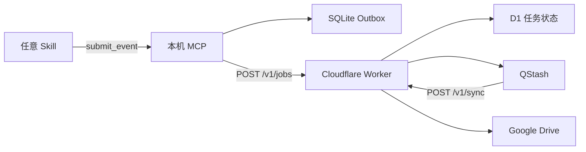
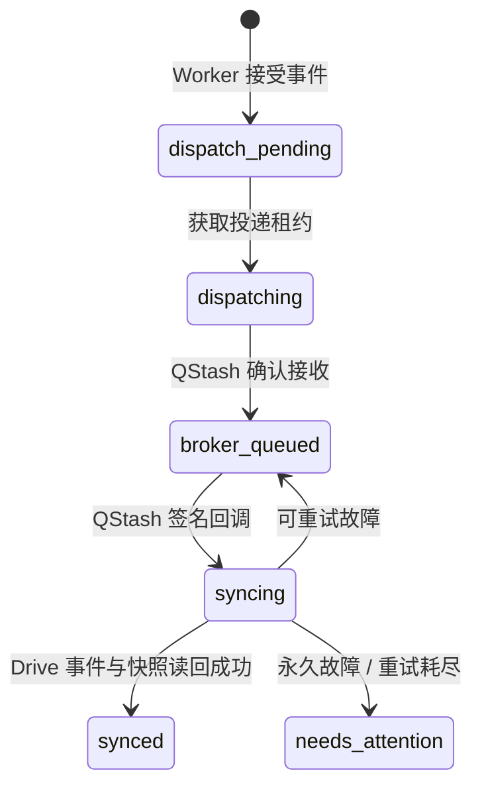

# Reliable Drive Sync：Skill 对接系统设计书

## 1. 系统目标

为任意 Codex Skill 提供可靠、异步、可追溯的 Google Drive 写入能力。Skill 只提交标准学习/业务事件，不直接管理 SQLite、D1、QStash、OAuth 或 Drive 文件。



## 2. 各组件职责

| 组件 | 负责什么 | 不负责什么 |
| --- | --- | --- |
| Skill | 形成事实、构造事件、调用 MCP | 直接写 Drive、重试云端任务 |
| 本机 MCP | 事件格式校验、本机 SQLite 先落盘、提交到 Worker、自动补发 | Drive OAuth、云端快照生成 |
| SQLite Outbox | 离线待发事件的持久化与恢复 | 跨电脑共享、云端状态机 |
| Worker + D1 | 鉴权、幂等入库、状态机、调度与通知 | 保存本机离线事件 |
| QStash | 异步触发同步、失败重试、签名投递 | 业务事件的最终存储 |
| Drive Adapter | 建立 Skill/用户目录、写不可变事件、生成并读回快照 | 解释学习内容 |

## 3. Skill 唯一需要调用的接口

MCP Server 名称：`reliable_drive_sync`  
工具名：`submit_event`

```ts
type SyncEvent = {
  schemaVersion: "1";
  eventId: string;       // 新 UUID
  eventKey: string;      // 必须以 "<userId>:" 开头；同一次重试保持不变
  type: string;          // 由 Skill 定义，例如 learning.consulted
  userId: string;        // 稳定用户标识，例如 qiaobingyuan
  sourceSkill: string;   // Skill 标识，例如 algorithm-learning
  destination: "drive";
  createdAt: string;     // ISO-8601 UTC 时间
  payload: Record<string, unknown>;
};
```

### 必须满足的规则

1. `eventId` 每个新事实使用新的 UUID。
2. `eventKey` 必须以同一个 `userId` 开头，例如 `qiaobingyuan:algorithm-learning:two-sum:2026-08-13T00:00:00.000Z`。
3. 网络重试同一事实时，复用原来的 `eventKey`；不能重新生成。
4. `sourceSkill` 与 `userId` 必须符合 `^[A-Za-z0-9][A-Za-z0-9_-]{0,63}$`。推荐使用小写连字符名称，例如 `algorithm-learning`、`interview`。
5. `payload` 必须是对象；它应只记录用户明确表达的事实，不臆测能力、成绩或隐私信息。

### 典型调用示例

```json
{
  "schemaVersion": "1",
  "eventId": "新生成的 UUID",
  "eventKey": "qiaobingyuan:algorithm-learning:two-sum:2026-08-13T00:00:00.000Z",
  "type": "learning.stuck",
  "userId": "qiaobingyuan",
  "sourceSkill": "algorithm-learning",
  "destination": "drive",
  "createdAt": "2026-08-13T00:00:00.000Z",
  "payload": {
    "topic": "哈希表",
    "problem": "两数之和",
    "evidence": "用户明确表示不会",
    "outcome": "stuck"
  }
}
```

## 4. 返回语义与 Skill 文案

| MCP 返回 | 含义 | Skill 可以说什么 |
| --- | --- | --- |
| `accepted: true` 且 `deliveryState: "cloud_accepted"` | Worker 已接受并写入 D1；Drive 后台同步中 | “事件已被云端接收，Drive 将后台同步。” |
| `accepted: false` 或 `deliveryState: "pending"` | 事件已保存在本机 SQLite Outbox，等待补发 | “事件已安全保留在本机 Outbox，等待自动补发。” |

`cloud_accepted` 不等于 Drive 已写完。只有云端 D1 状态为 `synced`，且 Worker 已完成 Drive 读回验证，才代表最终同步成功。

## 5. 云端状态机



- `eventKey` 是 D1 的幂等边界：重复提交不会创建第二个业务任务。
- QStash 回调会校验签名、目标 URL、过期时间和原始请求体哈希。
- 任何不确定的“已投递但状态未落库”情况会被保留在安全状态，不会盲目重复发布。

## 6. Drive 数据模型与目录规则

所有新文件按以下目录存放：

```text
事件父文件夹/<sourceSkill>/<userId>/event-<encoded eventKey>.json
快照父文件夹/<sourceSkill>/<userId>/snapshot-<timestamp>-<uuid>.json
```

事件 JSON 是不可变原始事实。快照 JSON 是同一个 `sourceSkill + userId` 范围内的完整聚合；不同 Skill 或不同用户不会混入同一份快照。

父文件夹之下已有的旧 JSON 是升级前历史数据，系统不会迁移、覆盖、删除或移动它们。

## 7. 新 Skill 对接模板

1. 为 Skill 选择稳定的 `sourceSkill`，例如 `interview`。
2. 在 Skill 正常业务回答结束后，提取用户明确表达的事件事实。
3. 生成 UUID、UTC 时间和以 `userId` 开头的 `eventKey`。
4. 调用 `reliable_drive_sync.submit_event`。
5. 仅根据 MCP 返回语义给用户反馈；不要直接声称 Drive 已写入。

一个访谈 Skill 的建议事件：

```json
{
  "type": "interview.completed",
  "sourceSkill": "interview",
  "payload": {
    "session": "java-backend-mock",
    "evidence": "用户完成了三道追问",
    "outcome": "completed"
  }
}
```

## 8. 安全边界

- Skill 和新电脑只持有 Worker 入口密钥 `INGRESS_SHARED_SECRET`；它只允许提交事件。
- QStash Token、QStash 签名密钥、Google Client Secret、Google Refresh Token 只保存在 Cloudflare Worker Secrets。
- 不要在 Skill、Markdown、Git、日志或截图中写入任何密钥值。
- 一台新电脑的本机 SQLite 只保存该电脑尚未被云端接受的事件；它不是云端备份。

## 9. 关键源码入口

- 协议校验：`packages/protocol/src/event.ts`
- 本机 MCP：`packages/mcp-server/src/index.ts`
- 本机 Outbox：`packages/mcp-server/src/outbox.ts`
- Worker 入口：`packages/workers/src/index.ts`
- 入口鉴权：`packages/workers/src/ingress.ts`
- 异步同步与签名验真：`packages/workers/src/sync.ts`
- Drive 目录与快照：`packages/workers/src/drive-adapter.ts`
